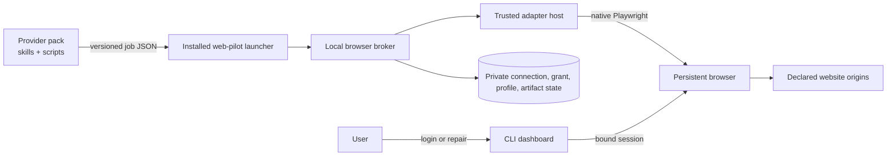

# RFC-0088: Web-pilot foundation

- **Status:** Experimental
- **Author:** eugenelim
- **Approver:** eugenelim
- **Date opened:** 2026-08-14
- **Date entered Experimental:** 2026-08-15
- **Date closed:** —
- **Decision weight:** heavy (authenticated browser state, executable adapters, a new dependency, and public contracts)
- **Related:** RFC-0017 (repo-level contracts), RFC-0031 (catalogue posture), RFC-0034 (catalogue install profiles), RFC-0084 (single sign-on destination trust), `docs/architecture/pack-layout.md`, `docs/architecture/credentials.md`
- **Research notes:**
  - [`0088-notes/playwright-contract-and-browser-landscape-survey.md`](0088-notes/playwright-contract-and-browser-landscape-survey.md)
  - [`0088-notes/plugin-contract-distribution-and-reference-adapter-survey.md`](0088-notes/plugin-contract-distribution-and-reference-adapter-survey.md)
  - [`0088-notes/cross-pack-consumer-pressure-test.md`](0088-notes/cross-pack-consumer-pressure-test.md)
  - [`0088-notes/web-connectors-and-aggregation-survey.md`](0088-notes/web-connectors-and-aggregation-survey.md)
- **Experimental evidence:**
  - [`S1 — persistent bind lifecycle`](0088-notes/spikes/s1-persistent-bind-lifecycle.md)
  - [`S2 — artifact, host, and dependency gate`](0088-notes/spikes/s2-artifact-host-and-dependency-gate.md)
  - [`S3 — safety-rail limits`](0088-notes/spikes/s3-safety-rail-limits.md)
  - [`S4 — open-source substitution check`](0088-notes/spikes/s4-oss-substitution-check.md)
  - [`S5 — cross-pack provider vertical`](0088-notes/spikes/s5-cross-pack-provider-vertical.md)
  - [`S6 — browser-session taxonomy`](0088-notes/spikes/s6-browser-session-taxonomy.md)
  - [`Synthetic fixture source archive`](0088-notes/spikes/experimental-fixture-source-archive.md)
  - [`2026-08-16 Experimental rerun`](0088-notes/spikes/2026-08-16-experimental-rerun.md)
  - [`Experimental rerun evidence archive`](0088-notes/spikes/experimental-rerun-evidence-archive.md)
  - [`2026-08-16 Experimental round 3`](0088-notes/spikes/2026-08-16-experimental-round3.md)
  - [`Round-3 Experimental evidence archive`](0088-notes/spikes/round3-evidence-archive.md)

`web-pilot` is the proposed name of an opt-in AgentBundle pack that would own
a local authenticated-browser runtime. A **provider pack** is a normal
AgentBundle pack containing skills, deterministic scripts, setup guidance, and
normally a bundled website adapter. A **website adapter** is the lower-level,
immutable executable driver loaded by the runtime. These definitions are local
to this RFC; they are not new catalogue product types.

## Reviewer brief

- **Decision:** Whether to validate an opt-in authenticated-browser foundation and its provider-pack/website-adapter contracts.
- **Recommended outcome:** Run only the six bounded pre-acceptance spikes while this RFC is Experimental; accept, reject, or withdraw it from the promoted evidence.
- **Change if accepted:**
  - Add a user-scope `web-pilot` accelerator pack with an embedded, unpublished Node runtime and one lockfile-pinned `playwright` dependency.
  - Add generic JSON Schema contracts for the one-shot local process protocol under the existing `contracts/jsonschema/` tree.
  - Add a provider-pack conformance profile and an opaque `auth: browser-session` credential strategy.
- **Affected surface:** pack metadata and lint, credentialed-skill conventions, user-local runtime state, browser profiles, executable adapter admission, downloads, network policy, and model-result boundaries.
- **Stakes:** Costly to reverse after third-party adapters exist; security-sensitive because admitted code controls an authenticated browser as the user.
- **Review focus:** the validation-versus-behavior authorization split, exact-digest trust, destination scope, and whether the proposed broker remains thinner than an existing browser platform.
- **Not in scope:** production implementation, implementation specs, catalogue or work-queue entries, mutation behaviors, a remote adapter catalogue, an npm SDK, background scheduling, or a vendor-specific reference adapter.

## The ask

- **Recommendation (bottom line up front):** Approve this architecture only to enter `Experimental` validation. The target is a user-scope `web-pilot` pack that installs an embedded Node runtime, owns one authenticated browser profile per connection, loads explicitly admitted immutable website adapters, and exposes a versioned local JSON process contract to provider packs. Keep executable adapters classified as trusted code, not as proven read-only sandboxes.
- **Why now (situation–complication–question):** AgentBundle integration packs can already carry skills, scripts, dependencies, and credentials, but there is no reusable contract for website-only integrations that require user handoff for sign-in and deterministic browser work afterward. Building that contract inside each provider would duplicate profile ownership, credential exposure controls, downloads, repair, and upgrade behavior. The question is whether this catalogue should validate one reusable, local-first browser foundation without moving site data into model context or creating another plugin marketplace.
- **Decisions requested:**

| ID | Question | Recommendation | Why | Decide by | Reviewer action |
| --- | --- | --- | --- | --- | --- |
| D1 | What is the product shape? | New opt-in, user-scope `web-pilot` accelerator pack with an embedded unpublished Node runtime delivered through the current skill and root-bin rails | `core` is repo-only and stack-neutral; the runtime and browser identity are user-local | This review | Confirm pack ownership, delivery, and charter fit |
| D2 | What browser substrate is admitted? | Provisionally, one exact lockfile-pinned direct production dependency: `playwright`; S4 must also execute `agent-browser`, OpenChrome, and OpenDevBrowser against the same boundary before acceptance | Current official Playwright interfaces fit the proposed native adapter ABI, while the 2026-08-15 bounded inventory found three current lifecycle candidates whose broader authority and non-native interfaces remain untested | Experimental spikes | Reopen the broker choice if a candidate removes material lifecycle code without widening authority |
| D3 | What are the extension layers? | Normal provider pack above an immutable website adapter | Keeps agent intent and deterministic domain logic in the catalogue while isolating browser-driver lifecycle | This review | Confirm the two-layer model |
| D4 | Who owns authenticated identity? | A connection owns the browser profile; resources are separately bound beneath it | One login may expose several mailboxes, projects, tenants, or accounts | This review | Confirm connection/resource separation |
| D5 | Where is authorization selected? | Per consumer activation, never globally on the connection | Consumers may migrate digests and resource scopes independently | This review | Confirm exact-grant tuple |
| D6 | How are setup and normal work separated? | Discriminated validation-only and behavior jobs | Authentication cannot become an unreviewed data-release path | This review | Confirm the split is non-negotiable |
| D7 | What is the credential primitive? | `auth: browser-session`; the browser retains authentication | Existing `sso-cookie` exports cookies and is the wrong boundary | This review, then convention amendment after acceptance | Confirm the fifth strategy |
| D8 | How are provider packs discovered? | Existing `integrations` category plus namespaced `pack.metadata.web-pilot.profile = "provider-v1"` | The destination has no `web-automation` category and no `pack.type`; open metadata is already supported | This review | Confirm the destination-specific taxonomy |
| D9 | What is the process framing and contract home? | One job JSON file in, one bounded JSON response on stdout or one bounded typed failure on stderr; cancellation uses process signals; schemas live under existing `contracts/jsonschema/` | The consumer contract is request/response, not a multiplexed service, so JSON-RPC adds an unused envelope and cancellation surface | This review | Confirm one-shot JSON and no JSON-RPC child |
| D10 | Is there an adapter catalogue? | No; provider packs and explicit local artifacts are sufficient initially | A second registry duplicates the catalogue and adds publisher/update trust prematurely | This review | Confirm the non-goal |
| D11 | Is there a public SDK? | No npm publication until a non-AgentBundle consumer or demonstrated authoring drift exists | The current process ABI supplies runtime reuse without Node linking | Graduation review | Confirm evidence-based graduation |
| D12 | What proves construction? | Synthetic `example-service` plus two synthetic provider consumers | Deterministic coverage is in scope; vendor-specific or non-SDLC references are not | Experimental spikes | Confirm the fixture boundary |
| D13 | What is the security claim? | Executable Playwright adapters are exact-digest trusted code with defense in depth | Native `Page`, context, request, and evaluation APIs can mutate or bypass in-process rails | This review | Reject any “sandboxed read-only” wording |
| D14 | What domain may use the foundation here? | Software-delivery integrations only | The charter excludes unrelated personal and business domains | This review | Confirm the scope correction |
| D15 | What does Experimental authorize? | Six throwaway evidence spikes and promotion of their notes only | Architecture acceptance must precede specs and production work | Draft → Experimental decision | Confirm the hard boundary |
| D16 | How does the pack deliver the runtime without a new projection primitive? | Carry the Node package and lockfile inside the setup skill; project a minimal Python launcher through `adapter-root-bins`; setup installs a versioned copy under user-local state | Current projection supports complete skill folders and user-scope Python root bins, but not an arbitrary Node runtime primitive | Cross-pack spike, then acceptance | Confirm the current-rail mapping |
| D17 | What blocks a vulnerable embedded runtime dependency? | S2 must prove a Node lockfile scanner and blocking policy; the first pack cannot merge until that scanner is wired into `build-check` | Current SCA covers Python dependencies, not the embedded Node lockfile | S2, then first implementation spec | Confirm the scanner gate |

### Imported-decision reconciliation

The source bundle arrived with provisional numbering, paths, metadata, and
catalogue assumptions. The following material deviations are intentional and
must remain visible during review.

| Source assumption | Destination evidence | Adaptation | Reason |
| --- | --- | --- | --- |
| RFC-0004 and `0004-notes/` | Next local ordinal is 0088 | Renumber to RFC-0088 and `0088-notes/` | RFC-0087 was assigned on `main` before this branch rebased; local RFC numbers remain unique and sequential |
| A broad browser foundation may serve finance and other personal domains | `docs/CHARTER.md` limits the catalogue to software delivery | Restrict provider and domain examples to software-delivery integrations | Charter scope is binding |
| `web-automation` is an existing category | Current soft vocabulary has `integrations`, not `web-automation` | Use `integrations` plus the namespaced conformance profile; revisit a category after a second provider | Avoid inventing taxonomy for one claimant |
| Required dependencies accept a general SemVer range and resolve by catalogue identity | `pack.schema.json` requires catalogue/pack/version, but install resolves installed packs by short name and accepts only `^X.Y` | Examples use the local catalogue name and `^1.0`; cross-catalogue providers are out of scope | Match the executable contract, not the declarative aspiration |
| A new top-level `contracts/` tree and JSON-RPC child are needed | RFC-0017 and `contracts/jsonschema/` already provide a canonical schema home; the proposed consumer exchange is one-shot | Put job/result/failure schemas under the existing JSON Schema tree and use process signals for cancellation | Avoid duplicate structure and an unnecessary RPC protocol |
| A pack can project an arbitrary embedded runtime directly | Current projection carries complete skill folders and only Python files through the shared root-bin rail | Keep the Node package and lockfile in the setup skill, project a minimal Python launcher, and install an immutable versioned runtime copy during explicit setup | Use supported delivery rails; do not invent a primitive implicitly |
| A real financial sandbox is the likely public reference | The destination charter excludes that product domain | Make `example-service` mandatory; require a separate future RFC for any real-site reference | Avoid a permanent out-of-scope maintenance obligation |
| The connector/aggregation survey promotes named out-of-scope product analogies | The charter makes those domains non-normative here | Preserve the object-model hypotheses as a source-transfer note, drop the product citations, and require S5 synthetic proof | Prevent an external analogy from becoming destination authority |
| A named existing cross-pack provider is the principal migration target | Destination implementation is intentionally not part of this RFC | Preserve the pressure test generically; require two synthetic consumers before acceptance | Keep the foundation review independent of an existing provider refactor |
| Local state used a source-repository-specific home | Existing user state is rooted at `~/.agentbundle/` | Use `~/.agentbundle/web-pilot/` in the illustrative layout | Follow destination conventions |
| Browser binding had a precise introduction-version claim | Current official release and API pages disagree on that historical detail | State the present API only; keep the combined lifecycle as a spike | Do not manufacture historical certainty |

## Problem & goals

### Diagnosis

Authenticated websites require two modes that must share one browser. A user
must sometimes complete passwords, multifactor authentication, passkeys,
CAPTCHAs, consent, or account recovery. Normal retrieval should then be
deterministic, bounded, typed, and frugal with model context. Provider-local
browser implementations tend to split those modes across profiles and duplicate
login handoff, network observation, download validation, profile locking,
repair, and redaction.

AgentBundle dependencies do not link packages at runtime. The install gate only
checks that a required pack name and compatible version are already present in
the union of user, repo, and local install state. A reusable foundation therefore
needs a stable installed launcher and process protocol; importing projected
files from another pack is not a supported composition mechanism.

### Goals

- Preserve the same live browser across user authentication and deterministic adapter work.
- Keep credentials, cookies, tokens, passkeys, authenticated headers, storage state, profiles, and raw captures outside skills and model context.
- Let provider packs remain ordinary AgentBundle products with self-contained skills and scripts.
- Admit only exact immutable adapter artifacts, with explicit upgrade and rollback per consumer.
- Separate connection identity, resource identity, and behavior authorization.
- Validate inputs and outputs against exact schemas before browser launch and before result release.
- Make drift, expiry, wrong-login, resource changes, crashes, and ambiguous profile ownership typed failures.
- Prove the contract without live credentials through a synthetic site and two provider consumers.

### Non-goals

- Website mutations: sends, submissions, configuration changes, deletes, purchases, trades, transfers, or form submission.
- A searchable adapter marketplace, remote version index, publisher service, or automatic update feed.
- Executing mutable Git branches or development directories during normal jobs.
- Treating native Playwright, Node's Permission Model, request routing, or TypeScript types as a malicious-code sandbox.
- Sending raw HTML, JSON, screenshots, traces, downloads, or authentication material to a model by default.
- Background scheduling, a remote browser backend, or a multi-user daemon in the first release.
- A public npm SDK before its graduation criteria are met.
- Domain contracts unrelated to software delivery.

## Proposal

### Product and ownership boundaries

`web-pilot` would be an opt-in, user-scope accelerator pack. It clears the
charter's accelerator exception only while it remains tied to software-delivery
integrations, declares an experimental/validated maturity state, has a named
maintainer, and carries an archive/deprecation path. It is not added to a default
profile.

The layers are deliberately separate:

| Layer | Owns | Must not own |
| --- | --- | --- |
| Provider skill | User intent, judgment, sequencing, presentation, setup and repair guidance | Browser launch, profile reads, raw credentials |
| Provider script | Deterministic provider-domain transforms that do not need a live browser | Imports from sibling skills or another pack projection |
| Website adapter | Authentication predicates, identity evidence, origins, selectors, endpoint contracts, downloads, named read behaviors | Agent prompts, user intent, global profile lifecycle |
| `web-pilot` runtime | Profile ownership, broker lifecycle, adapter admission, authorization, policy observation, schemas, redaction, artifacts, failures | Provider workflow semantics or domain normalization |
| User-local state | Connections, resources, grants, profiles, installed adapter digests, artifacts, diagnostics | Source-controlled data |

The normal path is:



The model sees only a user-authorized normalized summary or an opaque artifact
handle. Website content is untrusted data, never instructions, and is not
written to persistent agent memory automatically.

### Provider-pack conformance

The destination has no exclusive pack type and no current `web-automation`
category. A provider uses the existing soft category plus an open namespaced
metadata table:

```toml
[pack]
categories = ["integrations"]

[[pack.dependencies.required]]
catalogue = "agent-ready-repo"
pack = "web-pilot"
version = "^1.0"

[pack.metadata.web-pilot]
profile = "provider-v1"
declared-intent = "read-only"
setup-skill = "example-provider-setup"
web-skill = "example-provider-web"
adapter-delivery = "bundled"
```

Here **provider conformance profile** means a construction contract selected by
namespaced metadata. It is unrelated to a catalogue **install profile**, the
catalogue-level manifest that installs an ordered group of packs. The metadata
is a construction claim about intended behaviors, not runtime authority or a
sandbox guarantee; approval surfaces must still warn that trusted executable
code can mutate. Before acceptance, no linter understands it.
After acceptance, a follow-on spec must define static checks for the foundation
dependency, named skills, bundled candidate, read-only behavior declarations,
synthetic fixtures, and rendered-install boundaries.

The destination dependency gate ignores `catalogue` while resolving installed
state and supports only caret-minor ranges. This RFC does not extend it. A
provider from another catalogue must still arrange for an installed short-name
`web-pilot` dependency without relying on cross-catalogue resolution; improving
that resolver is a separate RFC.

### Connection, resource, and activation model

A **connection binding** owns one authenticated login, one browser-profile
namespace, a stable user alias, an adapter identity namespace, and immutable
configuration generations. A **resource binding** is a separately aliased
object visible through that login, such as a project, tenant, mailbox, or
workspace. Provider identifiers stay local.

A **consumer activation** is the authorization record for one provider
consumer. It selects:

- declared installed-consumer identity, used for confused-deputy checks among conforming callers;
- connection identity and configuration generation;
- exact admitted adapter digest;
- resource binding IDs and immutable resource-scope digest;
- behavior ID and version;
- input and output schema digests;
- sensitivity class and result policy; and
- expiry/revocation state.

The connection never has one globally active adapter digest or behavior set.
Two consumers may use the same connection with independent grants and migrate
digests separately. A newly discovered resource does not inherit an existing
grant.

Binding selectors are not capabilities. Before every behavior profile lease,
the runtime reconstructs a canonical scope object from local state, verifies an
HMAC-SHA-256 digest using an installation-local secret, checks the complete
activation tuple, and rechecks live binding identity. The secret is stored in
the user-private runtime state with current-user-only permissions. It is a
fresh, per-installation secret of at least 256 bits generated by the operating
system CSPRNG before any grant is signed; it is never deterministically
derived, reused from another installation, exported, or logged. This HMAC
detects tampering, torn writes, and accidental substitution of scope or
configuration records. Stale or replayed but validly signed records are
rejected by explicit generations, the activation tuple, expiry/revocation
state, and the live-identity check—not by the HMAC. The HMAC is not an
authorization boundary against another malicious process running as the same
operating-system user, which can replace both the secret and the grant files.
Strong consumer identity requires a later OS isolation boundary. Rotating the
secret invalidates existing grants and requires explicit re-consent; the
runtime never silently re-signs them.

V1 trusts processes already running as the same operating-system user. Each job
declares an installation-local `consumerIdentity`, and the launcher requires it
to equal the setup authorization or behavior grant before dispatch. This
prevents accidental grant substitution and catches a conforming provider using
another provider's grant ID; it does not make the grant non-transferable to a
malicious same-user process that can read or forge local invocation state. S5
tests declared-identity/tuple isolation only. Strong pack-to-pack principals or
bearer-proof claims require an OS isolation design and are not v1 guarantees.

### Validation-only versus behavior execution

The launcher is a one-shot process contract, not JSON-RPC: it accepts exactly
one confined job JSON file, emits exactly one bounded success object on stdout
or one bounded typed failure on stderr, and exits. `protocolVersion` supplies
the handshake. Cancellation and deadlines use operating-system process signals
plus the job's fixed deadline; no multiplexing, notifications, server-initiated
messages, or remote transport exist in v1. The authorization paths are
disjoint:

```ts
interface JobBaseV1 {
  protocolVersion: "1.0";
  jobId: string;
  connectionBindingId: string;
  consumerIdentity: string; // local declared pack identity; not a strong principal
  deadlineAt: string; // RFC 3339 UTC; cannot exceed the host policy maximum
}

interface ConnectionValidationJobV1 extends JobBaseV1 {
  kind: "connection-validation";
  setupAuthorizationId: string;
  operation: "authenticate" | "resolve-identity" | "health";
  resultPolicy: "local-validation-only";
}

interface BehaviorJobV1 extends JobBaseV1 {
  kind: "behavior";
  consumerGrantId: string;
  resourceBindingIds: string[];
  resourceScopeDigest: string;
  behavior: {
    id: string;
    contractVersion: string;
    inputSchemaDigest: string;
    outputSchemaDigest: string;
    sensitivityClass: "summary" | "sensitive";
    input: unknown;
  };
  resultPolicy: "agent-summary" | "local-artifact-only";
}
```

A validation job has no behavior, resource scope, consumer grant, artifact
writer, checkpoint, adapter-payload logger, or result-release operation. A
behavior job cannot name a setup authorization. Unknown or mixed fields are
rejected before browser launch. A missing, expired, malformed, or host-maximum-
exceeding deadline is rejected before a profile lease; the host timer remains
authoritative and cancels the child even if the adapter ignores its
`AbortSignal`. The host may record fixed, enum-bounded lifecycle events for
validation, but the adapter cannot supply their payload.

`resolve-identity` is also the only setup-time resource-discovery path. It
returns fixed-schema `BindingIdentityEvidence` to the host process only:
runtime-only connection/resource correlation values, ephemeral candidate keys,
an adapter-declared resource-kind enum, and an optional bounded local display
hint. The host may render those candidates in a host-owned local confirmation
UI so the user can assign aliases and choose resources. The evidence and display
hint never cross provider stdout/stderr, an artifact, a diagnostic event, or
model context; rejected/unselected candidates are discarded. Confirmation
creates the first resource generations and scope digest. This local UI is not a
behavior result-release surface.

Sensitivity and delivery are orthogonal. `sensitivityClass` classifies the
payload; `resultPolicy` selects whether any validated projection may reach the
agent or only a local artifact may be committed. Both job values must exactly
match the active grant. Any change, including a narrower delivery policy,
requires an explicit grant amendment so implementations cannot invent a
partial ordering.

Initial connection flow is:

1. Admit one exact adapter digest after non-executing artifact inspection.
2. Approve a short-lived setup authorization limited to the declared login origin and fixed authentication, identity, and health contracts.
3. Launch a dedicated persistent profile and bind the live browser for user handoff.
4. Run the adapter authentication predicate and binding-identity predicate.
5. Ask the user to confirm the connection alias and selected resources.
6. Record immutable configuration generations and keyed identity evidence.
7. Obtain a separate consumer behavior grant.
8. Only then dispatch a behavior against the same live browser.

For an existing connection, wrong identity returns
`connection-identity-mismatch` before behavior traffic or data release. If
stable identity evidence is unavailable, every new browser process or
reauthentication increments the connection generation and invalidates prior
grants.

### Browser-session credential boundary

The browser retains authentication. `web-pilot` is the opaque credentialed CLI
primitive and never returns cookies, tokens, passkeys, storage state, browser
headers, or profile paths to a skill. Existing `auth: sso-cookie` explicitly
resolves cookies, so reusing it would contradict the boundary. After acceptance,
a convention amendment may add:

```yaml
metadata:
  credentialed: true
  primitive-class: credentialed-cli
  auth: browser-session
```

The future lint must recognize only the installed launcher contract, reject
cookie-resolver imports and credential-shaped arguments, and verify that jobs
carry opaque connection, grant, behavior, resource-scope, and input values.
This RFC does not edit conventions or lint while Draft or Experimental.

### Runtime delivery and browser lifecycle

The current pack contract has no arbitrary Node-runtime projection primitive.
This RFC therefore maps delivery onto existing rails rather than assuming one:

```text
packs/web-pilot/.apm/skills/web-pilot-setup/scripts/runtime/
  package.json
  package-lock.json
  dist/                         # embedded unpublished runtime payload
packs/web-pilot/.apm/adapter-root-bins/web-pilot.py
  -> ~/.agentbundle/bin/web-pilot.py

explicit setup
  -> ~/.agentbundle/web-pilot/runtime/<pack-version>/
  -> ~/.agentbundle/web-pilot/current activation record
```

The setup skill owns the Node package, exact lockfile, and embedded payload.
The existing user-scope `adapter-root-bins` rail carries only a minimal
pure-stdlib Python launcher; it does not carry the Node runtime or contain
browser logic. Explicit setup copies and verifies the versioned payload into
user-local state, resolves the manifest-declared runtime prerequisites, and
atomically changes the current activation only after checks pass. The launcher
fails closed when the activated runtime is absent, corrupt, incompatible, or
belongs to a disabled pack. Provider packs call this stable launcher and never
locate a projected skill. S5 must prove the mapping against both source and
rendered installations; failure reopens D16 before any pack implementation.

The pack manifest's existing `runtime-dependencies` surface records the system
Node prerequisite and exactly one direct production npm dependency: an exact
`playwright` version. The setup skill's lockfile pins and scans all transitives
and is the dependency source of truth. Separately approved, exact-pinned
build-only tooling is permitted only when S2 proves it necessary; it is not
shipped in the runtime artifact and its addition is recorded as a material RFC
decision before acceptance. No other production dependency, crawler,
model-driven browser framework, standalone MCP package, stealth plugin, or
remote-browser SDK is admitted initially.

The recommended broker is on-demand and user-local. It owns process liveness,
profile leases, crash detection, idle shutdown, a private local endpoint, and
redacted lifecycle events. It launches a headed persistent context, obtains the
owning browser, binds it, and allows separately authorized CLI dashboard
attachment. One connection executes jobs serially; different profiles may run
concurrently under a global cap.

All endpoints live in a user-private run directory and prefer Unix-domain
sockets or named pipes. Any loopback WebSocket fallback requires a per-launch
unguessable credential delivered out of band, current-user access checks, and
no stable port. Every dashboard or repair attachment credential is bound to the
current user, connection, profile/identity generation, and single declared
purpose; it is short-lived and single-use for attachment establishment. It is
revoked on timeout, cancellation, browser/broker crash, disconnect, identity
change, or repair completion. Endpoint credentials never enter jobs, logs, or
model context.

Official documentation establishes the individual APIs, not the complete
persistent-profile → bind → attach → crash/reconnect behavior. Experimental
spike S1 must test the composition before it becomes a contract.

### Website-adapter artifact and runtime contract

An adapter artifact contains inert metadata separately from executable code:

```text
adapter-package/
├── web-pilot.adapter.json
├── dist/adapter.mjs
├── contracts/
├── provenance.json
└── conformance/synthetic-fixtures/
```

The installer reads and validates the manifest without importing the entry
point. It rejects absolute paths, traversal, symlinks, native add-ons, install
scripts, remote schema references, unexpected executables, and entry points
outside the artifact root. Files are staged outside the final digest path,
hashed, marked complete, and atomically finalized where the platform supports
it. Incomplete or mismatched trees are quarantined. Trust approval is stored
outside the artifact and cannot be reconstructed from bytes alone.

`provenance.json` is inert, digest-covered metadata naming the source origin
and immutable ref/archive digest, build recipe, toolchain, dependency lockfile
digest, build materials, and whether reproducibility was attempted and
achieved. Admission verifies internally referenced materials without executing
the adapter. If the source-to-artifact relationship cannot be independently
verified, the artifact is labelled `source-unverified trusted code`, requires a
distinct explicit approval, and can never activate automatically. Immutability
does not substitute for provenance or publisher trust.

The manifest declares adapter identity/version, runtime and Playwright
compatibility, exact origins by purpose, login and identity contracts,
per-connection profile strategy, configuration schemas, read behaviors,
input/output schema paths and digests, sensitivity class, method rules, Service Worker
posture, artifacts, and bounded health signals. Origin rules are structured
HTTPS scheme/ASCII host/effective-port values. Live adapters reject loopback,
private, link-local, multicast, and metadata destinations after DNS resolution
and on every redirect/connection. Synthetic fixtures may request an explicit
loopback/HTTP exception that is invalid for other environments.

Protocol and manifest versions use `MAJOR.MINOR`. Minor versions may add
optional fields or failure kinds; semantic changes require a major. Behavior
versions follow SemVer independently, and a published behavior version's schema
digests are immutable. The runtime rejects unsupported version windows before
browser launch and preserves unknown failure kinds as bounded
`unknown-runtime-failure` results.

### Native Playwright and trusted-code posture

Capable adapters receive the host's native pinned `Page` and `BrowserContext`
plus mode-specific fixtures. The adapter neither bundles nor launches
Playwright.

```ts
interface BrowserExecutionBase {
  readonly page: Page;
  readonly context: BrowserContext;
  readonly signal: AbortSignal;
}

interface ValidationExecution extends BrowserExecutionBase {
  readonly job: Readonly<ConnectionValidationJobV1>;
  readonly connection: Readonly<{ alias?: string; config: unknown }>;
  // Deliberately no local resource bindings, artifact writer, adapter logger,
  // checkpoint sink, behavior request, or result-release capability.
}

interface BehaviorExecution extends BrowserExecutionBase {
  readonly job: Readonly<BehaviorJobV1>;
  readonly connection: Readonly<{ alias: string; config: unknown }>;
  readonly resources: readonly Readonly<{
    resourceBindingId: string;
    alias: string;
    kind?: string;
    config: unknown;
  }>[];
  readonly artifacts: ArtifactWriter;
  readonly log: RedactedAdapterLogger;
  checkpoint(checkpoint: Readonly<{
    ruleId: string;
    completedPages?: number;
    completedItems?: number;
  }>): void;
}
```

A checkpoint is an internal progress observation, not a general adapter output
channel. `ruleId` must be a manifest-declared public-safe opaque identifier;
counts are non-negative bounded integers; no free-form string, cursor, URL,
provider identifier, page content, authentication material, or adapter-defined
object is accepted. The fixed schema is capped at 4 KiB, redacted and validated
before it enters quarantined job state, and is never released as a result,
artifact, diagnostic, log payload, or model-visible value. An invalid or
oversized checkpoint fails closed with `invalid-checkpoint`, cancels the job,
and prevents every result or handle release. Finalization removes its
quarantined checkpoint state; exceptional paths follow the fixed retention rule
without widening its audience.

Native Playwright exposes evaluation, clicks, form submission, route removal,
context access, downloads, WebSockets, and an authenticated request client with
mutating methods. Admitting a `trusted-playwright` artifact is approval to run
reviewed same-user code with the authenticated browser. Broker-installed routes,
event observation, method/origin rules, Service Worker blocking, sanitized
environment, child-process/native-addon denial, filesystem restrictions, and
Node permissions are safety rails against mistakes and drift. They are not a
security boundary against malicious admitted code.

A separate `declarative` execution tier may interpret a small allowlisted
operation set and make a stronger restriction claim. It must not become the ABI
for capable adapters or force the foundation to mirror Playwright.

### Network, downloads, filesystem, and result handling

Source preference is: supported customer API or export, website download,
observed same-origin internal API, then DOM extraction. Internal endpoints are
documented as unstable and never represented as supported public APIs.

The context-associated request client may be used for same-origin
cookie-authenticated reads because current Playwright documentation confirms it
shares the browser context's cookie jar. Application-held bearer tokens may be
used only inside the browser/adapter runtime through observed requests or
in-page fetch. No token, cookie, authenticated header, replayable request, or
raw response crosses the consumer protocol.

Downloads are written only through a generated-path artifact writer beneath one
canonicalized job root. The host validates declared origin, period or selector,
status, media type, magic bytes, size, safe filename properties, and hash before
commit. Adapter-supplied paths are forbidden. Retention is bounded and purge
targets only runtime-owned directories.

Results and artifacts use a two-phase commit. Job output remains quarantined
until behavior-output schema validation, artifact validation, authorization
recheck, sensitivity/result-policy checks, and finalization all succeed. A
timeout, cancellation, component crash, or schema/policy failure releases no
result, checkpoint, artifact handle, or diagnostics handle; it emits one
bounded typed failure and precisely purges or quarantines the generated job
temporary state according to the fixed retention policy.

The first release uses these falsifiable default ceilings. S2/S3 may recommend
different values, but any change before acceptance is recorded in the decision
log and retains both a byte/count bound and an age/cleanup rule.

| State | Default hard bound | Retention / cleanup trigger | Exhaustion behavior |
| --- | --- | --- | --- |
| Protocol stdout | 256 KiB serialized, one response | Process exit | Fail with `resource-limit-exceeded: result-bytes`; release no partial JSON |
| Protocol stderr | 16 KiB serialized, one failure | Process exit | Truncate only at schema-approved field boundaries and emit `resource-limit-exceeded: failure-bytes` |
| Committed artifacts | 512 MiB and 50 files per job; 20 completed jobs per connection | 30 days or explicit exact-job purge, whichever is earlier | Refuse commit with `resource-limit-exceeded: artifact-quota`; preserve prior committed jobs |
| Diagnostics | 64 MiB per job; 10 completed diagnostic jobs per connection | 7 days or explicit exact-job purge | Stop capture and return the original bounded failure plus `diagnostics-truncated: true` |
| Quarantine / staging | 1 GiB and 20 entries per installation | 7 days; cleanup at startup and before install | Refuse new install/job finalization with `storage-quota-exceeded`; never evict an active or rollback target |
| Active browser profile | One profile per connection, 5 GiB | No age purge while active; 7 days after disconnect-local unless the user purges sooner | Refuse launch with `resource-limit-exceeded: profile-bytes`; never delete browser state implicitly |

Cleanup runs under the same path jail and lock as the owning store. A cleanup
failure is a bounded `retention-cleanup-failed` event; it never broadens a
deletion target or silently discards an active profile, activation, or rollback
artifact. The runtime reports current usage and the exact user action needed to
purge a generated job, retired connection, or quarantined entry.

Stdout contains one bounded protocol response. Nonzero exits emit one bounded,
redacted typed failure on stderr. Neither channel may contain raw stacks,
environment values, URLs, headers, page text, browser errors, subprocess output,
or local paths. Detailed diagnostics remain in the confined local store behind
an opaque handle.

Lifecycle observability uses a fixed `DiagnosticEventV1`, not adapter-authored
prose. One event is at most 8 KiB and contains only: schema version; opaque
correlation/job IDs; RFC 3339 timestamp; component and phase enums; outcome;
adapter ID/version/digest; declared behavior and rule IDs; connection/resource
aliases when the user marked them safe; schema digests; bounded
page/item/byte/retry counts; typed failure kind; retryability; and a fixed
recovery-action enum. Every terminal failure includes correlation ID,
timestamp, component, phase, failure kind, retryability, and recovery action.
URLs, headers, DOM/page text, provider identifiers, values, filenames, local
paths, environment data, raw exceptions/stacks, and arbitrary adapter strings
are schema-invalid. Construction fixtures must prove both usefulness of the
minimum terminal event and rejection of every forbidden field class.

Illustrative local state:

```text
~/.agentbundle/web-pilot/
├── bin/web-pilot
├── runtime/<pack-version>/
├── registry.json
├── adapters/store/<sha256>/
├── connections/<generated-id>/
├── profiles/<generated-id>/
├── artifacts/<generated-id>/<job-id>/
├── diagnostics/<generated-id>/<job-id>/
└── run/
```

Generated IDs, never aliases, URLs, adapter metadata, or downloaded filenames,
form path components. Every resolved path must remain inside its owner root after
symlink or junction resolution.

### Domain-profile boundary

`web-pilot` owns only generic provenance, authorization, artifact, health, and
failure envelopes. A domain conformance profile may be advertised only after an
accepted RFC names its owner pack, versioned definition, exact definition and
schema digests, sensitivity floor, canonical fixtures, and behavior-role
mapping. The provider must depend on that owner pack. Catalogue conformance
verifies the inert declaration and fixtures; the browser runtime treats the
payload as opaque.

No domain profile is created by this RFC. Source-bundle domain-profile sketches
are non-normative and are not promoted as destination capabilities or
machine-discoverable claims.

### Installation, upgrade, rollback, and repair

Installation and activation are separate transitions:

```text
install provider pack
  -> inspect candidate artifact without execution
  -> show exact digest and behavior/schema/origin/method/trust diff
  -> approve constrained execution of that digest
  -> stage and finalize disabled immutable artifact
  -> run synthetic conformance
  -> authorize validation-only connection setup
  -> confirm live identity and resource aliases
  -> approve exact consumer behavior grant
  -> activate atomically; retain prior activation for rollback
```

A provider pack update may carry a new candidate but never admits or activates
it silently. Normal execution never loads a mutable checkout. Public or private
Git may host provider-pack or adapter source; Git credentials and source updates
remain outside the runtime.

Connection and resource configuration use immutable generations independent of
adapter code. A migration copies prior configuration into staging, validates the
candidate, and requires per-consumer activation. Adapter code never migrates a
browser profile.

Supervised repair attaches approved CLI/tooling to the same browser and may
capture time-bounded raw local diagnostics. It cannot package, admit, activate,
or send captures to a model automatically. A model-proposed patch remains
untrusted source requiring human review, tests, a new digest, and explicit
activation.

### No second catalogue and no npm SDK

V1 has no adapter search, publisher namespace, remote index, automatic update
feed, marketplace UI, or mutable remote loader. A future distribution RFC needs
observed independent publishers, multi-user approval/revocation needs, a
non-AgentBundle consumer, or material failure of direct immutable installation.
Its first option must be the existing AgentBundle catalogue.

The process ABI and copied/generated types are sufficient for current
AgentBundle consumers. Publish an npm SDK only when a second non-AgentBundle
consumer exists, multiple foundational packs need in-process imports, or two
independent provider implementations demonstrate schema/type drift that copied
types and contract tests cannot control.

## Experiment / validation

Moving this RFC to `Experimental` authorizes only throwaway prototypes in an
approved temporary path and promotion of evidence notes under
`0088-notes/spikes/`. It does not authorize a pack, dependency, production code,
implementation spec, catalogue entry, changelog entry, guide, or queue item.

### Experimental run ledger — 2026-08-15

| Spike | Result | Decision effect | Exit disposition |
| --- | --- | --- | --- |
| [S1](0088-notes/spikes/s1-persistent-bind-lifecycle.md) | Blocked at browser launch for bundled and system channels | No initial OS/browser support row is accepted; D2 remains operationally unproven | Rerun outside the enterprise Mach-port restriction |
| [S2](0088-notes/spikes/s2-artifact-host-and-dependency-gate.md) | Artifact/host construction passed; vulnerability-database access blocked | Self-contained ESM archive needs no demonstrated bundler, but D17 has no scanner or blocking policy | Rerun scanner clean and controlled-vulnerable cases; rerun native host after S1 |
| [S3](0088-notes/spikes/s3-safety-rail-limits.md) | Local file/data rails passed; browser/network corpus blocked | Preserve the trusted-code claim; no browser rail is promoted to enforced read-only | Rerun the complete browser/network corpus after S1 |
| [S4](0088-notes/spikes/s4-oss-substitution-check.md) | Bounded candidate inventory recorded; executable conformance blocked | Retain the thin broker provisionally; add `agent-browser`, OpenChrome, and OpenDevBrowser to the mandatory rerun because their current daemon/profile lifecycles are material candidates | Run all candidates through the same S1/S3 corpus before acceptance |
| [S5](0088-notes/spikes/s5-cross-pack-provider-vertical.md) | Pack projection, dependency, and grant isolation passed; same-browser row blocked | D16 and the exact-grant/validation split are constructible on current rails | Rerun same-browser handoff after S1 |
| [S6](0088-notes/spikes/s6-browser-session-taxonomy.md) | Prototype feasibility passed | D7 is feasible without cookie export; current production lint and conventions remain unchanged | Satisfied for Experimental evidence; convention amendment still waits for acceptance |

These results are intentionally not rewritten as positive architecture proof.
S1, S2, S3, S4, and S5 remain open Experimental gates. The S4 candidate-set
change is the only new material ecosystem deviation: the broker decision must
be reopened if any of the three newly load-bearing candidates passes the
native-adapter and authority tests.

The RFC may advance from Experimental only when all six spikes satisfy the
evidence contract below, S2 identifies a Node lockfile scanner and blocking
policy that the first implementation spec must wire into `build-check`, S1
records the accepted initial OS/browser support matrix and explicit deferrals,
and any decision-changing result has passed targeted adversarial,
security-design, and quality review. No foundation pack may merge until that
scanner runs against the frozen runtime lockfile and fails on the accepted
severity/policy threshold.

Every promoted spike note must contain:

| Evidence field | Required content |
| --- | --- |
| Reproduction identity | Exact OS/architecture, browser channel/version, Node and Playwright versions, artifact/lockfile digests, tool versions, and repository ref |
| Reproduction procedure | Copy-paste-safe commands, synthetic fixture paths relative to the repository or approved temporary root, setup/cleanup, and expected exit status |
| Scenario matrix | One row per scenario ID with precondition, stimulus, expected observable/failure kind, actual bounded observable, pass/fail, and evidence digest/path |
| Sensitive-data disposition | Confirmation that only synthetic inputs and redacted bounded outputs were promoted; raw local diagnostics remain outside the repository |
| Decision impact | Which decision/assumption the result confirms, revises, defers, or rejects; owner and required targeted re-review |

A summary assertion without the scenario rows and reproducible fixture is not
evidence and cannot satisfy Experimental exit.

| Spike | Load-bearing question | Required scenario groups | Pass bar / decision output |
| --- | --- | --- | --- |
| **S1 — Persistent bind lifecycle** | Can one owner preserve same-browser handoff and recover safely? | Persistent launch; owning-browser lookup; bind and CLI/dashboard attach; default-context visibility; disconnect/reconnect; short-lived attachment expiry; browser close; owner crash; stale/ambiguous lock; clean shutdown; bundled Chromium and one system channel | Every scenario has deterministic state/typed failure; choose the initial OS/browser matrix or explicitly defer a row |
| **S2 — Artifact, host, and Node dependency gate** | Can exact adapter/runtime artifacts be inspected, scanned, and executed without hidden dependency surfaces? | Plain ESM, package archive, bundled ESM; non-executing manifest/provenance inspection; install-script/native-addon refusal; host-supplied Playwright; sanitized environment; output validation; source-verified and source-unverified approval; throwaway lockfile scanner pass/fail; proposed frozen-lockfile CI command | Select artifact shape and any bundler; record mandatory provenance; prove the scanner catches a controlled vulnerable fixture and define blocking policy |
| **S3 — Safety-rail limits** | Which read-only controls prevent, detect, or cannot observe capable-adapter behavior? | Page-route precedence/removal; Service Workers; page and worker fetch; WebSockets; redirects; DNS rebinding; browser proxy; inherited proxy environment; raw Node egress; every request-client method; path/symlink escape; logging; downloads; each retention/quota and two-phase-commit failure | Apply exact origin/method/DNS policy wherever controllable; classify every channel and preserve the trusted-code claim for every unobservable path |
| **S4 — Substitution check** | Does an existing local-first broker remove material lifecycle code without widening authority? | Dated candidate inventory; reproducible search and inclusion criteria; official primary contract/version evidence per candidate; same profile ownership, handoff, deterministic adapter, crash recovery, attachment lifetime, local containment, dependency/update posture; responsibility-by-responsibility comparison matrix | Survey at least the pinned browser's bundled interface plus every candidate meeting the recorded criteria; adopt only when a candidate passes the same scenarios and removes named custom responsibilities, otherwise retain the thin broker with a falsifiable rejection row for each candidate |
| **S5 — Cross-pack vertical** | Does the current pack system deliver and isolate the foundation for two conforming consumers? | D16 payload/root-bin/versioned-install map; source and rendered installs; dependency absence; stable launcher only; no cross-pack imports; provenance survival; source-unverified approval; host-only identity/resource candidate display and discard; two declared consumer identities and grants with distinct behavior/schema/resource tuples; mismatched identity/grant pair; ungranted resource; sensitivity-only mismatch; result-policy-only mismatch; attempted narrower policy without grant amendment; positive cases for `agent-summary` and `local-artifact-only`; independent digest upgrade; same-browser handoff | Candidate evidence reaches only the local confirmation UI; every tuple, sensitivity, result-policy, or declared-identity mismatch fails before browser launch; both exact policy cases pass; rendered artifacts match source contracts; no claim is made against a malicious same-user caller |
| **S6 — Credentialed-skill taxonomy** | Can lint recognize an opaque browser session without creating a credential export path? | Accepted launcher form; cookie-resolver import; credential-shaped argv; cookies/tokens/storage state/auth headers on stdout, stderr, job JSON, diagnostics event, or model result | Only opaque selectors and behavior input cross the consumer boundary; every credential-shaped fixture is rejected |

Post-acceptance gates remain separate: transactional registry fault injection,
full platform support, and any real-site reference adapter. None may be smuggled
into Experimental work.

## Testing strategy after acceptance

Verification is split by artifact and test level; no single end-to-end journey is
allowed to substitute for lower-level contract or fault tests.

| Owning follow-on artifact | Test level | Required verification | Release gate |
| --- | --- | --- | --- |
| Credentialed-skill convention amendment | Static metadata/lint | Exact launcher form; exactly one npm `playwright` runtime dependency with an exact version; lockfile/scanner-input match; no additional runtime npm dependency without an accepted decision; browser-session credential-exfiltration fixtures | Amendment accepted before Spec 1 implementation |
| Spec 1 — foundation delivery and lifecycle | Contract plus construction | Manifest/job/failure handshake; malformed, expired, and host-maximum-exceeding deadlines rejected before profile lease; host timer cancels an adapter that ignores `AbortSignal`; exactly one terminal protocol object and no result/artifact/diagnostic handle after cancellation; validation fixture surface absence; D16 source/render/install mapping; persistent browser/attachment lifecycle bound to the S1 support matrix; two-provider authorization journey; scanner wired into `build-check` | Must pass before the first foundation pack can merge |
| Spec 1 — installation-state acceptance gate | Component fault injection | Interrupt artifact copy, hashing, completion marker, admit, activation, configuration staging, upgrade, rollback, repair, and registry reconstruction at every transition; prove no torn activation and no loss/change of prior grant, profile, or rollback target | Must pass before the first foundation pack can merge |
| Spec 2 — results, files, policy, and diagnostics | Contract, property, and malicious-fixture tests | Result/artifact/diagnostic schemas; two-phase commit; every quota/retention trigger; origin/DNS/method policy; downloads/path jail; S3 bypass corpus; terminal-event usefulness and forbidden-field rejection | Must pass before behavior results or downloads ship |
| Spec 3 — developer workbench | Construction and operator-recovery tests | Mutable dev-link isolation; supervised probe/repair authorization; capture retention; package/provenance diff; explicit activation and rollback | Must pass before repair tooling ships |
| Each adopting provider spec | Source/rendered conformance plus synthetic journey | Reject sibling-skill reads, projection imports, provider-owned Playwright, undeclared cross-pack imports, missing dependency, metadata mismatch, schema/grant mismatch, and resource widening | Required per provider; does not weaken foundation gates |
| Local smoke protocol | Supervised live check | Explicit supported-matrix browser/site check with raw results local only | Never a CI substitute or acceptance proof by itself |

An authorization-order fixture must prove validation can call only
authentication, identity, and bounded health. Attempts to execute a behavior,
observe existing local resource bindings, write an artifact, log adapter
payload, checkpoint, or release data must fail before dispatch. Fixture-level
type and runtime probes must show those properties and methods are absent, not
merely reject calls after data has been exposed. Only a committed consumer
grant may open the behavior surface. A paired setup fixture proves
`resolve-identity` candidate evidence is schema-bounded, rendered only by the
local host confirmation UI, discarded on rejection, and absent from provider
stdout/stderr, artifacts, diagnostic events, and model results.

## Options considered

The options are MECE along three independent axes: browser ownership, adapter
expressiveness, and distribution. Each axis includes do-nothing.

### Browser ownership axis

| Option | Benefit | Cost / failure mode | Verdict |
| --- | --- | --- | --- |
| Provider-local browser scripts (do nothing) | No new pack | Duplicated profiles, controls, downloads, and repair; no shared handoff contract | Reject |
| CLI-only owner | Strong dashboard and handoff | Function/command surfaces are not a general module loader | Reject as production loader |
| Library-only owner | Direct imports and type safety | No durable standard handoff/dashboard attachment surface | Insufficient alone |
| Library broker plus bound CLI | Same live browser, native imports, bounded lifecycle owner | Adds a small process, IPC, locks, and crash recovery | Recommend, subject to S1 |
| Remote browser service | Managed session lifecycle | Authenticated state leaves the device; adds service and cost boundaries | Defer |

### Adapter expressiveness axis

| Option | Benefit | Cost / failure mode | Verdict |
| --- | --- | --- | --- |
| Declarative only | Strongest enforceable restriction | Cannot express all site authentication, observation, and download flows | Supported tier, not sole ABI |
| Home-grown browser facade | Narrow apparent API | Mirrors and lags Playwright; still bypassable if native objects leak | Reject |
| Native Playwright trusted code | Durable ecosystem contract and capable adapters | Cannot prove read-only against malicious approved code | Recommend with honest trust |
| OS/container isolation for hostile code | Stronger containment | Platform complexity and a different product boundary | Future option |
| No adapters (do nothing) | No executable extension risk | Every provider must modify the foundation or duplicate browser code | Reject |

### Distribution axis

| Option | Benefit | Cost / failure mode | Verdict |
| --- | --- | --- | --- |
| Provider pack plus exact local artifact | Reuses the catalogue; separates product install from code trust | Explicit approval and update ceremony | Recommend |
| Mutable local folder or Git checkout | Easy development | Time-of-check/time-of-use drift | Development mode only |
| Private npm package | Native Node resolution | Registry credentials, release, install-script, and supply-chain surface | Defer |
| New adapter catalogue | Discovery and centralized updates | Duplicates catalogue infrastructure and publisher governance | Reject initially |
| Hard-code adapters in foundation (do nothing) | Simple first driver | Couples every site change to the foundation release | Reject |

## Risks & what would make this wrong

### Pre-mortem

- **The broker becomes a general browser platform.** Stop and repeat S4 if it grows beyond profile ownership, attachment, policy observation, and recovery.
- **Read-only language creates false confidence.** Keep the trusted-code label in manifests, approval prompts, docs, and failures; never call executable adapters sandboxed.
- **Authentication leaks through convenience APIs.** Contract tests treat stdout, stderr, exceptions, diagnostics, artifacts, jobs, and model summaries as independent exfiltration channels.
- **Validation becomes a behavior back door.** Keep distinct TypeScript types, schemas, host dispatch tables, and authorization records; test surface absence, not only runtime denial.
- **A provider update silently changes executable code.** Pack installation exposes a disabled candidate only; exact-digest activation stays separate and per consumer.
- **The local registry becomes a second package manager.** Search, remote credentials, automatic updates, and dependency solving require a new RFC.
- **Untrusted website text steers an agent.** Normal jobs normalize and validate results; raw repair projections are explicit, attributed, bounded, and user-reviewed.
- **Profiles or downloads escape confinement.** Generated path components, canonicalize-then-confine checks, symlink/junction fixtures, private permissions, and exact deletion roots are mandatory.
- **Dependency updates expand supply-chain risk.** Frozen lockfile installation, one direct browser dependency, SCA, inventory, side-by-side runtime rollback, and no adapter install scripts bound the change.

### Key assumptions

- The current library-owned persistent browser can be bound and attached with the required default-context behavior.
- A small broker can survive agent turns without becoming a scheduler or multi-user service.
- Self-contained ESM adapters are practical without runtime install scripts or native add-ons.
- The local launcher is sufficient cross-pack linkage under current projection rules.
- Two synthetic provider consumers are enough to expose domain leakage before acceptance.
- Users can understand exact-digest executable-adapter approval as a trusted-code act.

S1, S2, or S5 failing without a bounded alternative invalidates the recommended
architecture. S3 cannot validate a malicious-code sandbox; a result claiming it
does is itself a failed spike.

### Drawbacks

- The broker, installer, schemas, authorization store, policy observation, and conformance suite are substantial foundation work.
- User-scope installation and browser binaries increase disk and update cost.
- Explicit updates are slower than automatic updates.
- Native Playwright preserves author capability at the cost of hard isolation.
- The first release is limited to software-delivery providers and cannot claim general connector-market fit.

### Architectural tradeoffs and sensitivity points

- **Native API versus containment:** native Playwright reduces adapter and upgrade friction but widens blast radius. The design chooses capability plus explicit trust; declarative adapters remain the stronger-restriction option.
- **Local continuity versus operability:** an on-demand broker preserves memory-only sessions but creates process/lock recovery work. S1 is the sensitivity point; if recovery code grows materially, adopt an existing broker.
- **Exact approval versus update velocity:** immutable digest grants slow urgent adapter repair but prevent mutable-source drift. The design chooses reviewability and rollback.

## Evidence & prior art

### Destination repository evidence

- `packages/agentbundle/agentbundle/_data/pack.schema.json` permits open namespaced metadata, declares `runtime-dependencies`, has no `pack.type`, and requires dependency objects with catalogue, pack, and version.
- `packages/agentbundle/agentbundle/commands/install.py` enforces required dependencies before writes, resolves the union of installed scopes by pack name, and accepts only `^X.Y` ranges.
- `packages/agentbundle/agentbundle/categories.py` provides a soft category vocabulary containing `integrations` but not `web-automation`.
- RFC-0017 and the current `contracts/jsonschema/` tree establish the canonical repo-level home for the one-shot job/result/failure schemas.
- RFC-0031 rejects a hosted registry and makes `pack.toml` the rich source of truth with lossy projection.
- RFC-0034 distinguishes catalogue install profiles from dependency graphs and records deps-first composition.
- The credentialed-skill convention currently has four auth strategies; none represents an opaque live browser session.

### External contract evidence

- Current official [Playwright release notes](https://playwright.dev/docs/release-notes) document the bundled CLI/MCP entry points and browser binding interoperability.
- The [Browser API](https://playwright.dev/docs/next/api/class-browser) documents `browser.bind()` and `unbind()`.
- The [BrowserType API](https://playwright.dev/docs/api/class-browsertype) documents persistent contexts and the prohibition on concurrent owners for one user-data directory.
- The [BrowserContext API](https://playwright.dev/docs/api/class-browsercontext) documents access to the owning browser and warns that context routing does not intercept requests handled by Service Workers.
- The [CLI sessions and dashboard guide](https://playwright.dev/agent-cli/sessions) documents named sessions, persistent profiles, visual takeover, and manual interaction.
- The [API request documentation](https://playwright.dev/docs/next/api/class-apirequestcontext) confirms that the context-associated request client shares the browser context's cookie jar and exposes mutating methods.
- The official [Node Permission Model](https://nodejs.org/api/permissions.html) is a defense-in-depth control and does not protect against malicious code.

The four companion notes preserve the imported surveys while correcting the
destination schema, category, contract-path, product-scope, and Playwright
history assumptions.

## Open questions

1. **Which operating systems and browser channels enter the first supported release?** Recommended candidate: macOS with bundled Chromium; S1 must also test one system channel so the Experimental exit can either admit it or record an explicit deferral. Keep path and IPC contracts portable. Owner: RFC approver. Decide by: Experimental exit.
2. **Does adapter packaging require build-only bundler tooling?** Recommended default: accept plain self-contained ESM if S2 proves dependency isolation; add exact-pinned, scanned, non-shipped build tooling only when the spike demonstrates it is necessary and record the deviation in this RFC before acceptance. Owner: RFC owner with approver. Decide by: S2 / Experimental exit.
3. **Does the pack clear the charter's “used often enough” bar?** Recommended default: require S5 to prove two independent software-delivery provider consumers before acceptance. Owner: RFC approver. Decide by: Experimental exit.

## Follow-on artifacts

Create these only after the RFC is Accepted and the approver separately
authorizes implementation:

- ADR: library-owned broker plus bound Playwright CLI.
- ADR: immutable adapter artifacts and no remote adapter catalogue in v1.
- Convention amendment: add `auth: browser-session` and its lint contract.
- Spec 1: synthetic foundation/provider vertical, current-rail runtime delivery,
  browser lifecycle, authorization-order fixtures, and the installation-state
  fault-injection gate for install/admit/activate/upgrade/rollback/repair;
  include the user guide for install, login handoff, recovery, and disconnect.
- Spec 2: generic result/artifact, download, retention/quota, diagnostics,
  redaction, authorization, and network/filesystem policy contracts.
- Spec 3: developer workbench, supervised probes, packaging/provenance review,
  and repair workflow.
- A separate provider-adoption RFC/spec for each existing pack after the foundation is available; mutation paths remain out of scope.

No follow-on artifact is created while this RFC is Draft or Experimental.

## Amendments

### Current Experimental state

This section is the authoritative current contract where it differs from the
2026-08-15 body or ledger. The historical ledger remains as the audit trail for
the first run, and the round-2 verdicts it superseded are preserved in the
[2026-08-16 rerun note](0088-notes/spikes/2026-08-16-experimental-rerun.md).

**Safety-critical D2 supersession:** do not execute the historical decision
table's execute-all instruction. The adopted two-stage rule in
[S4 gate decision](#s4-gate-decision) is authoritative.

Current verdicts reflect the third Experimental run
([round-3 note](0088-notes/spikes/2026-08-16-experimental-round3.md)).

| Spike | Current verdict | Decision effect | Remaining exit gate |
| --- | --- | --- | --- |
| [S1](0088-notes/spikes/2026-08-16-experimental-round3.md#s1--persistent-bind-lifecycle) | **Pass on the named gates** | Real lifetime-based attachment expiry, forced detach at expiry, seeded dead-owner recovery, seeded live and ambiguous ownership refusal, and signature-matched typed refusals are demonstrated across 12 asserted rows, twice on bundled Chromium 151.0.7922.34 and system Chrome 151.0.7922.138, both measured rather than assumed. Broker responsiveness held at 37 ms worst-case scheduling lag against a 750 ms bound | The bind endpoint is a bearer credential — a never-authorised second local client attached inside an open window — so correction 8 withdraws D7's single-use claim. The approver must still accept or defer the initial OS/browser support matrix |
| [S2](0088-notes/spikes/2026-08-16-experimental-round3.md#s2--artifact-host-and-dependency-gate) | **Pass on the named gates** | A genuinely separate child host receives native host-owned `Page`/`BrowserContext`, cannot read a parent-only sentinel, and is denied child processes, out-of-allowlist filesystem access, native addons, worker threads **and a direct read of the live browser profile**. Valid and invalid outputs return to parent-owned closed-schema validation, redaction-free two-phase finalization and release; malformed, extra-field, credential-shaped and oversized payloads all fail before release. The D17 blocking policy is met on 16 of 18 checks | Correction 7 withdraws this section's own "network restrictions" clause as unachievable. Two declared residuals: no vendor signature manifest ships with the browser payload, and the download host is verified only at the installer's own resolution, not at connection level |
| [S3](0088-notes/spikes/2026-08-16-experimental-round3.md#s3--safety-rail-limits) | **Partial** | Connected-address enforcement and DNS-rebinding prevention are proved at a broker-owned egress proxy with a valid unpinned control. Bounded redirect chains with per-hop revalidation, request-client origin policy, Service-Worker-handled page requests, real-download confinement including a symlink-through target, and WSS interception with canonical `ws`→`http` / `wss`→`https` mapping all pass | WebRTC and WebTransport egress are not prevented by any control tested. Method policy is unenforceable at the connection point. Linux proxy behaviour is untested. Every proxy-based verdict was measured under a deliberately inverted loopback-only destination rule and is not yet evidence for the production rule |
| [S4](0088-notes/spikes/2026-08-16-experimental-round3.md#s4--substitution-check-under-amended-d2) | **Partial** | Every exact candidate has a reviewed disposition resting on measured facts rather than a keyword screen. Two candidates fail the blocking dependency scan outright. The one candidate that cleared it executed under an explicit environment allowlist verified via a stand-in child, replacing the round-2 tainted row, and was excluded on measured grounds. Playwright is retained provisionally; D2 is not reopened | The gate text below admits to execution only candidates that "clear inspection" and holds S4 open until those pass the common corpus. Stage one's keyword screen is now shown non-discriminating — the retained substrate trips five of the same categories — and the common S1/S3 lifecycle and crash-recovery corpus was not run. The approver must amend the gate text or commission the corpus |
| [S5](0088-notes/spikes/2026-08-16-experimental-round3.md#s5--cross-pack-vertical) | **Pass** | Host-owned candidate presentation, explicit confirmation and rejection, and immediate discard of clear identity evidence, asserted against six sinks that were actually written and two read back from disk. Validation exposes exactly `{page, context, signal, job, connection}`, and every single-field grant mismatch refuses ahead of a real browser launcher that the positive case proves reachable. Cross-consumer residue is partitioned across the eight classes verified as actually planted, of which 3 survive | None for this gate. The disposition is that per-consumer isolation is **not** viable within one `BrowserContext`, which confirms rather than removes connection-wide native-adapter trust |
| [S6](0088-notes/spikes/s6-browser-session-taxonomy.md) | **Pass, unchanged** | Opaque `browser-session` taxonomy remains feasible | Convention amendment still waits for acceptance |

S3 and S4 remain open. S1, S2 and S5 have closed their named gates and carry the
residual items named above. No initial support matrix is accepted yet, and no
implementation or follow-on artifact is authorized.

**Remaining pre-acceptance blockers** — the union of the per-spike residuals
above, with no separate class of "residual" that escapes the list:

1. WebRTC egress is not prevented by any control tested (S3).
2. WebTransport egress is not prevented and no flag tested removed it (S3).
3. Method policy is unenforceable at the connection point for the context
   request client (S3).
4. Every proxy-based prevention was measured under an inverted loopback-only
   destination rule, not the production rule (S3).
5. The S4 gate text needs an approver decision: amend the precondition to the
   one actually used, or commission the common corpus (S4).
6. An accepted OS/browser support matrix. Evidence supports macOS 26.5.2 arm64
   with both channels; **any platform admitted beyond that is untested and
   becomes a blocker on admission**, which today means Linux and Windows.
7. No vendor signature manifest ships with the browser payload, and download-host
   verification is at the installer's resolution rather than connection level
   (S2).
8. The bind endpoint is a bearer credential with no per-attachment
   authorization hook (S1, correction 8).
9. Three of eight cross-consumer residue classes survive best-effort teardown —
   a foreign init script, origin-scoped storage, and a committed artifact — and
   five named removal APIs do not exist (S5, correction 3). Disclosed and
   accepted rather than remediable within one `BrowserContext`; acceptance
   requires the approval surface to state that every consumer sharing a
   connection inherits this residue.
10. Raw egress from the capable adapter host cannot be prevented by the Node
    Permission Model, because the single coarse `net` permission also gates the
    Playwright transport (S2, correction 7). Acceptance requires either a named
    OS-level boundary for the adapter host or an explicit accepted-risk
    decision; no compensating control is demonstrated.

Corrections 7 and 8 **withdraw** RFC clauses that this evidence showed to be
wrong as written. Correction 10 **relocates** an enforcement point without
withdrawing a clause.

### Security and runtime corrections in force

1. **Adapter-host separation is mandatory.** A capable executable adapter runs
   in a separate child process under an explicit environment allowlist and the
   intended filesystem, process, native-addon, and network restrictions. The
   parent owns authorization, schema validation, redaction, two-phase
   finalization, and release. Importing the adapter into the broker process
   cannot support a sanitized-environment claim because it shares `process.env`,
   filesystem/process modules, and host mutation authority. S2 must compose
   this child boundary with the real host-owned native Playwright connection;
   isolated unit demonstrations do not satisfy the gate. **Satisfied in
   round 3**, with the network clause corrected by item 7 below and the
   spawn/flush construction requirements in the *Carry into the future
   implementation spec* paragraph. Parent-owned **redaction** is not part of
   what round 3 exercised; only schema validation, two-phase finalization and
   release were.
2. **Dashboard and repair attachment is credential-equivalent.** Attachment
   authorization covers both establishment and the resulting session. The
   attached session has an idle timeout and forced detach on identity change,
   disconnect, browser/broker crash, or repair completion. Attachment stdout or
   stderr never routes to an agent or model: any supervised capture goes only
   to the confined diagnostics store behind an opaque handle. The broker event
   loop must remain responsive while handoff is possible, and attachment
   failure is detected by a bounded timeout rather than child exit status.
   Lifetime expiry and forced detach are proved in round 3; the single-use
   claim is corrected by item 8 below.
3. **Native-adapter trust is connection-wide unless stronger isolation is
   proven.** Exact grants isolate invocation and result release; they do not
   erase routes, init scripts, patched globals, listeners, sockets, or other
   state an admitted adapter leaves in the shared Page or BrowserContext. Until
   S5 proves an isolation/teardown contract, approval must disclose that every
   consumer sharing a connection inherits residue risk from every admitted
   native adapter digest that executes there. Fresh pages and best-effort
   cleanup are safety rails, not isolation from trusted native code.
   **Confirmed by measurement in round 3, with the gap narrower than round 2
   recorded.** Of the eight residue classes verified as actually planted, three
   survive a best-effort teardown: an init script registered by another holder,
   origin-scoped storage, and an artifact already committed to the shared job
   root. Four are cleared by teardown — a context route, a context listener, an
   extra page, and a held request-client reference. One more, a patched page
   global, is not cross-page by construction and is not evidence that teardown
   cleared anything. An earlier draft of this correction claimed no API revokes
   a held request client; that was wrong. `ctx.request.dispose()` exists and
   works, but it disposes the *shared* context client, so a broker using it must
   re-establish the next consumer's client rather than treat it as targeted
   revocation. `addInitScript` returns a `Disposable` only to its registrant,
   and `removeInitScript`, `removeAllInitScripts`, `clearInitScripts`,
   `initScripts` and `revokeRequest` are all `undefined`. Per-consumer isolation
   is still not viable within one `BrowserContext`.
4. **Third-party candidate execution is itself an admission event.** Every
   candidate command runs from an exact inspected artifact only after its
   dependencies are scanned, with an explicit environment allowlist and a
   fresh synthetic profile. The 2026-08-16 S4 run inherited credential-class
   session state; no credential value was promoted, but that run does not
   satisfy sanitized execution and the affected external session state requires
   operator rotation/review. **Closed in round 3:** the operator rotated the
   three exposed session tokens and confirmed the SSH agent held no identities
   before the run, and round-3 candidate execution passed an explicitly
   constructed environment containing only `HOME`, `PATH` and `TMPDIR`. The
   broader account-level exposure from that unmonitored round-2 run — it
   executed at the operator's uid with the real `HOME` and no egress
   monitoring — is **accepted by the approver, not excluded**; "no evidence of
   misuse" is absence of evidence.
5. **Supply-chain coverage includes more than the npm lock.** The acceptance
   policy blocks on High/Critical findings, fails closed on scanner/database
   failure, disables silent ignore files, asserts database freshness and source
   integrity, emits a separate nonblocking all-severity inventory, records the
   scanned lock digest, and distinguishes findings from infrastructure failure.
   Browser installation additionally uses an approved download host and verifies
   the exact browser-revision digest or signature; a clean Node lock does not
   cover the browser payload.
6. **Output schemas are closed.** Every object level rejects additional
   properties. Parent-owned validation rejects malformed and extra
   credential-shaped fields before any result, artifact handle, diagnostic
   handle, or checkpoint can be released. Proved in round 3; the
   credential-shaped field is rejected by schema closure, not by a denylist of
   credential names.
7. **The adapter host cannot be denied raw network access.** Node 26.4.0 has a
   single coarse `net` permission that covers Unix-domain sockets as well as
   TCP, so denying raw egress also denies the Playwright transport the adapter
   requires. The two cannot hold together, and `--allow-net` is additionally
   flagged experimental in that build. Correction 1's "network restrictions"
   wording is therefore withdrawn: raw-egress containment for a capable adapter
   host requires an OS-level boundary, which the Node Permission Model does not
   supply and which must never be described as a malicious-code sandbox. An
   environment allowlist is also not an exhaustive description of the child
   environment — macOS injects `__CF_USER_TEXT_ENCODING` regardless — so the
   policy asserts the absence of named sensitive keys, not an exact environment
   size.
8. **An attachment credential cannot be made single-use with the current API.**
   Within an open bind window, any local process holding the endpoint path
   attaches; Playwright exposes no server-side per-attachment authorization
   hook. A broker can bound the window's lifetime and force detach at expiry —
   both proved — but not the number of attachments. D7's "single-use for
   attachment establishment" is withdrawn as an achievable v1 guarantee and
   restated as a bounded-window guarantee. Endpoint confinement additionally
   rests on the `0700` per-user temporary root, not on the socket's own mode,
   which is `0755`.
9. **The child read allowlist must exclude the browser profile.** An
   allowlist that encloses the profile root lets an admitted adapter read
   cookies and storage straight off disk, defeating the opaque-credential
   boundary without touching any rail. Round 3 proves the denial only once the
   profile root and the whole temporary root are outside the grant.
10. **The connection point is a broker-owned proxy, not the route API.**
    Connected-address policy and DNS pinning are enforceable only where the
    resolution and the socket are owned together: the proxy resolves the name
    and connects to the resolved address literal, leaving no gap between check
    and connection. Its reach is bounded and the bound is exact — inside a
    CONNECT tunnel only `host:port` is visible, and Playwright routes the
    context-associated request client through an HTTP proxy with CONNECT even
    for a cleartext `http` origin, so method and path policy for that client is
    a host-wrapper rail an admitted native adapter can bypass. Supply-chain
    policy additionally pins `PLAYWRIGHT_DOWNLOAD_HOST`,
    `PLAYWRIGHT_CDN_MIRROR` and `PLAYWRIGHT_DOWNLOAD_CONNECTION`, because
    naming approved hosts does not prevent redirection. Download-host
    verification is at the installer's own resolution, not at connection level.

**Carry into the future implementation spec (non-binding, not contract).**
Round 3 surfaced three construction requirements that belong in a plan rather
than in this corrections list: spawn the adapter host asynchronously, because a
synchronous spawn stops the bound endpoint being serviced and the child's
attachment times out; flush stdout before exiting the one-shot protocol,
because `process.exit()` discards a pending write and a large payload then
reads as malformed rather than oversized; and emit a permission allowlist as
repeated flags, because a comma-joined `--allow-fs-read` value is
order-sensitive in Node 26.4.0 and silently drops later entries, while a bare
directory path grants only that entry rather than its subtree.

### Network corrections in force

The original statement that live adapters reject forbidden destination classes
after DNS resolution and on every redirect/connection is an invariant, not a
capability established by `browserContext.route()`. Current evidence shows that
the route API exposes the requested hostname rather than the connected address,
and `route.continue()` can follow a cross-origin redirect without a second route
callback. Those paths are not treated as enforced until an egress control proves
them.

- For routed HTTP, the sanctioned handler performs the request with redirects
  disabled, inspects each `Location`, reapplies origin, method, scheme, port,
  destination-class, and hop-count policy, and fulfills only after the complete
  bounded chain is allowed. Playwright documents `maxRedirects: 0` for both
  [`route.fetch()`](https://playwright.dev/docs/api/class-route) and the
  [`APIRequestContext`](https://playwright.dev/docs/api/class-apirequestcontext);
  the Experimental evidence proves only the first denied redirect, not the
  allowed chain or connected-address guarantee.
- HTTP routing does not cover WebSockets. The broker installs
  [`browserContext.routeWebSocket()`](https://playwright.dev/docs/api/class-browsercontext)
  before any page exists and compares a canonical transport tuple that maps
  `ws` to `http` and `wss` to `https`; cleartext and secure transports do not
  become interchangeable merely because host and port match. *(Superseded by
  the round-3 dispositions below: WSS interception, the canonical mapping,
  bounded redirect chains, and connected-address checks are now proved.
  Proxy interaction on Linux remains untested.)*
- The host-provided request wrapper is the sanctioned convenience path for
  trusted adapters and enforces origin, method, redirect, deadline, and size
  policy before using the context-associated client. It is a rail, not a
  boundary: the native Page and BrowserContext necessarily expose the raw
  request client, whose methods bypass browser routing.
- Site-controlled egress is separate from malicious-adapter bypass. WebRTC,
  WebTransport, Service-Worker-handled page requests, WebSockets, redirects,
  and connected-address/DNS behavior each require a prevent, detect, disable,
  or explicit acceptance-blocker disposition. D13 does not excuse an
  uncontrolled channel initiated by untrusted website JavaScript.
- Page-route precedence, route removal, raw Node egress, and direct use of the
  raw request client remain evidence that capable admitted adapters are trusted
  code. No JavaScript-level rail is described as a sandbox.

Round-3 dispositions for the channels this section left open. **Every
proxy-based "Prevented" verdict below was measured under a deliberately
inverted, loopback-only destination rule** — the corpus allows loopback and
refuses everything else, where production does the reverse. They are evidence
that the control point works and that policy is enforceable there; they are not
yet evidence for the production destination-class policy.

| Channel | Disposition | Where the control sits |
| --- | --- | --- |
| Connected-address validation | **Prevented** | Broker-owned proxy resolves the name and connects to the resolved address literal; an unpinned control run reaches the other address, so the pinned result is not vacuous |
| DNS rebinding | **Prevented** | Same; resolve-once-and-pin, re-verified at connect |
| Allowed redirect chains, per-hop revalidation, hop bounds | **Prevented** | Host handler with `maxRedirects: 0`; a 3-hop allowed chain completes, a 4-hop chain is refused on the bound, an off-origin hop is refused before egress |
| WSS, with canonical `ws`→`http` and `wss`→`https` mapping | **Prevented** | `browserContext.routeWebSocket()` installed before any page exists; the secure transport is intercepted and a cleartext and secure tuple on one host:port never compare equal |
| Page requests handled by Service Workers | **Prevented for relayed egress** | Measured **without the proxy**, because service workers require a secure context and loopback bypasses the proxy. A worker-synthesised reply is invisible to context routing and the origin server received nothing; worker-relayed egress is routable and was aborted. The synthesised-reply conclusion rests on one origin receive log, with no packet-level observer |
| `APIRequestContext` methods | **Origin prevented; method unobservable** | The proxy refuses an undeclared origin, but the client tunnels cleartext `http` through CONNECT, so all six methods reached a declared destination while the proxy saw only `CONNECT` |
| Page-route precedence and route removal | **Not prevented in-browser; prevented at the proxy** | Confirms the trusted-code claim; the destination still received zero |
| Raw Node egress | **Unobservable** | Invisible to every browser rail. Denial is possible only in a child that does not need the Playwright transport, which the adapter host does |
| Download confinement through real browser download APIs | **Prevented** | Host-generated paths under a canonicalized job root; every adapter-supplied path refused, zero escape files |
| WebRTC | **Not prevented — acceptance blocker** | No flag name identified here stopped it: default flags, `--force-webrtc-ip-handling-policy=disable_non_proxied_udp` with and without a proxy, and `--disable-features=WebRTC,RTCPeerConnection` each emitted a STUN binding request to an independent UDP probe. Chromium silently ignores unknown feature names and the run did not read back the accepted command line, so a disabled variant behaving like its control is also what an ignored flag looks like. S4 measured a different launcher raising `SecurityError: RTCPeerConnection blocked while domain filtering is active`, a named mechanism showing the channel is controllable |
| WebTransport | **Not prevented, not disabled — acceptance blocker** | The constructor survived `--disable-features=WebTransport,WebTransportH3` and UDP egress was observed in both variants. The same flag-recognition caveat applies |
| Linux proxy behavior | **Not tested** | No Linux host was available. If Linux enters the claimed support matrix this becomes an acceptance blocker |

### S4 gate decision

The 2026-08-16 evidence corrects one rationale: a CDP-owning candidate can
supply native Playwright Page and BrowserContext objects. The provisional
Playwright choice now rests on effective authority and endpoint control, not an
assumption that every alternative lacks a native-object bridge. Credential or
storage export outside the grant boundary, persistent credential stores,
desktop capture, extension/plugin relays, self-update, a second browser-driver
copy, or a stable unauthenticated debugging endpoint are material widening.

The approver adopted the two-stage gate on 2026-08-16. This current-state rule
supersedes D2's historical execute-all wording:

1. Inspect every exact in-scope candidate for unavoidable credential,
   authority, dependency, update, and private-endpoint violations before any
   candidate process runs.
2. A static exclusion must name the exact offending surface, show that the
   surface is unavoidable in the proposed constrained mode, and carry a
   falsifiable revisit trigger.
3. Only candidates that clear inspection execute the common S1/S3 lifecycle,
   handoff, native-ABI, crash-recovery, and containment corpus. Every such
   execution uses an explicit environment allowlist, scanned dependencies, and
   a fresh synthetic profile.
4. Reopen the provisional Playwright choice if a candidate passes both stages
   and removes material lifecycle responsibility without widening effective
   authority.

The decision changes the evaluation rule, not the evidence verdict. S4 is
Partial until every candidate has a reviewed disposition under the amended
gate and every candidate that clears inspection has passed the common corpus.
The earlier candidate execution that inherited session state cannot satisfy a
sanitized-execution requirement.

**Round-3 outcome: Playwright is retained; the gate itself needs an approver
decision.** All four exact artifacts were integrity-verified, installed with
`--ignore-scripts` into isolated trees, and scanned under the blocking policy.
`openchrome-mcp` 1.12.9 and `opendevbrowser` 0.0.40 fail that scan outright, so
the amended rule's execution precondition is unmet for both; each also carries a
structural disqualifier — a fixed unauthenticated debugging port and a required
native addon in the first, a second `playwright-core` copy at 1.62.1 in the
resolved lock of the second. `agent-browser` 0.34.0 cleared the scan and was
therefore executed, under an explicit environment allowlist whose construction was verified
via a `/usr/bin/env` stand-in observing exactly `HOME`, `PATH` and `TMPDIR`, with fresh generated
synthetic profiles. It supplies native `Page`/`BrowserContext` over an
unauthenticated loopback CDP endpoint carrying no per-connection token, retains a
cookie-read surface that returns a non-empty payload to its caller, and — run
with containment and an explicit profile together — **refuses with exit 1**:
*"--allowed-domains is not supported with --profile because Chrome may restore
existing pages before network containment is installed."* It cannot provide
containment and the per-connection profile D4 requires at the same time. It
widens effective authority and is excluded on measured grounds.

S4 nevertheless remains **Partial**, for a reason the round-3 evidence itself
surfaced. Clause 3 above admits to execution only candidates that "clear
inspection", and the exit sentence holds S4 open until every such candidate has
passed the common S1/S3 corpus. Neither condition is operable as written.
Stage one's keyword screen was shown **non-discriminating**: scanning every tree
on equal footing, the retained Playwright substrate trips five of the same
surface categories, while `agent-browser` trips none in code because its logic
lives in a Mach-O binary that was not statically inspected. The precondition
actually used was clearance of the blocking dependency scan. And the common
lifecycle, handoff, crash-recovery corpus was not run — only the native-ABI,
containment, endpoint-character, credential-surface and sanitized-execution
subsets were.

**Approver decision required.** Either amend clause 3 and the exit sentence to
name the precondition actually used and state that an execution-backed
*exclusion* discharges the corpus requirement, or commission the full common
corpus for `agent-browser`. Until one of those happens S4 cannot close, and no
candidate exclusion or execution row has been converted to a pass.

One round-3 result cuts the other way and is recorded as a lead, not a
reversal: under `--allowed-domains`, `agent-browser` raises `SecurityError:
RTCPeerConnection blocked while domain filtering is active` — a named mechanism
disabling the WebRTC API that no Playwright control tested could match, verified
against an independent UDP probe with a valid control arm and a page that
reports its own outcome. The result is n=1 and unreplicated. WebRTC containment
is achievable at the browser-launch layer, and the foundation should investigate
that mechanism rather than record the channel as inherently uncontrollable.

### Amendment history / audit trail

- **2026-08-16 — second Experimental run.** Promoted the manifested rerun
  evidence, corrected its overclaimed S1/S2/S5 verdicts through destination
  adversarial and security review, recorded the network and attachment
  findings, preserved D13's trusted-code posture, completed targeted
  adversarial, security-design, quality/testability, and cold-reader review,
  and left S1 through S5 open.
- **2026-08-16 — D2 approver disposition.** Adopted the two-stage
  inspection-then-execution gate. This avoids executing candidates already
  proven to violate admission constraints while retaining an exact,
  falsifiable disposition for every candidate. Reclassified S4 from Blocked
  against the undecided D2 rule to Partial under the amended rule; no candidate
  exclusion or execution row was silently converted to a pass.
- **2026-08-16 — third Experimental run.** Promoted the
  [round-3 note](0088-notes/spikes/2026-08-16-experimental-round3.md) and its
  [manifested archive](0088-notes/spikes/round3-evidence-archive.md) (40 files, archive SHA-256 `d13ed745…e689`), reconstructed and verified independently.
  Moved S1, S2 and S5 from Partial to Pass on their named gates and left S3 and
  S4 Partial. The current-state table and the corrections in force were updated
  in place, as the two-layer convention intends; the round-2 verdicts they
  replace remain in the round-2 note, and no historical evidence row was
  rewritten.

  What the run changed beyond the verdicts. Three RFC claims were falsified by
  measurement: the adapter host cannot be denied raw network access while
  keeping the Playwright transport (correction 7, a withdrawal), an attachment
  credential cannot be single-use with the current API (correction 8, a
  withdrawal), and connected-address policy belongs at a broker-owned proxy
  rather than the route API (correction 10, a relocation). Two channels —
  WebRTC and WebTransport — were shown unprevented by every control tested and
  are named acceptance blockers, with the caveat that Chromium silently ignores
  unknown feature flags and the run did not read back the accepted command line.
  Cross-consumer residue was measured rather than assumed, confirming
  connection-wide native-adapter trust. The round-2 test-conduct incident is
  closed for agent forwarding and the three named tokens after operator
  rotation; the broader account-level exposure from that unmonitored run at the
  operator's uid is recorded as accepted, not excluded.

  **A destination review round rejected the first draft of this evidence.**
  Adversarial, security-design and quality/testability review found a privacy
  defect in the promoted archive — four scanner command strings carried the
  operator's account name and uid — together with tautological predicates and
  hard-coded literals standing in for measurements across S1, S2, S3, S4 and S5.
  Thirty defects are recorded row-by-row in the note's *Fixture defects
  corrected during this run* table. Several changed conclusions rather than merely tightening a test:
  the S4 containment-versus-profile refusal that carries the D2 and D4
  dispositions had never been executed; the S4 WebRTC result was a false
  positive whose corrected form identifies a named mechanism; the S2 child
  allowlist enclosed the live browser profile, so the restriction row could not
  have detected an adapter reading cookies off disk; and the S4 keyword screen
  was shown non-discriminating, which is why S4 is Partial rather than Pass.
  The archive builder now carries a hard privacy gate, negative-tested by
  injecting a home-directory path and confirming the build fails closed.

  Completed targeted adversarial architecture, security-design,
  quality/testability and cold-reader review. No implementation or follow-on
  artifact is authorized, and the RFC remains Experimental.

  **Review loop did not converge.** Three rounds of adversarial,
  security-design and quality/testability review ran against this evidence.
  Round 3 still returned blockers — narrower than earlier rounds, and mostly of
  the form "this predicate does not assert what the prose claims" rather than a
  wrong conclusion, but real. Thirty defects were fixed and recorded; a fourth
  round should be expected to find more. The verdicts above are stated against
  the corrected evidence, not against a clean review.

- **2026-08-16 — approver disposition after round 3.** The approver directed a
  further Experimental round rather than acceptance or rejection. RFC-0088
  therefore stays `Experimental`. The ten pre-acceptance blockers listed under
  *Current Experimental state* are the agenda for round 4, and the two genuine
  unknowns among them — unprevented WebRTC and WebTransport egress — are the
  reason acceptance was not taken now: accepting would commit to those channels
  blind. No implementation or follow-on artifact is authorized by this
  disposition.
