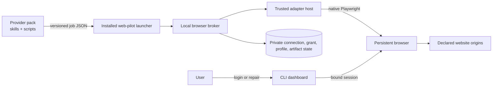

# RFC-0088: Web-pilot foundation

- **Status:** Accepted
- **Author:** eugenelim
- **Approver:** eugenelim
- **Date opened:** 2026-08-14
- **Date entered Experimental:** 2026-08-15
- **Date closed:** 2026-08-24
- **Decision weight:** heavy (authenticated browser state, executable adapters, a new dependency, and public contracts)
- **Related:** RFC-0017 (repo-level contracts), RFC-0031 (catalogue posture), RFC-0034 (catalogue install profiles), RFC-0084 (single sign-on destination trust), `docs/architecture/pack-layout.md`, `docs/architecture/credentials.md`
- **Research notes:**
  - [`0088-notes/playwright-contract-and-browser-landscape-survey.md`](0088-notes/playwright-contract-and-browser-landscape-survey.md)
  - [`0088-notes/plugin-contract-distribution-and-reference-adapter-survey.md`](0088-notes/plugin-contract-distribution-and-reference-adapter-survey.md)
  - [`0088-notes/cross-pack-consumer-pressure-test.md`](0088-notes/cross-pack-consumer-pressure-test.md)
  - [`0088-notes/web-connectors-and-aggregation-survey.md`](0088-notes/web-connectors-and-aggregation-survey.md)
- **Experimental evidence:**
  - [`S1 — persistent bind lifecycle`](0088-notes/spikes/s1-persistent-bind-lifecycle.md)
  - [`S2 — artifact, host, and dependency gate`](0088-notes/spikes/s2-artifact-host-and-dependency-gate.md)
  - [`S3 — safety-rail limits`](0088-notes/spikes/s3-safety-rail-limits.md)
  - [`S4 — open-source substitution check`](0088-notes/spikes/s4-oss-substitution-check.md)
  - [`S5 — cross-pack provider vertical`](0088-notes/spikes/s5-cross-pack-provider-vertical.md)
  - [`S6 — browser-session taxonomy`](0088-notes/spikes/s6-browser-session-taxonomy.md)
  - [`Synthetic fixture source archive`](0088-notes/spikes/experimental-fixture-source-archive.md)
  - [`2026-08-16 Experimental rerun`](0088-notes/spikes/2026-08-16-experimental-rerun.md)
  - [`Experimental rerun evidence archive`](0088-notes/spikes/experimental-rerun-evidence-archive.md)
  - [`2026-08-16 Experimental round 3`](0088-notes/spikes/2026-08-16-experimental-round3.md)
  - [`Round-3 Experimental evidence archive`](0088-notes/spikes/round3-evidence-archive.md)
  - [`2026-08-16 Experimental round 4`](0088-notes/spikes/2026-08-16-experimental-round4.md)
  - [`Round-4 Experimental evidence archive`](0088-notes/spikes/round4-evidence-archive.md)
  - [`Experimental rounds 5 and 6`](0088-notes/spikes/2026-08-16-experimental-round5.md)
  - [`Rounds 5 and 6 Experimental evidence archive`](0088-notes/spikes/round5-evidence-archive.md)
  - [`Experimental rounds 7, 8 and 9`](0088-notes/spikes/2026-08-17-experimental-round7.md) — **current; authoritative over every earlier round**
  - [`Round-7 Experimental evidence archive`](0088-notes/spikes/round7-evidence-archive.md)

`web-pilot` is the proposed name of an opt-in AgentBundle pack that would own
a local authenticated-browser runtime. A **provider pack** is a normal
AgentBundle pack containing skills, deterministic scripts, setup guidance, and
normally a bundled website adapter. A **website adapter** is the lower-level,
immutable executable driver loaded by the runtime. These definitions are local
to this RFC; they are not new catalogue product types.

> ## Read this before the body
>
> **Everything between here and [`## Amendments`](#amendments) is FROZEN and
> historical.** It records the 2026-08-15 Draft → Experimental decision and the
> first run's ledger. It is not the current state, and several of its clauses
> have since been withdrawn as wrong.
>
> - **Do not execute the D2 candidate list.** The body tells a reviewer that S4
>   "must also execute `agent-browser`, OpenChrome, and OpenDevBrowser against
>   the same boundary before acceptance". **Do not.** Executing two of them was
>   itself the hazard, and it caused a real credential exposure. The amended
>   rule in [S4 gate decision](#s4-gate-decision) is authoritative.
> - **The D1–D17 decisions dated "this review" were taken on 2026-08-15.**
>   Eleven of the seventeen rows say "Decide by: this review"; those are
>   historical. **Six are not:** D11 (graduation review), D16 (cross-pack spike,
>   then acceptance), D17 (S2, then first implementation spec) were always later,
>   and **D7 is explicitly still open** — Decision C below asks the approver to
>   rule on it. What is being asked now is in
>   [What the approver is being asked to decide now](#what-the-approver-is-being-asked-to-decide-now).
> - **The 2026-08-15 ledger's five "Blocked" rows are not the current
>   scorecard.** Current verdicts are six Passes — one of them, S1, qualified as
>   "Pass on the named gates; one platform row fails on BOTH platforms — round 10
>   measured on macOS what round 5 measured on Linux" — carrying **six**
>   pre-acceptance blockers, in
>   [Current Experimental state](#current-experimental-state).
> - **Item numbers written before 2026-08-17 refer to older numberings.** This
>   list has been renumbered three times (ten → nine → seven → six). The
>   enumerated list under *Current Experimental state* is the only current one;
>   references elsewhere are marked where they differ.
> - **The body is ~860 lines of history — but read two of its tables**, because
>   they are the vocabulary the amendments use and are defined nowhere else: the
>   **D1–D17 decision table** and the **S1–S6 spike table**. Skip the rest and
>   go to [`## Amendments`](#amendments).
> - **Live state, in one place:** [`## Amendments`](#amendments). Where it and
>   the body disagree, it wins. Where it and the dated audit trail below it
>   disagree, the audit trail is the record of what was believed on a date, not
>   what is true now.

## Reviewer brief

- **Decision:** Whether to validate an opt-in authenticated-browser foundation and its provider-pack/website-adapter contracts.
- **Recommended outcome:** Run only the six bounded pre-acceptance spikes while this RFC is Experimental; accept, reject, or withdraw it from the promoted evidence.
- **Change if accepted:**
  - Add a user-scope `web-pilot` accelerator pack with an embedded, unpublished Node runtime and one lockfile-pinned `playwright` dependency.
  - Add generic JSON Schema contracts for the one-shot local process protocol under the existing `contracts/jsonschema/` tree.
  - Add a provider-pack conformance profile and an opaque `auth: browser-session` credential strategy.
- **Affected surface:** pack metadata and lint, credentialed-skill conventions, user-local runtime state, browser profiles, executable adapter admission, downloads, network policy, and model-result boundaries.
- **Stakes:** Costly to reverse after third-party adapters exist; security-sensitive because admitted code controls an authenticated browser as the user.
- **Review focus:** the validation-versus-behavior authorization split, exact-digest trust, destination scope, and whether the proposed broker remains thinner than an existing browser platform.
- **Not in scope:** production implementation, implementation specs, catalogue or work-queue entries, mutation behaviors, a remote adapter catalogue, an npm SDK, background scheduling, or a vendor-specific reference adapter.

## The ask

- **Recommendation (bottom line up front):** Approve this architecture only to enter `Experimental` validation. The target is a user-scope `web-pilot` pack that installs an embedded Node runtime, owns one authenticated browser profile per connection, loads explicitly admitted immutable website adapters, and exposes a versioned local JSON process contract to provider packs. Keep executable adapters classified as trusted code, not as proven read-only sandboxes.
- **Why now (situation–complication–question):** AgentBundle integration packs can already carry skills, scripts, dependencies, and credentials, but there is no reusable contract for website-only integrations that require user handoff for sign-in and deterministic browser work afterward. Building that contract inside each provider would duplicate profile ownership, credential exposure controls, downloads, repair, and upgrade behavior. The question is whether this catalogue should validate one reusable, local-first browser foundation without moving site data into model context or creating another plugin marketplace.
- **Decisions requested:**

| ID | Question | Recommendation | Why | Decide by | Reviewer action |
| --- | --- | --- | --- | --- | --- |
| D1 | What is the product shape? | New opt-in, user-scope `web-pilot` accelerator pack with an embedded unpublished Node runtime delivered through the current skill and root-bin rails | `core` is repo-only and stack-neutral; the runtime and browser identity are user-local | This review | Confirm pack ownership, delivery, and charter fit |
| D2 | What browser substrate is admitted? | Provisionally, one exact lockfile-pinned direct production dependency: `playwright`; S4 must also execute `agent-browser`, OpenChrome, and OpenDevBrowser against the same boundary before acceptance | Current official Playwright interfaces fit the proposed native adapter ABI, while the 2026-08-15 bounded inventory found three current lifecycle candidates whose broader authority and non-native interfaces remain untested | Experimental spikes | Reopen the broker choice if a candidate removes material lifecycle code without widening authority |
| D3 | What are the extension layers? | Normal provider pack above an immutable website adapter | Keeps agent intent and deterministic domain logic in the catalogue while isolating browser-driver lifecycle | This review | Confirm the two-layer model |
| D4 | Who owns authenticated identity? | A connection owns the browser profile; resources are separately bound beneath it | One login may expose several mailboxes, projects, tenants, or accounts | This review | Confirm connection/resource separation |
| D5 | Where is authorization selected? | Per consumer activation, never globally on the connection | Consumers may migrate digests and resource scopes independently | This review | Confirm exact-grant tuple |
| D6 | How are setup and normal work separated? | Discriminated validation-only and behavior jobs | Authentication cannot become an unreviewed data-release path | This review | Confirm the split is non-negotiable |
| D7 | What is the credential primitive? | `auth: browser-session`; the browser retains authentication | Existing `sso-cookie` exports cookies and is the wrong boundary | This review, then convention amendment after acceptance | Confirm the fifth strategy |
| D8 | How are provider packs discovered? | Existing `integrations` category plus namespaced `pack.metadata.web-pilot.profile = "provider-v1"` | The destination has no `web-automation` category and no `pack.type`; open metadata is already supported | This review | Confirm the destination-specific taxonomy |
| D9 | What is the process framing and contract home? | One job JSON file in, one bounded JSON response on stdout or one bounded typed failure on stderr; cancellation uses process signals; schemas live under existing `contracts/jsonschema/` | The consumer contract is request/response, not a multiplexed service, so JSON-RPC adds an unused envelope and cancellation surface | This review | Confirm one-shot JSON and no JSON-RPC child |
| D10 | Is there an adapter catalogue? | No; provider packs and explicit local artifacts are sufficient initially | A second registry duplicates the catalogue and adds publisher/update trust prematurely | This review | Confirm the non-goal |
| D11 | Is there a public SDK? | No npm publication until a non-AgentBundle consumer or demonstrated authoring drift exists | The current process ABI supplies runtime reuse without Node linking | Graduation review | Confirm evidence-based graduation |
| D12 | What proves construction? | Synthetic `example-service` plus two synthetic provider consumers | Deterministic coverage is in scope; vendor-specific or non-SDLC references are not | Experimental spikes | Confirm the fixture boundary |
| D13 | What is the security claim? | Executable Playwright adapters are exact-digest trusted code with defense in depth | Native `Page`, context, request, and evaluation APIs can mutate or bypass in-process rails | This review | Reject any “sandboxed read-only” wording |
| D14 | What domain may use the foundation here? | Software-delivery integrations only | The charter excludes unrelated personal and business domains | This review | Confirm the scope correction |
| D15 | What does Experimental authorize? | Six throwaway evidence spikes and promotion of their notes only | Architecture acceptance must precede specs and production work | Draft → Experimental decision | Confirm the hard boundary |
| D16 | How does the pack deliver the runtime without a new projection primitive? | Carry the Node package and lockfile inside the setup skill; project a minimal Python launcher through `adapter-root-bins`; setup installs a versioned copy under user-local state | Current projection supports complete skill folders and user-scope Python root bins, but not an arbitrary Node runtime primitive | Cross-pack spike, then acceptance | Confirm the current-rail mapping |
| D17 | What blocks a vulnerable embedded runtime dependency? | S2 must prove a Node lockfile scanner and blocking policy; the first pack cannot merge until that scanner is wired into `build-check` | Current SCA covers Python dependencies, not the embedded Node lockfile | S2, then first implementation spec | Confirm the scanner gate |

### Imported-decision reconciliation

The source bundle arrived with provisional numbering, paths, metadata, and
catalogue assumptions. The following material deviations are intentional and
must remain visible during review.

| Source assumption | Destination evidence | Adaptation | Reason |
| --- | --- | --- | --- |
| RFC-0004 and `0004-notes/` | Next local ordinal is 0088 | Renumber to RFC-0088 and `0088-notes/` | RFC-0087 was assigned on `main` before this branch rebased; local RFC numbers remain unique and sequential |
| A broad browser foundation may serve finance and other personal domains | `docs/CHARTER.md` limits the catalogue to software delivery | Restrict provider and domain examples to software-delivery integrations | Charter scope is binding |
| `web-automation` is an existing category | Current soft vocabulary has `integrations`, not `web-automation` | Use `integrations` plus the namespaced conformance profile; revisit a category after a second provider | Avoid inventing taxonomy for one claimant |
| Required dependencies accept a general SemVer range and resolve by catalogue identity | `pack.schema.json` requires catalogue/pack/version, but install resolves installed packs by short name and accepts only `^X.Y` | Examples use the local catalogue name and `^1.0`; cross-catalogue providers are out of scope | Match the executable contract, not the declarative aspiration |
| A new top-level `contracts/` tree and JSON-RPC child are needed | RFC-0017 and `contracts/jsonschema/` already provide a canonical schema home; the proposed consumer exchange is one-shot | Put job/result/failure schemas under the existing JSON Schema tree and use process signals for cancellation | Avoid duplicate structure and an unnecessary RPC protocol |
| A pack can project an arbitrary embedded runtime directly | Current projection carries complete skill folders and only Python files through the shared root-bin rail | Keep the Node package and lockfile in the setup skill, project a minimal Python launcher, and install an immutable versioned runtime copy during explicit setup | Use supported delivery rails; do not invent a primitive implicitly |
| A real financial sandbox is the likely public reference | The destination charter excludes that product domain | Make `example-service` mandatory; require a separate future RFC for any real-site reference | Avoid a permanent out-of-scope maintenance obligation |
| The connector/aggregation survey promotes named out-of-scope product analogies | The charter makes those domains non-normative here | Preserve the object-model hypotheses as a source-transfer note, drop the product citations, and require S5 synthetic proof | Prevent an external analogy from becoming destination authority |
| A named existing cross-pack provider is the principal migration target | Destination implementation is intentionally not part of this RFC | Preserve the pressure test generically; require two synthetic consumers before acceptance | Keep the foundation review independent of an existing provider refactor |
| Local state used a source-repository-specific home | Existing user state is rooted at `~/.agentbundle/` | Use `~/.agentbundle/web-pilot/` in the illustrative layout | Follow destination conventions |
| Browser binding had a precise introduction-version claim | Current official release and API pages disagree on that historical detail | State the present API only; keep the combined lifecycle as a spike | Do not manufacture historical certainty |

## Problem & goals

### Diagnosis

Authenticated websites require two modes that must share one browser. A user
must sometimes complete passwords, multifactor authentication, passkeys,
CAPTCHAs, consent, or account recovery. Normal retrieval should then be
deterministic, bounded, typed, and frugal with model context. Provider-local
browser implementations tend to split those modes across profiles and duplicate
login handoff, network observation, download validation, profile locking,
repair, and redaction.

AgentBundle dependencies do not link packages at runtime. The install gate only
checks that a required pack name and compatible version are already present in
the union of user, repo, and local install state. A reusable foundation therefore
needs a stable installed launcher and process protocol; importing projected
files from another pack is not a supported composition mechanism.

### Goals

- Preserve the same live browser across user authentication and deterministic adapter work.
- Keep credentials, cookies, tokens, passkeys, authenticated headers, storage state, profiles, and raw captures outside skills and model context.
- Let provider packs remain ordinary AgentBundle products with self-contained skills and scripts.
- Admit only exact immutable adapter artifacts, with explicit upgrade and rollback per consumer.
- Separate connection identity, resource identity, and behavior authorization.
- Validate inputs and outputs against exact schemas before browser launch and before result release.
- Make drift, expiry, wrong-login, resource changes, crashes, and ambiguous profile ownership typed failures.
- Prove the contract without live credentials through a synthetic site and two provider consumers.

### Non-goals

- Website mutations: sends, submissions, configuration changes, deletes, purchases, trades, transfers, or form submission.
- A searchable adapter marketplace, remote version index, publisher service, or automatic update feed.
- Executing mutable Git branches or development directories during normal jobs.
- Treating native Playwright, Node's Permission Model, request routing, or TypeScript types as a malicious-code sandbox.
- Sending raw HTML, JSON, screenshots, traces, downloads, or authentication material to a model by default.
- Background scheduling, a remote browser backend, or a multi-user daemon in the first release.
- A public npm SDK before its graduation criteria are met.
- Domain contracts unrelated to software delivery.

## Proposal

### Product and ownership boundaries

`web-pilot` would be an opt-in, user-scope accelerator pack. It clears the
charter's accelerator exception only while it remains tied to software-delivery
integrations, declares an experimental/validated maturity state, has a named
maintainer, and carries an archive/deprecation path. It is not added to a default
profile.

The layers are deliberately separate:

| Layer | Owns | Must not own |
| --- | --- | --- |
| Provider skill | User intent, judgment, sequencing, presentation, setup and repair guidance | Browser launch, profile reads, raw credentials |
| Provider script | Deterministic provider-domain transforms that do not need a live browser | Imports from sibling skills or another pack projection |
| Website adapter | Authentication predicates, identity evidence, origins, selectors, endpoint contracts, downloads, named read behaviors | Agent prompts, user intent, global profile lifecycle |
| `web-pilot` runtime | Profile ownership, broker lifecycle, adapter admission, authorization, policy observation, schemas, redaction, artifacts, failures | Provider workflow semantics or domain normalization |
| User-local state | Connections, resources, grants, profiles, installed adapter digests, artifacts, diagnostics | Source-controlled data |

The normal path is:



The model sees only a user-authorized normalized summary or an opaque artifact
handle. Website content is untrusted data, never instructions, and is not
written to persistent agent memory automatically.

### Provider-pack conformance

The destination has no exclusive pack type and no current `web-automation`
category. A provider uses the existing soft category plus an open namespaced
metadata table:

```toml
[pack]
categories = ["integrations"]

[[pack.dependencies.required]]
catalogue = "agent-ready-repo"
pack = "web-pilot"
version = "^1.0"

[pack.metadata.web-pilot]
profile = "provider-v1"
declared-intent = "read-only"
setup-skill = "example-provider-setup"
web-skill = "example-provider-web"
adapter-delivery = "bundled"
```

Here **provider conformance profile** means a construction contract selected by
namespaced metadata. It is unrelated to a catalogue **install profile**, the
catalogue-level manifest that installs an ordered group of packs. The metadata
is a construction claim about intended behaviors, not runtime authority or a
sandbox guarantee; approval surfaces must still warn that trusted executable
code can mutate. Before acceptance, no linter understands it.
After acceptance, a follow-on spec must define static checks for the foundation
dependency, named skills, bundled candidate, read-only behavior declarations,
synthetic fixtures, and rendered-install boundaries.

The destination dependency gate ignores `catalogue` while resolving installed
state and supports only caret-minor ranges. This RFC does not extend it. A
provider from another catalogue must still arrange for an installed short-name
`web-pilot` dependency without relying on cross-catalogue resolution; improving
that resolver is a separate RFC.

### Connection, resource, and activation model

A **connection binding** owns one authenticated login, one browser-profile
namespace, a stable user alias, an adapter identity namespace, and immutable
configuration generations. A **resource binding** is a separately aliased
object visible through that login, such as a project, tenant, mailbox, or
workspace. Provider identifiers stay local.

A **consumer activation** is the authorization record for one provider
consumer. It selects:

- declared installed-consumer identity, used for confused-deputy checks among conforming callers;
- connection identity and configuration generation;
- exact admitted adapter digest;
- resource binding IDs and immutable resource-scope digest;
- behavior ID and version;
- input and output schema digests;
- sensitivity class and result policy; and
- expiry/revocation state.

The connection never has one globally active adapter digest or behavior set.
Two consumers may use the same connection with independent grants and migrate
digests separately. A newly discovered resource does not inherit an existing
grant.

Binding selectors are not capabilities. Before every behavior profile lease,
the runtime reconstructs a canonical scope object from local state, verifies an
HMAC-SHA-256 digest using an installation-local secret, checks the complete
activation tuple, and rechecks live binding identity. The secret is stored in
the user-private runtime state with current-user-only permissions. It is a
fresh, per-installation secret of at least 256 bits generated by the operating
system CSPRNG before any grant is signed; it is never deterministically
derived, reused from another installation, exported, or logged. This HMAC
detects tampering, torn writes, and accidental substitution of scope or
configuration records. Stale or replayed but validly signed records are
rejected by explicit generations, the activation tuple, expiry/revocation
state, and the live-identity check—not by the HMAC. The HMAC is not an
authorization boundary against another malicious process running as the same
operating-system user, which can replace both the secret and the grant files.
Strong consumer identity requires a later OS isolation boundary. Rotating the
secret invalidates existing grants and requires explicit re-consent; the
runtime never silently re-signs them.

V1 trusts processes already running as the same operating-system user. Each job
declares an installation-local `consumerIdentity`, and the launcher requires it
to equal the setup authorization or behavior grant before dispatch. This
prevents accidental grant substitution and catches a conforming provider using
another provider's grant ID; it does not make the grant non-transferable to a
malicious same-user process that can read or forge local invocation state. S5
tests declared-identity/tuple isolation only. Strong pack-to-pack principals or
bearer-proof claims require an OS isolation design and are not v1 guarantees.

### Validation-only versus behavior execution

The launcher is a one-shot process contract, not JSON-RPC: it accepts exactly
one confined job JSON file, emits exactly one bounded success object on stdout
or one bounded typed failure on stderr, and exits. `protocolVersion` supplies
the handshake. Cancellation and deadlines use operating-system process signals
plus the job's fixed deadline; no multiplexing, notifications, server-initiated
messages, or remote transport exist in v1. The authorization paths are
disjoint:

```ts
interface JobBaseV1 {
  protocolVersion: "1.0";
  jobId: string;
  connectionBindingId: string;
  consumerIdentity: string; // local declared pack identity; not a strong principal
  deadlineAt: string; // RFC 3339 UTC; cannot exceed the host policy maximum
}

interface ConnectionValidationJobV1 extends JobBaseV1 {
  kind: "connection-validation";
  setupAuthorizationId: string;
  operation: "authenticate" | "resolve-identity" | "health";
  resultPolicy: "local-validation-only";
}

interface BehaviorJobV1 extends JobBaseV1 {
  kind: "behavior";
  consumerGrantId: string;
  resourceBindingIds: string[];
  resourceScopeDigest: string;
  behavior: {
    id: string;
    contractVersion: string;
    inputSchemaDigest: string;
    outputSchemaDigest: string;
    sensitivityClass: "summary" | "sensitive";
    input: unknown;
  };
  resultPolicy: "agent-summary" | "local-artifact-only";
}
```

A validation job has no behavior, resource scope, consumer grant, artifact
writer, checkpoint, adapter-payload logger, or result-release operation. A
behavior job cannot name a setup authorization. Unknown or mixed fields are
rejected before browser launch. A missing, expired, malformed, or host-maximum-
exceeding deadline is rejected before a profile lease; the host timer remains
authoritative and cancels the child even if the adapter ignores its
`AbortSignal`. The host may record fixed, enum-bounded lifecycle events for
validation, but the adapter cannot supply their payload.

`resolve-identity` is also the only setup-time resource-discovery path. It
returns fixed-schema `BindingIdentityEvidence` to the host process only:
runtime-only connection/resource correlation values, ephemeral candidate keys,
an adapter-declared resource-kind enum, and an optional bounded local display
hint. The host may render those candidates in a host-owned local confirmation
UI so the user can assign aliases and choose resources. The evidence and display
hint never cross provider stdout/stderr, an artifact, a diagnostic event, or
model context; rejected/unselected candidates are discarded. Confirmation
creates the first resource generations and scope digest. This local UI is not a
behavior result-release surface.

Sensitivity and delivery are orthogonal. `sensitivityClass` classifies the
payload; `resultPolicy` selects whether any validated projection may reach the
agent or only a local artifact may be committed. Both job values must exactly
match the active grant. Any change, including a narrower delivery policy,
requires an explicit grant amendment so implementations cannot invent a
partial ordering.

Initial connection flow is:

1. Admit one exact adapter digest after non-executing artifact inspection.
2. Approve a short-lived setup authorization limited to the declared login origin and fixed authentication, identity, and health contracts.
3. Launch a dedicated persistent profile and bind the live browser for user handoff.
4. Run the adapter authentication predicate and binding-identity predicate.
5. Ask the user to confirm the connection alias and selected resources.
6. Record immutable configuration generations and keyed identity evidence.
7. Obtain a separate consumer behavior grant.
8. Only then dispatch a behavior against the same live browser.

For an existing connection, wrong identity returns
`connection-identity-mismatch` before behavior traffic or data release. If
stable identity evidence is unavailable, every new browser process or
reauthentication increments the connection generation and invalidates prior
grants.

### Browser-session credential boundary

The browser retains authentication. `web-pilot` is the opaque credentialed CLI
primitive and never returns cookies, tokens, passkeys, storage state, browser
headers, or profile paths to a skill. Existing `auth: sso-cookie` explicitly
resolves cookies, so reusing it would contradict the boundary. After acceptance,
a convention amendment may add:

```yaml
metadata:
  credentialed: true
  primitive-class: credentialed-cli
  auth: browser-session
```

The future lint must recognize only the installed launcher contract, reject
cookie-resolver imports and credential-shaped arguments, and verify that jobs
carry opaque connection, grant, behavior, resource-scope, and input values.
This RFC does not edit conventions or lint while Draft or Experimental.

### Runtime delivery and browser lifecycle

The current pack contract has no arbitrary Node-runtime projection primitive.
This RFC therefore maps delivery onto existing rails rather than assuming one:

```text
packs/web-pilot/.apm/skills/web-pilot-setup/scripts/runtime/
  package.json
  package-lock.json
  dist/                         # embedded unpublished runtime payload
packs/web-pilot/.apm/adapter-root-bins/web-pilot.py
  -> ~/.agentbundle/bin/web-pilot.py

explicit setup
  -> ~/.agentbundle/web-pilot/runtime/<pack-version>/
  -> ~/.agentbundle/web-pilot/current activation record
```

The setup skill owns the Node package, exact lockfile, and embedded payload.
The existing user-scope `adapter-root-bins` rail carries only a minimal
pure-stdlib Python launcher; it does not carry the Node runtime or contain
browser logic. Explicit setup copies and verifies the versioned payload into
user-local state, resolves the manifest-declared runtime prerequisites, and
atomically changes the current activation only after checks pass. The launcher
fails closed when the activated runtime is absent, corrupt, incompatible, or
belongs to a disabled pack. Provider packs call this stable launcher and never
locate a projected skill. S5 must prove the mapping against both source and
rendered installations; failure reopens D16 before any pack implementation.

The pack manifest's existing `runtime-dependencies` surface records the system
Node prerequisite and exactly one direct production npm dependency: an exact
`playwright` version. The setup skill's lockfile pins and scans all transitives
and is the dependency source of truth. Separately approved, exact-pinned
build-only tooling is permitted only when S2 proves it necessary; it is not
shipped in the runtime artifact and its addition is recorded as a material RFC
decision before acceptance. No other production dependency, crawler,
model-driven browser framework, standalone MCP package, stealth plugin, or
remote-browser SDK is admitted initially.

The recommended broker is on-demand and user-local. It owns process liveness,
profile leases, crash detection, idle shutdown, a private local endpoint, and
redacted lifecycle events. It launches a headed persistent context, obtains the
owning browser, binds it, and allows separately authorized CLI dashboard
attachment. One connection executes jobs serially; different profiles may run
concurrently under a global cap.

All endpoints live in a user-private run directory and prefer Unix-domain
sockets or named pipes. Any loopback WebSocket fallback requires a per-launch
unguessable credential delivered out of band, current-user access checks, and
no stable port. Every dashboard or repair attachment credential is bound to the
current user, connection, profile/identity generation, and single declared
purpose; it is short-lived and single-use for attachment establishment. It is
revoked on timeout, cancellation, browser/broker crash, disconnect, identity
change, or repair completion. Endpoint credentials never enter jobs, logs, or
model context.

Official documentation establishes the individual APIs, not the complete
persistent-profile → bind → attach → crash/reconnect behavior. Experimental
spike S1 must test the composition before it becomes a contract.

### Website-adapter artifact and runtime contract

An adapter artifact contains inert metadata separately from executable code:

```text
adapter-package/
├── web-pilot.adapter.json
├── dist/adapter.mjs
├── contracts/
├── provenance.json
└── conformance/synthetic-fixtures/
```

The installer reads and validates the manifest without importing the entry
point. It rejects absolute paths, traversal, symlinks, native add-ons, install
scripts, remote schema references, unexpected executables, and entry points
outside the artifact root. Files are staged outside the final digest path,
hashed, marked complete, and atomically finalized where the platform supports
it. Incomplete or mismatched trees are quarantined. Trust approval is stored
outside the artifact and cannot be reconstructed from bytes alone.

`provenance.json` is inert, digest-covered metadata naming the source origin
and immutable ref/archive digest, build recipe, toolchain, dependency lockfile
digest, build materials, and whether reproducibility was attempted and
achieved. Admission verifies internally referenced materials without executing
the adapter. If the source-to-artifact relationship cannot be independently
verified, the artifact is labelled `source-unverified trusted code`, requires a
distinct explicit approval, and can never activate automatically. Immutability
does not substitute for provenance or publisher trust.

The manifest declares adapter identity/version, runtime and Playwright
compatibility, exact origins by purpose, login and identity contracts,
per-connection profile strategy, configuration schemas, read behaviors,
input/output schema paths and digests, sensitivity class, method rules, Service Worker
posture, artifacts, and bounded health signals. Origin rules are structured
HTTPS scheme/ASCII host/effective-port values. Live adapters reject loopback,
private, link-local, multicast, and metadata destinations after DNS resolution
and on every redirect/connection. Synthetic fixtures may request an explicit
loopback/HTTP exception that is invalid for other environments.

Protocol and manifest versions use `MAJOR.MINOR`. Minor versions may add
optional fields or failure kinds; semantic changes require a major. Behavior
versions follow SemVer independently, and a published behavior version's schema
digests are immutable. The runtime rejects unsupported version windows before
browser launch and preserves unknown failure kinds as bounded
`unknown-runtime-failure` results.

### Native Playwright and trusted-code posture

Capable adapters receive the host's native pinned `Page` and `BrowserContext`
plus mode-specific fixtures. The adapter neither bundles nor launches
Playwright.

```ts
interface BrowserExecutionBase {
  readonly page: Page;
  readonly context: BrowserContext;
  readonly signal: AbortSignal;
}

interface ValidationExecution extends BrowserExecutionBase {
  readonly job: Readonly<ConnectionValidationJobV1>;
  readonly connection: Readonly<{ alias?: string; config: unknown }>;
  // Deliberately no local resource bindings, artifact writer, adapter logger,
  // checkpoint sink, behavior request, or result-release capability.
}

interface BehaviorExecution extends BrowserExecutionBase {
  readonly job: Readonly<BehaviorJobV1>;
  readonly connection: Readonly<{ alias: string; config: unknown }>;
  readonly resources: readonly Readonly<{
    resourceBindingId: string;
    alias: string;
    kind?: string;
    config: unknown;
  }>[];
  readonly artifacts: ArtifactWriter;
  readonly log: RedactedAdapterLogger;
  checkpoint(checkpoint: Readonly<{
    ruleId: string;
    completedPages?: number;
    completedItems?: number;
  }>): void;
}
```

A checkpoint is an internal progress observation, not a general adapter output
channel. `ruleId` must be a manifest-declared public-safe opaque identifier;
counts are non-negative bounded integers; no free-form string, cursor, URL,
provider identifier, page content, authentication material, or adapter-defined
object is accepted. The fixed schema is capped at 4 KiB, redacted and validated
before it enters quarantined job state, and is never released as a result,
artifact, diagnostic, log payload, or model-visible value. An invalid or
oversized checkpoint fails closed with `invalid-checkpoint`, cancels the job,
and prevents every result or handle release. Finalization removes its
quarantined checkpoint state; exceptional paths follow the fixed retention rule
without widening its audience.

Native Playwright exposes evaluation, clicks, form submission, route removal,
context access, downloads, WebSockets, and an authenticated request client with
mutating methods. Admitting a `trusted-playwright` artifact is approval to run
reviewed same-user code with the authenticated browser. Broker-installed routes,
event observation, method/origin rules, Service Worker blocking, sanitized
environment, child-process/native-addon denial, filesystem restrictions, and
Node permissions are safety rails against mistakes and drift. They are not a
security boundary against malicious admitted code.

A separate `declarative` execution tier may interpret a small allowlisted
operation set and make a stronger restriction claim. It must not become the ABI
for capable adapters or force the foundation to mirror Playwright.

### Network, downloads, filesystem, and result handling

Source preference is: supported customer API or export, website download,
observed same-origin internal API, then DOM extraction. Internal endpoints are
documented as unstable and never represented as supported public APIs.

The context-associated request client may be used for same-origin
cookie-authenticated reads because current Playwright documentation confirms it
shares the browser context's cookie jar. Application-held bearer tokens may be
used only inside the browser/adapter runtime through observed requests or
in-page fetch. No token, cookie, authenticated header, replayable request, or
raw response crosses the consumer protocol.

Downloads are written only through a generated-path artifact writer beneath one
canonicalized job root. The host validates declared origin, period or selector,
status, media type, magic bytes, size, safe filename properties, and hash before
commit. Adapter-supplied paths are forbidden. Retention is bounded and purge
targets only runtime-owned directories.

Results and artifacts use a two-phase commit. Job output remains quarantined
until behavior-output schema validation, artifact validation, authorization
recheck, sensitivity/result-policy checks, and finalization all succeed. A
timeout, cancellation, component crash, or schema/policy failure releases no
result, checkpoint, artifact handle, or diagnostics handle; it emits one
bounded typed failure and precisely purges or quarantines the generated job
temporary state according to the fixed retention policy.

The first release uses these falsifiable default ceilings. S2/S3 may recommend
different values, but any change before acceptance is recorded in the decision
log and retains both a byte/count bound and an age/cleanup rule.

| State | Default hard bound | Retention / cleanup trigger | Exhaustion behavior |
| --- | --- | --- | --- |
| Protocol stdout | 256 KiB serialized, one response | Process exit | Fail with `resource-limit-exceeded: result-bytes`; release no partial JSON |
| Protocol stderr | 16 KiB serialized, one failure | Process exit | Truncate only at schema-approved field boundaries and emit `resource-limit-exceeded: failure-bytes` |
| Committed artifacts | 512 MiB and 50 files per job; 20 completed jobs per connection | 30 days or explicit exact-job purge, whichever is earlier | Refuse commit with `resource-limit-exceeded: artifact-quota`; preserve prior committed jobs |
| Diagnostics | 64 MiB per job; 10 completed diagnostic jobs per connection | 7 days or explicit exact-job purge | Stop capture and return the original bounded failure plus `diagnostics-truncated: true` |
| Quarantine / staging | 1 GiB and 20 entries per installation | 7 days; cleanup at startup and before install | Refuse new install/job finalization with `storage-quota-exceeded`; never evict an active or rollback target |
| Active browser profile | One profile per connection, 5 GiB | No age purge while active; 7 days after disconnect-local unless the user purges sooner | Refuse launch with `resource-limit-exceeded: profile-bytes`; never delete browser state implicitly |

Cleanup runs under the same path jail and lock as the owning store. A cleanup
failure is a bounded `retention-cleanup-failed` event; it never broadens a
deletion target or silently discards an active profile, activation, or rollback
artifact. The runtime reports current usage and the exact user action needed to
purge a generated job, retired connection, or quarantined entry.

Stdout contains one bounded protocol response. Nonzero exits emit one bounded,
redacted typed failure on stderr. Neither channel may contain raw stacks,
environment values, URLs, headers, page text, browser errors, subprocess output,
or local paths. Detailed diagnostics remain in the confined local store behind
an opaque handle.

Lifecycle observability uses a fixed `DiagnosticEventV1`, not adapter-authored
prose. One event is at most 8 KiB and contains only: schema version; opaque
correlation/job IDs; RFC 3339 timestamp; component and phase enums; outcome;
adapter ID/version/digest; declared behavior and rule IDs; connection/resource
aliases when the user marked them safe; schema digests; bounded
page/item/byte/retry counts; typed failure kind; retryability; and a fixed
recovery-action enum. Every terminal failure includes correlation ID,
timestamp, component, phase, failure kind, retryability, and recovery action.
URLs, headers, DOM/page text, provider identifiers, values, filenames, local
paths, environment data, raw exceptions/stacks, and arbitrary adapter strings
are schema-invalid. Construction fixtures must prove both usefulness of the
minimum terminal event and rejection of every forbidden field class.

Illustrative local state:

```text
~/.agentbundle/web-pilot/
├── bin/web-pilot
├── runtime/<pack-version>/
├── registry.json
├── adapters/store/<sha256>/
├── connections/<generated-id>/
├── profiles/<generated-id>/
├── artifacts/<generated-id>/<job-id>/
├── diagnostics/<generated-id>/<job-id>/
└── run/
```

Generated IDs, never aliases, URLs, adapter metadata, or downloaded filenames,
form path components. Every resolved path must remain inside its owner root after
symlink or junction resolution.

### Domain-profile boundary

`web-pilot` owns only generic provenance, authorization, artifact, health, and
failure envelopes. A domain conformance profile may be advertised only after an
accepted RFC names its owner pack, versioned definition, exact definition and
schema digests, sensitivity floor, canonical fixtures, and behavior-role
mapping. The provider must depend on that owner pack. Catalogue conformance
verifies the inert declaration and fixtures; the browser runtime treats the
payload as opaque.

No domain profile is created by this RFC. Source-bundle domain-profile sketches
are non-normative and are not promoted as destination capabilities or
machine-discoverable claims.

### Installation, upgrade, rollback, and repair

Installation and activation are separate transitions:

```text
install provider pack
  -> inspect candidate artifact without execution
  -> show exact digest and behavior/schema/origin/method/trust diff
  -> approve constrained execution of that digest
  -> stage and finalize disabled immutable artifact
  -> run synthetic conformance
  -> authorize validation-only connection setup
  -> confirm live identity and resource aliases
  -> approve exact consumer behavior grant
  -> activate atomically; retain prior activation for rollback
```

A provider pack update may carry a new candidate but never admits or activates
it silently. Normal execution never loads a mutable checkout. Public or private
Git may host provider-pack or adapter source; Git credentials and source updates
remain outside the runtime.

Connection and resource configuration use immutable generations independent of
adapter code. A migration copies prior configuration into staging, validates the
candidate, and requires per-consumer activation. Adapter code never migrates a
browser profile.

Supervised repair attaches approved CLI/tooling to the same browser and may
capture time-bounded raw local diagnostics. It cannot package, admit, activate,
or send captures to a model automatically. A model-proposed patch remains
untrusted source requiring human review, tests, a new digest, and explicit
activation.

### No second catalogue and no npm SDK

V1 has no adapter search, publisher namespace, remote index, automatic update
feed, marketplace UI, or mutable remote loader. A future distribution RFC needs
observed independent publishers, multi-user approval/revocation needs, a
non-AgentBundle consumer, or material failure of direct immutable installation.
Its first option must be the existing AgentBundle catalogue.

The process ABI and copied/generated types are sufficient for current
AgentBundle consumers. Publish an npm SDK only when a second non-AgentBundle
consumer exists, multiple foundational packs need in-process imports, or two
independent provider implementations demonstrate schema/type drift that copied
types and contract tests cannot control.

## Experiment / validation

Moving this RFC to `Experimental` authorizes only throwaway prototypes in an
approved temporary path and promotion of evidence notes under
`0088-notes/spikes/`. It does not authorize a pack, dependency, production code,
implementation spec, catalogue entry, changelog entry, guide, or queue item.

### Experimental run ledger — 2026-08-15

| Spike | Result | Decision effect | Exit disposition |
| --- | --- | --- | --- |
| [S1](0088-notes/spikes/s1-persistent-bind-lifecycle.md) | Blocked at browser launch for bundled and system channels | No initial OS/browser support row is accepted; D2 remains operationally unproven | Rerun outside the enterprise Mach-port restriction |
| [S2](0088-notes/spikes/s2-artifact-host-and-dependency-gate.md) | Artifact/host construction passed; vulnerability-database access blocked | Self-contained ESM archive needs no demonstrated bundler, but D17 has no scanner or blocking policy | Rerun scanner clean and controlled-vulnerable cases; rerun native host after S1 |
| [S3](0088-notes/spikes/s3-safety-rail-limits.md) | Local file/data rails passed; browser/network corpus blocked | Preserve the trusted-code claim; no browser rail is promoted to enforced read-only | Rerun the complete browser/network corpus after S1 |
| [S4](0088-notes/spikes/s4-oss-substitution-check.md) | Bounded candidate inventory recorded; executable conformance blocked | Retain the thin broker provisionally; add `agent-browser`, OpenChrome, and OpenDevBrowser to the mandatory rerun because their current daemon/profile lifecycles are material candidates | Run all candidates through the same S1/S3 corpus before acceptance |
| [S5](0088-notes/spikes/s5-cross-pack-provider-vertical.md) | Pack projection, dependency, and grant isolation passed; same-browser row blocked | D16 and the exact-grant/validation split are constructible on current rails | Rerun same-browser handoff after S1 |
| [S6](0088-notes/spikes/s6-browser-session-taxonomy.md) | Prototype feasibility passed | D7 is feasible without cookie export; current production lint and conventions remain unchanged | Satisfied for Experimental evidence; convention amendment still waits for acceptance |

These results are intentionally not rewritten as positive architecture proof.
S1, S2, S3, S4, and S5 remain open Experimental gates. The S4 candidate-set
change is the only new material ecosystem deviation: the broker decision must
be reopened if any of the three newly load-bearing candidates passes the
native-adapter and authority tests.

The RFC may advance from Experimental only when all six spikes satisfy the
evidence contract below, S2 identifies a Node lockfile scanner and blocking
policy that the first implementation spec must wire into `build-check`, S1
records the accepted initial OS/browser support matrix and explicit deferrals,
and any decision-changing result has passed targeted adversarial,
security-design, and quality review. No foundation pack may merge until that
scanner runs against the frozen runtime lockfile and fails on the accepted
severity/policy threshold.

Every promoted spike note must contain:

| Evidence field | Required content |
| --- | --- |
| Reproduction identity | Exact OS/architecture, browser channel/version, Node and Playwright versions, artifact/lockfile digests, tool versions, and repository ref |
| Reproduction procedure | Copy-paste-safe commands, synthetic fixture paths relative to the repository or approved temporary root, setup/cleanup, and expected exit status |
| Scenario matrix | One row per scenario ID with precondition, stimulus, expected observable/failure kind, actual bounded observable, pass/fail, and evidence digest/path |
| Sensitive-data disposition | Confirmation that only synthetic inputs and redacted bounded outputs were promoted; raw local diagnostics remain outside the repository |
| Decision impact | Which decision/assumption the result confirms, revises, defers, or rejects; owner and required targeted re-review |

A summary assertion without the scenario rows and reproducible fixture is not
evidence and cannot satisfy Experimental exit.

| Spike | Load-bearing question | Required scenario groups | Pass bar / decision output |
| --- | --- | --- | --- |
| **S1 — Persistent bind lifecycle** | Can one owner preserve same-browser handoff and recover safely? | Persistent launch; owning-browser lookup; bind and CLI/dashboard attach; default-context visibility; disconnect/reconnect; short-lived attachment expiry; browser close; owner crash; stale/ambiguous lock; clean shutdown; bundled Chromium and one system channel | Every scenario has deterministic state/typed failure; choose the initial OS/browser matrix or explicitly defer a row |
| **S2 — Artifact, host, and Node dependency gate** | Can exact adapter/runtime artifacts be inspected, scanned, and executed without hidden dependency surfaces? | Plain ESM, package archive, bundled ESM; non-executing manifest/provenance inspection; install-script/native-addon refusal; host-supplied Playwright; sanitized environment; output validation; source-verified and source-unverified approval; throwaway lockfile scanner pass/fail; proposed frozen-lockfile CI command | Select artifact shape and any bundler; record mandatory provenance; prove the scanner catches a controlled vulnerable fixture and define blocking policy |
| **S3 — Safety-rail limits** | Which read-only controls prevent, detect, or cannot observe capable-adapter behavior? | Page-route precedence/removal; Service Workers; page and worker fetch; WebSockets; redirects; DNS rebinding; browser proxy; inherited proxy environment; raw Node egress; every request-client method; path/symlink escape; logging; downloads; each retention/quota and two-phase-commit failure | Apply exact origin/method/DNS policy wherever controllable; classify every channel and preserve the trusted-code claim for every unobservable path |
| **S4 — Substitution check** | Does an existing local-first broker remove material lifecycle code without widening authority? | Dated candidate inventory; reproducible search and inclusion criteria; official primary contract/version evidence per candidate; same profile ownership, handoff, deterministic adapter, crash recovery, attachment lifetime, local containment, dependency/update posture; responsibility-by-responsibility comparison matrix | Survey at least the pinned browser's bundled interface plus every candidate meeting the recorded criteria; adopt only when a candidate passes the same scenarios and removes named custom responsibilities, otherwise retain the thin broker with a falsifiable rejection row for each candidate |
| **S5 — Cross-pack vertical** | Does the current pack system deliver and isolate the foundation for two conforming consumers? | D16 payload/root-bin/versioned-install map; source and rendered installs; dependency absence; stable launcher only; no cross-pack imports; provenance survival; source-unverified approval; host-only identity/resource candidate display and discard; two declared consumer identities and grants with distinct behavior/schema/resource tuples; mismatched identity/grant pair; ungranted resource; sensitivity-only mismatch; result-policy-only mismatch; attempted narrower policy without grant amendment; positive cases for `agent-summary` and `local-artifact-only`; independent digest upgrade; same-browser handoff | Candidate evidence reaches only the local confirmation UI; every tuple, sensitivity, result-policy, or declared-identity mismatch fails before browser launch; both exact policy cases pass; rendered artifacts match source contracts; no claim is made against a malicious same-user caller |
| **S6 — Credentialed-skill taxonomy** | Can lint recognize an opaque browser session without creating a credential export path? | Accepted launcher form; cookie-resolver import; credential-shaped argv; cookies/tokens/storage state/auth headers on stdout, stderr, job JSON, diagnostics event, or model result | Only opaque selectors and behavior input cross the consumer boundary; every credential-shaped fixture is rejected |

Post-acceptance gates remain separate: transactional registry fault injection,
full platform support, and any real-site reference adapter. None may be smuggled
into Experimental work.

## Testing strategy after acceptance

Verification is split by artifact and test level; no single end-to-end journey is
allowed to substitute for lower-level contract or fault tests.

| Owning follow-on artifact | Test level | Required verification | Release gate |
| --- | --- | --- | --- |
| Credentialed-skill convention amendment | Static metadata/lint | Exact launcher form; exactly one npm `playwright` runtime dependency with an exact version; lockfile/scanner-input match; no additional runtime npm dependency without an accepted decision; browser-session credential-exfiltration fixtures | Amendment accepted before Spec 1 implementation |
| Spec 1 — foundation delivery and lifecycle | Contract plus construction | Manifest/job/failure handshake; malformed, expired, and host-maximum-exceeding deadlines rejected before profile lease; host timer cancels an adapter that ignores `AbortSignal`; exactly one terminal protocol object and no result/artifact/diagnostic handle after cancellation; validation fixture surface absence; D16 source/render/install mapping; persistent browser/attachment lifecycle bound to the S1 support matrix; two-provider authorization journey; scanner wired into `build-check` | Must pass before the first foundation pack can merge |
| Spec 1 — installation-state acceptance gate | Component fault injection | Interrupt artifact copy, hashing, completion marker, admit, activation, configuration staging, upgrade, rollback, repair, and registry reconstruction at every transition; prove no torn activation and no loss/change of prior grant, profile, or rollback target | Must pass before the first foundation pack can merge |
| Spec 2 — results, files, policy, and diagnostics | Contract, property, and malicious-fixture tests | Result/artifact/diagnostic schemas; two-phase commit; every quota/retention trigger; origin/DNS/method policy; downloads/path jail; S3 bypass corpus; terminal-event usefulness and forbidden-field rejection | Must pass before behavior results or downloads ship |
| Spec 3 — developer workbench | Construction and operator-recovery tests | Mutable dev-link isolation; supervised probe/repair authorization; capture retention; package/provenance diff; explicit activation and rollback | Must pass before repair tooling ships |
| Each adopting provider spec | Source/rendered conformance plus synthetic journey | Reject sibling-skill reads, projection imports, provider-owned Playwright, undeclared cross-pack imports, missing dependency, metadata mismatch, schema/grant mismatch, and resource widening | Required per provider; does not weaken foundation gates |
| Local smoke protocol | Supervised live check | Explicit supported-matrix browser/site check with raw results local only | Never a CI substitute or acceptance proof by itself |

An authorization-order fixture must prove validation can call only
authentication, identity, and bounded health. Attempts to execute a behavior,
observe existing local resource bindings, write an artifact, log adapter
payload, checkpoint, or release data must fail before dispatch. Fixture-level
type and runtime probes must show those properties and methods are absent, not
merely reject calls after data has been exposed. Only a committed consumer
grant may open the behavior surface. A paired setup fixture proves
`resolve-identity` candidate evidence is schema-bounded, rendered only by the
local host confirmation UI, discarded on rejection, and absent from provider
stdout/stderr, artifacts, diagnostic events, and model results.

## Options considered

The options are MECE along three independent axes: browser ownership, adapter
expressiveness, and distribution. Each axis includes do-nothing.

### Browser ownership axis

| Option | Benefit | Cost / failure mode | Verdict |
| --- | --- | --- | --- |
| Provider-local browser scripts (do nothing) | No new pack | Duplicated profiles, controls, downloads, and repair; no shared handoff contract | Reject |
| CLI-only owner | Strong dashboard and handoff | Function/command surfaces are not a general module loader | Reject as production loader |
| Library-only owner | Direct imports and type safety | No durable standard handoff/dashboard attachment surface | Insufficient alone |
| Library broker plus bound CLI | Same live browser, native imports, bounded lifecycle owner | Adds a small process, IPC, locks, and crash recovery | Recommend, subject to S1 |
| Remote browser service | Managed session lifecycle | Authenticated state leaves the device; adds service and cost boundaries | Defer |

### Adapter expressiveness axis

| Option | Benefit | Cost / failure mode | Verdict |
| --- | --- | --- | --- |
| Declarative only | Strongest enforceable restriction | Cannot express all site authentication, observation, and download flows | Supported tier, not sole ABI |
| Home-grown browser facade | Narrow apparent API | Mirrors and lags Playwright; still bypassable if native objects leak | Reject |
| Native Playwright trusted code | Durable ecosystem contract and capable adapters | Cannot prove read-only against malicious approved code | Recommend with honest trust |
| OS/container isolation for hostile code | Stronger containment | Platform complexity and a different product boundary | Future option |
| No adapters (do nothing) | No executable extension risk | Every provider must modify the foundation or duplicate browser code | Reject |

### Distribution axis

| Option | Benefit | Cost / failure mode | Verdict |
| --- | --- | --- | --- |
| Provider pack plus exact local artifact | Reuses the catalogue; separates product install from code trust | Explicit approval and update ceremony | Recommend |
| Mutable local folder or Git checkout | Easy development | Time-of-check/time-of-use drift | Development mode only |
| Private npm package | Native Node resolution | Registry credentials, release, install-script, and supply-chain surface | Defer |
| New adapter catalogue | Discovery and centralized updates | Duplicates catalogue infrastructure and publisher governance | Reject initially |
| Hard-code adapters in foundation (do nothing) | Simple first driver | Couples every site change to the foundation release | Reject |

## Risks & what would make this wrong

### Pre-mortem

- **The broker becomes a general browser platform.** Stop and repeat S4 if it grows beyond profile ownership, attachment, policy observation, and recovery.
- **Read-only language creates false confidence.** Keep the trusted-code label in manifests, approval prompts, docs, and failures; never call executable adapters sandboxed.
- **Authentication leaks through convenience APIs.** Contract tests treat stdout, stderr, exceptions, diagnostics, artifacts, jobs, and model summaries as independent exfiltration channels.
- **Validation becomes a behavior back door.** Keep distinct TypeScript types, schemas, host dispatch tables, and authorization records; test surface absence, not only runtime denial.
- **A provider update silently changes executable code.** Pack installation exposes a disabled candidate only; exact-digest activation stays separate and per consumer.
- **The local registry becomes a second package manager.** Search, remote credentials, automatic updates, and dependency solving require a new RFC.
- **Untrusted website text steers an agent.** Normal jobs normalize and validate results; raw repair projections are explicit, attributed, bounded, and user-reviewed.
- **Profiles or downloads escape confinement.** Generated path components, canonicalize-then-confine checks, symlink/junction fixtures, private permissions, and exact deletion roots are mandatory.
- **Dependency updates expand supply-chain risk.** Frozen lockfile installation, one direct browser dependency, SCA, inventory, side-by-side runtime rollback, and no adapter install scripts bound the change.

### Key assumptions

- The current library-owned persistent browser can be bound and attached with the required default-context behavior.
- A small broker can survive agent turns without becoming a scheduler or multi-user service.
- Self-contained ESM adapters are practical without runtime install scripts or native add-ons.
- The local launcher is sufficient cross-pack linkage under current projection rules.
- Two synthetic provider consumers are enough to expose domain leakage before acceptance.
- Users can understand exact-digest executable-adapter approval as a trusted-code act.

S1, S2, or S5 failing without a bounded alternative invalidates the recommended
architecture. S3 cannot validate a malicious-code sandbox; a result claiming it
does is itself a failed spike.

### Drawbacks

- The broker, installer, schemas, authorization store, policy observation, and conformance suite are substantial foundation work.
- User-scope installation and browser binaries increase disk and update cost.
- Explicit updates are slower than automatic updates.
- Native Playwright preserves author capability at the cost of hard isolation.
- The first release is limited to software-delivery providers and cannot claim general connector-market fit.

### Architectural tradeoffs and sensitivity points

- **Native API versus containment:** native Playwright reduces adapter and upgrade friction but widens blast radius. The design chooses capability plus explicit trust; declarative adapters remain the stronger-restriction option.
- **Local continuity versus operability:** an on-demand broker preserves memory-only sessions but creates process/lock recovery work. S1 is the sensitivity point; if recovery code grows materially, adopt an existing broker.
- **Exact approval versus update velocity:** immutable digest grants slow urgent adapter repair but prevent mutable-source drift. The design chooses reviewability and rollback.

## Evidence & prior art

### Destination repository evidence

- `packages/agentbundle/agentbundle/_data/pack.schema.json` permits open namespaced metadata, declares `runtime-dependencies`, has no `pack.type`, and requires dependency objects with catalogue, pack, and version.
- `packages/agentbundle/agentbundle/commands/install.py` enforces required dependencies before writes, resolves the union of installed scopes by pack name, and accepts only `^X.Y` ranges.
- `packages/agentbundle/agentbundle/categories.py` provides a soft category vocabulary containing `integrations` but not `web-automation`.
- RFC-0017 and the current `contracts/jsonschema/` tree establish the canonical repo-level home for the one-shot job/result/failure schemas.
- RFC-0031 rejects a hosted registry and makes `pack.toml` the rich source of truth with lossy projection.
- RFC-0034 distinguishes catalogue install profiles from dependency graphs and records deps-first composition.
- The credentialed-skill convention currently has four auth strategies; none represents an opaque live browser session.

### External contract evidence

- Current official [Playwright release notes](https://playwright.dev/docs/release-notes) document the bundled CLI/MCP entry points and browser binding interoperability.
- The [Browser API](https://playwright.dev/docs/next/api/class-browser) documents `browser.bind()` and `unbind()`.
- The [BrowserType API](https://playwright.dev/docs/api/class-browsertype) documents persistent contexts and the prohibition on concurrent owners for one user-data directory.
- The [BrowserContext API](https://playwright.dev/docs/api/class-browsercontext) documents access to the owning browser and warns that context routing does not intercept requests handled by Service Workers.
- The [CLI sessions and dashboard guide](https://playwright.dev/agent-cli/sessions) documents named sessions, persistent profiles, visual takeover, and manual interaction.
- The [API request documentation](https://playwright.dev/docs/next/api/class-apirequestcontext) confirms that the context-associated request client shares the browser context's cookie jar and exposes mutating methods.
- The official [Node Permission Model](https://nodejs.org/api/permissions.html) is a defense-in-depth control and does not protect against malicious code.

The four companion notes preserve the imported surveys while correcting the
destination schema, category, contract-path, product-scope, and Playwright
history assumptions.

## Open questions

1. **Which operating systems and browser channels enter the first supported release?** Recommended candidate: macOS with bundled Chromium; S1 must also test one system channel so the Experimental exit can either admit it or record an explicit deferral. Keep path and IPC contracts portable. Owner: RFC approver. Decide by: Experimental exit.
2. **Does adapter packaging require build-only bundler tooling?** Recommended default: accept plain self-contained ESM if S2 proves dependency isolation; add exact-pinned, scanned, non-shipped build tooling only when the spike demonstrates it is necessary and record the deviation in this RFC before acceptance. Owner: RFC owner with approver. Decide by: S2 / Experimental exit.
3. **Does the pack clear the charter's “used often enough” bar?** Recommended default: require S5 to prove two independent software-delivery provider consumers before acceptance. Owner: RFC approver. Decide by: Experimental exit.
4. **Should service-worker suppression be destination-scoped rather than global?** D/item 6 currently reads as a session-wide control. Measurement shows real destinations have opposite needs: a sign-in surface needs no worker, a mail surface has one but does not depend on it, and a real-time collaboration surface breaks without one. A global switch therefore forces a choice between losing a surface and losing the control. Recommended candidate: fold worker policy into the **destination** constraint decision C already established, so one policy decides both where a session may talk and whether a worker may run there. Owner: RFC approver. Decide by: Experimental exit.
5. **How is a consumer that captures and replays a scoped API token accommodated?** The RFC's credential posture assumes the session stays in the browser, and decision C keeps the broker outside the credential boundary so that no component holds the user's session in cleartext. A realistic consumer instead intercepts a scoped bearer token from the page's own requests and replays it, because that is how an agent acts as a frontend user at volume. No blocker item covers this pattern. Recommended candidate: require the token to remain **page-resident** — captured and used inside the document by the same init-script mechanism the egress shim already uses — so the broker still never holds it. Owner: RFC approver. Decide by: Experimental exit.
6. **Is the browser-provenance anchor a file digest or a signing identity?** Item 2 assumes a digest pinned from an independently verified channel. That is unachievable for an MDM-provisioned, auto-updating system browser, which is the runtime a real adopter requires because only it reaches the OS keychain for the device-compliance certificate. Such a binary does, however, carry a **stable vendor team identifier, notarization, and library-validation** — an anchor that survives updates and blocks a code-injection class a digest pin never addressed. Recommended candidate: accept signing identity as the anchor for system channels and keep digest pinning for bundled ones. Owner: RFC approver. Decide by: Experimental exit.

## Follow-on artifacts

Create these only after the RFC is Accepted and the approver separately
authorizes implementation:

- ADR: library-owned broker plus bound Playwright CLI.
- ADR: immutable adapter artifacts and no remote adapter catalogue in v1.
- Convention amendment: add `auth: browser-session` and its lint contract.
- Spec 1: synthetic foundation/provider vertical, current-rail runtime delivery,
  browser lifecycle, authorization-order fixtures, and the installation-state
  fault-injection gate for install/admit/activate/upgrade/rollback/repair;
  include the user guide for install, login handoff, recovery, and disconnect.
- Spec 2: generic result/artifact, download, retention/quota, diagnostics,
  redaction, authorization, and network/filesystem policy contracts.
- Spec 3: developer workbench, supervised probes, packaging/provenance review,
  and repair workflow.
- A separate provider-adoption RFC/spec for each existing pack after the foundation is available; mutation paths remain out of scope.

No follow-on artifact is created while this RFC is Draft or Experimental.

## Amendments

### Current state — Accepted 2026-08-24

This section is the authoritative current contract. The body above is frozen; where they disagree, this section wins. Later entries in the audit trail supersede earlier ones; a later entry that contradicts an earlier ruling must name it explicitly.

**Safety-critical D2 supersession:** do not execute the historical decision table's execute-all instruction. The adopted two-stage rule in [S4 gate decision](#s4-gate-decision) is authoritative.

**Body clauses superseded:**

| Body claim | Superseded by |
| --- | --- |
| "S4 must execute `agent-browser`, OpenChrome, and OpenDevBrowser against the same boundary before acceptance" | [S4 gate decision](#s4-gate-decision) — executing two of them was itself the hazard |
| Attachment credentials are "short-lived and single-use for attachment establishment" | Correction 8: single-use is not achievable with the current API; bounded-window guarantee replaces it |
| "Live adapters reject forbidden destinations after DNS resolution and on every redirect/connection" is a capability of `browserContext.route()` | *Network corrections* — it is an invariant, not a route-API capability |
| Node permissions listed among the safety rails | Correction 7: one coarse `net` permission gates the Playwright transport too; raw-egress containment requires an OS-level boundary |
| The six *Open questions* | All six are answered; see [Open question rulings](#open-question-rulings) and the audit trail |

**Spike verdicts:**

| Spike | Verdict | Key remaining residual |
| --- | --- | --- |
| S1 — Per-attachment authorization | **Pass on named gates (macOS and Linux)** | Endpoint confinement fails on both platforms: `S1-ATTACHMENT-ENDPOINT-CONFINEMENT` requires ownership up to `/`, which neither platform's temp root supplies; correction 13 is the remedy. Four manifested drivers remain unmeasured sandboxed |
| S2 — OS-level adapter-host boundary | **Pass on named gates** | `file-read*` is required and unrestricted: an adapter host under this profile can read the live browser profile off disk; composition with the Node permission model is unmeasured. Linux boundary requires `SYS_ADMIN` (container capability caveat) |
| S3 — WebRTC/WebTransport under a read-back command line | **Pass on named gates** | Windows untested; realm coverage not exhaustive (worker created by a service worker emitted nothing with no controls, restored-profile realm never attempted); correction 16 details both |
| S4 — Substitution check under amended D2 | **Pass** | None |
| S5 — Cross-pack vertical | **Pass** | Three residue classes survive best-effort teardown (foreign init script, origin-scoped storage, committed job-root artifact); approval surface must disclose them |
| S6 — Browser-session taxonomy | **Pass, unchanged** | Convention amendment waits for acceptance |

**Pre-acceptance blockers:**

1. **OS/browser support matrix — settled with a sandbox-measurement residual.** The accepted pilot matrix is in [Platform and channels](#platform-and-channels). Four manifested drivers remain unmeasured sandboxed: `s1/r4-attachment-authorization.mjs`, `s2/r5-deny-default-boundary.mjs`, `s2/r5-linux-os-boundary.mjs`, `s3/r5-linux.mjs`. A design that ships sandbox-off must say so explicitly: site content achieving renderer code execution becomes a same-uid actor with the bind endpoint, interception pin and authenticated profile all reachable at that uid.

2. **Browser integrity — open.** A DSSE-signed SLSA provenance statement is published beside the bundled browser download with a subject digest matching the archive bytes, but the DSSE signature is unverified against a trusted key. The platform code signature is ad-hoc (`Signature=adhoc`, `TeamIdentifier=not set`, no `Authority`), carries no signing identity, and cannot anchor integrity under any extraction. Integrity rests on the pinned digest until the attestation's signer identity is established.

3. **Cross-consumer residue — disclosure required.** Three residue classes survive best-effort teardown: a foreign init script, origin-scoped storage, and a committed job-root artifact. A downloaded artifact has crossed to the user and is not the pack's residue to clear, but it persists after session end outside anything the pack tears down. The approval surface must disclose both.

4. **D7 method-policy disposition — resolved by decision C.** Decision C (2026-08-18) declined method-policy enforcement in favour of destination-level constraint at a non-terminating proxy. The item closes for the pilot. Any future design adopting correction 12's terminating TLS requires an explicit D7 disposition.

5. **OS profile / Node composition — open.** `file-read*` is required by the `deny default` OS profile and unrestricted; without the Node permission model's filesystem restrictions an adapter host can read the live browser profile off disk (correction 9's defeat class). No arm has composed both controls. Additionally, `sysctl*` admits `kern.procargs2`, letting a confined adapter host read the interception pin off the browser's argv.

6. **Service-worker realm coverage — not exhaustive.** Binding requirement 4 requires the composed control per group; correction 16 states the gaps. A worker created *by* a service worker emitted nothing with no controls installed (harness may be unable to inject code into it). No fixture creates a restored-profile realm — it is untested in the stronger sense of never having been attempted.

---

### Platform and channels

Accepted pilot matrix — 2026-08-22 ruling:

| Platform | Channel | Disposition |
| --- | --- | --- |
| macOS 26.5.2 arm64 | bundled Chromium | **Supported** |
| macOS 26.5.2 arm64 | system Chrome | **Supported** |
| Linux Ubuntu 24.04.4 arm64 | either | **Deferred** — measured, not admitted |
| Windows, any channel | — | **Untested in every respect; a blocker on admission** |
| Any `x86_64`, either OS | — | **Unmeasured; deferred** |

Two accepted exposures on the pilot platform: Playwright's own bind endpoint is reachable by any same-uid process (the V1 same-user posture the RFC states); the sandbox-off design choice stands (site content achieving renderer code execution becomes a same-uid actor). Both are named rather than excluded.

---

### Binding requirements

All five are in force as of the 2026-08-22 restatement. Items 1–4 are measurable; item 5 is a process requirement that no experiment closes.

1. **Compose the OS profile with the Node permission model.** Both controls are required together: the OS-level boundary (`deny default` `sandbox-exec` on macOS, or network namespace with `SYS_ADMIN` on Linux) plus the Node permission model's filesystem, process, and addon restrictions. Neither alone is sufficient; their composition is currently unmeasured (blocker item 5).

2. **Deny `--allow-addons`.** When absent, `ERR_DLOPEN_DISABLED` confirms policy denial. When present, `ERR_DLOPEN_FAILED` on the same file shows the gate is open. The bypass of filesystem confinement via a compiled `.node` addon is unmeasured and remains carried (`rfc0088-native-addon-confinement-bypass`) scoped to configurations that grant the flag.

3. **Each consumer gets its own connection AND its own job root.** A shared connection carries residue: a foreign init script and origin-scoped storage do not cross an unshared connection. A downloaded artifact has crossed to the user and is not the pack's residue to clear; the approval surface must disclose that it persists after session end outside anything the pack tears down.

4. **Purge service-worker storage AND block registration before handing the session to the agent.** `serviceWorkers: 'block'` alone does not reach a worker already persisted in a profile — a restored profile still reports a controller and emits traffic identically under `block` and `allow`. The composed control (block + purge of the profile's persisted service-worker storage) closes it. Worker policy is decided **per destination group** (a separate browser context); within a group the weakest member sets the policy; groups are drawn by which destinations must genuinely share a sign-in.

5. **The first browser-digest pin is established from an independently verified channel, and that channel is recorded.** Not measurable — no experiment closes trust-on-first-use. For the bundled channel, integrity rests on the pinned digest (DSSE anchor is trust-on-first-use until the signer identity is established). For the system channel, signing identity is the provenance anchor; `rfc0088-signing-identity-update-survival` is carried as a post-acceptance observation.

---

### Architectural decisions

Recorded here rather than under `docs/adr/` because the Boundaries forbid creating follow-on artifacts while this RFC is `Experimental`. Each graduates to an ADR at acceptance.

**AD-1 — authentication is an optional layer, not a precondition of page driving.** The foundation ships page driving without any authentication mechanism. Sign-in and the human handoff are a layer composed onto it; a deployment that never authenticates is a supported configuration. The credential-free core and the live-session layer are separately buildable and separately testable.

**AD-2 — per-destination degradation is first-class.** Any single destination may go dark without failing the pack or the session reaching its other destinations. A destination's failure is reported as that destination's state; no aggregate health signal may collapse it into a session-wide verdict.

**AD-3 — credentials resolve through the broker, and no model-facing tool can reach one.** Credential resolution is `credbroker`'s, in its declared order. The boundary is a **reach property**, not a list of channels: no credential — resolved or destination-issued — is reachable by a model-facing tool, and any credential a process holds carries a declared lifetime. Two derived obligations: a browser user-data directory is a credential-bearing artifact whose lifetime is declared and enforced; a page-resident token is out of reach of every model-facing tool.

**AD-4 — a pinned container is the CI fixture, and it is load-bearing.** The fixture is the only destination whose credentials the repository may own, and therefore the only place the full login → token → frontend-API path can be asserted mechanically. Fixtures are synthetic, never recorded from a live account. The fixture must be a container — an image pinned by digest — rather than a hosted demo instance; the registry is a named, allowlisted egress, and a digest pin makes what comes back immutable.

**Scope residual.** The pack must not be positioned as a substitute for a credential an operator explicitly refused to a user who asked for it.

---

### Open question rulings

**Q1 — ruled.** Both macOS channels are admitted. See [Platform and channels](#platform-and-channels). Ruled 2026-08-22.

**Q2 — resolved, not ruled.** Packaging does not require build-only bundler tooling; plain self-contained ESM is the supported default. The round-13 apparent contradiction came from conflating dependency isolation (S2's concern, closed) with vulnerability-database access (D17's concern, partially advanced via [ADR-0083](../adr/0083-extend-sast-sca-gate-to-npm-with-audit-and-allowlist.md) but not fully met). Resolved 2026-08-22.

**Q3 — ruled. The bar is a contract, not a count.** Ruled 2026-08-21; contract clause deferred to Spec 1 per 2026-08-23 entry.

> The bar is a **destination adapter contract**, exercised by **two independent fixtures of differing render and authentication shape**, plus **one documented reference consumer** an adopter runs against their own account. The original bar assumed the pack could ship its consumers; its legitimate destinations are predominantly operator-internal surfaces no pack can carry, so a shipped-consumer count measures what the pack is permitted to bundle rather than whether the foundation works. The contract is asserted in CI; the reference consumer is a recorded observation.

The two fixtures were measured in round 14 ([destination token-landing note](0088-notes/spikes/2026-08-21-destination-token-landing.md)). The reference consumer was run in round 15 on both admitted channels ([reference-consumer observation](0088-notes/spikes/2026-08-24-reference-consumer-observation.md)). The CI contract clause is deferred to Spec 1 — building it is post-acceptance implementation work, and the Boundaries forbid it while the RFC is `Experimental`.

**Q4 — ruled. Worker policy is per destination group.** Ruled 2026-08-21; item-6 binding requirement restated 2026-08-22.

> Worker policy is decided by the **destination group**, not by the session. A destination group is the unit at which decision C already constrains egress, and it is realised as a **separate browser context**. One policy per group decides both where that group may talk and whether a worker may run there. The session-wide reading of item 6 is withdrawn.

A deployment needing opposite worker policies for two destinations must run them in separate contexts — those destinations do not share session state and each group carries its own sign-in. The cost of that split is carried as `rfc0088-destination-group-split-cost`.

**Q5 — ruled. The accommodation is required where the destination's behaviour requires it; the residual exposure is disclosed.** Ruled 2026-08-22.

> A destination whose issued credential can come to rest outside the browser session — because its issuing response is uncached, because its frontend persists the token to page-readable storage, or both — is supported. The adapter must **declare that property for that destination**, and the adopter accepts the exposure knowingly. The pack must not present such a destination as equivalent to one whose credential stays confined, and must not imply that keeping a token page-resident prevents an at-rest copy the destination itself creates. **AD-3's two derived obligations continue to apply unchanged to this admitted class**: the browser user-data directory is a credential-bearing artifact whose lifetime is declared and enforced, and a page-resident token stays out of reach of every model-facing tool. The adopter accepts an exposure; the adopter does not discharge those obligations.

The declaration carrier is deferred to Spec 1. This ruling supersedes the round-13 decision surface's construction requirement that any adoption "must carry the `no-store` directive as a requirement" — a destination that never sends the directive is admitted, with declaration in place of the requirement.

**Q6 — ruled. Signing identity is the provenance anchor for system channels; digest pinning for bundled.** Ruled 2026-08-22. Signing identity was measured to be an attributable discriminator and survives updates by construction in a way a digest pin cannot — though update survival itself is unmeasured; one installation cannot observe a real update. Both anchors are live in the pilot because both channels are admitted. `rfc0088-signing-identity-update-survival` is carried as a post-acceptance observation: the first dated observation is taken during pilot operation; when a real vendor update occurs the second is carried by an RFC update.

---

### Security and runtime corrections in force

Each correction states the current operative fact. Where multiple rounds refined the same surface, only the current statement is shown.

1. **Adapter-host separation is mandatory.** A capable executable adapter runs in a separate child process under an explicit environment allowlist and the intended filesystem, process, native-addon, and network restrictions. The parent owns authorization, schema validation, redaction, two-phase finalization, and release. Importing the adapter into the broker process cannot support a sanitized-environment claim. *(Satisfied in round 3. Parent-owned redaction was not part of what round 3 exercised.)*

2. **Dashboard and repair attachment is credential-equivalent.** The attached session has an idle timeout and forced detach on identity change, disconnect, browser/broker crash, or repair completion. Attachment stdout/stderr never routes to an agent or model; supervised capture goes only to the confined diagnostics store behind an opaque handle. Lifetime expiry and forced detach are proved; the single-use claim is replaced by correction 8.

3. **Native-adapter trust is connection-wide unless stronger isolation is proven.** Exact grants isolate invocation and result release; they do not erase routes, init scripts, patched globals, listeners, sockets, or other state an admitted adapter leaves in the shared Page or BrowserContext. Of the eight residue classes verified as actually planted, three survive best-effort teardown: a foreign init script, origin-scoped storage, and an artifact committed to the shared job root. Per-consumer isolation is not viable within one `BrowserContext`.

4. **Third-party candidate execution is itself an admission event.** Every candidate command runs from an exact inspected artifact only after its dependencies are scanned, with an explicit environment allowlist and a fresh synthetic profile. The round-2 run that inherited credential-class session state required operator rotation; the three exposed tokens were rotated in round 3. The broader account-level exposure from that unmonitored run is **accepted by the approver, not excluded**.

5. **Supply-chain coverage includes more than the npm lock.** The acceptance policy blocks on High/Critical findings, fails closed on scanner/database failure, disables silent ignore files, asserts database freshness and source integrity, emits a separate nonblocking all-severity inventory, records the scanned lock digest, and distinguishes findings from infrastructure failure. A DSSE-signed SLSA provenance statement is published beside the bundled browser download and its subject digest matches the archive bytes — but the DSSE signature is unverified against a trusted key. The platform code signature is **ad-hoc** (`Signature=adhoc`, `TeamIdentifier=not set`, no `Authority`, three extraction methods fail identically); it carries no signing identity and cannot anchor integrity under any extraction. Integrity rests on the pinned digest.

6. **Output schemas are closed.** Every object level rejects additional properties. Credential-shaped fields are rejected by schema closure, not by a denylist.

7. **The adapter host cannot be denied raw network access via the Node Permission Model.** Node 26.4.0's coarse `net` permission gates Unix-domain sockets alongside TCP; denying raw egress also denies the Playwright transport. Correction 1's "network restrictions" wording is withdrawn. Raw-egress containment requires an OS-level boundary (correction 14). The environment allowlist asserts the absence of named sensitive keys, not an exact environment size.

8. **An attachment credential cannot be made single-use with the current API.** Playwright exposes no server-side per-attachment authorization hook. The broker can bound the window's lifetime and force detach at expiry — both proved — but cannot limit the number of attachments within an open window. A broker-owned relay in its `0700` run directory, holding a single-use grant, bounds attachments to the broker-owned endpoint; a same-uid process knowing Playwright's own endpoint path bypasses it. The confinement half is superseded by correction 13.

9. **The child read allowlist must exclude the browser profile.** An allowlist enclosing the profile root lets an admitted adapter read cookies and storage straight off disk, defeating the opaque-credential boundary without touching any rail.

10. **The connection point is a broker-owned proxy, not the route API.** Connected-address policy and DNS pinning are enforceable only where resolution and the socket are owned together: the proxy resolves the name and connects to the resolved address literal. Supply-chain policy additionally pins `PLAYWRIGHT_DOWNLOAD_HOST`, `PLAYWRIGHT_CDN_MIRROR` and `PLAYWRIGHT_DOWNLOAD_CONNECTION`, because naming approved hosts does not prevent redirection. Download-host verification is at connection level.

11. **Site-controlled WebRTC and WebTransport egress require both controls together.** The init script must replace **every binding of each interface, identified by identity rather than by name**, and must assert that no binding survives. The broker-owned egress proxy closes the worker escape (Chromium declines QUIC through an HTTP proxy). Neither control alone is sufficient. The launcher must pass `--proxy-bypass-list=<-loopback>` so Chromium does not bypass the proxy for loopback. Both controls are in force only for a context the broker launched itself — `addInitScript` does not reach a service worker already registered, and the proxy is a launch-time argument; the runtime must not attach to a browser started without both controls.

12. **Method policy is enforceable only at a terminating connection point.** A broker that terminates TLS sees all six methods; allowed methods are delivered, mutating ones refused with the destination receiving nothing. Trust is establishable without writing to any trust store: browser surface via `--ignore-certificate-errors-spki-list` (suppresses certificate errors for connections presenting the pinned key — a wrong-name certificate carrying the pinned key is also accepted, measured directly); driver surface via `NODE_EXTRA_CA_CERTS` (issuer-wide for the broker process, inherited by children). The decrypted request material — cookies, `Authorization` headers, bodies — must never be logged, persisted, or surfaced to a provider, artifact, diagnostic, or model. Key material must be destroyed with the profile. Adopting method policy requires an explicit D7 disposition from the approver; decision C resolved this for the pilot.

13. **Endpoint confinement is platform-specific and must not be inherited from the platform temporary directory.** On Linux, `/tmp` is mode `1777` with no current-user-only ancestor at any level above the socket's own directory; the same socket passes on macOS because macOS gives each user a `0700` temporary root. The broker must create its own `0700` run directory and place any endpoint it owns inside it. Mode `0755` denies `connect(2)` to other users, but the conservative ancestor predicate requires the owned-directory remedy regardless.

14. **An OS-level boundary for adapter-host raw egress exists and is named.** On macOS, `sandbox-exec` with `(deny default)` re-admitting only the bound Unix-domain socket keeps the Playwright transport while denying raw TCP egress, both DNS paths, and inbound bind. The production profile **must deny `mach*`, `ipc*` and `signal`** — these are not required for the runtime to start, and denying them dissolves the delegated-egress concern. `file-read*` is required and unrestricted; without the Node permission model composing it, an adapter host can read the live browser profile off disk (correction 9). On Linux, a network namespace (`unshare -rn`) denies all off-loopback egress while the Unix-domain transport survives — but only inside a container holding `--cap-add=SYS_ADMIN`; without it `unshare -rn` is unavailable. Windows has no measured equivalent of either.

15. **No evidence in this RFC was gathered with Chromium's renderer sandbox enabled for rounds 3–6.** The S3 egress rails (realm matrix and opaque-realm probe) were re-measured sandboxed in round 7 and behave identically on both platforms and in both modes. The S1 lifecycle corpus and both trust drivers are confirmed sandbox-invariant (round 10). Four manifested drivers remain unmeasured sandboxed. A design shipping sandbox-off must state so explicitly and accept that site content achieving renderer code execution becomes a same-uid actor with the bind endpoint, interception pin, and authenticated profile all reachable at that uid.

16. **Realm coverage is five realms driven, and is not exhaustive.** The `data:` iframe is a live WebRTC vector (two RTC bindings construct and emit STUN), not a WebTransport vector (interface absent in a non-secure context); the init script covers it. A worker created *by* a service worker emitted nothing with no controls installed — whether it cannot reach the network or the harness cannot inject code into it is not established. No fixture creates a restored-profile realm; it is untested in the stronger sense of never having been attempted. Sandboxed iframes, nested cross-origin frames, and other opaque-origin realms are untested.

17. **What the trust result delivers, stated precisely.** The browser mechanism (`--ignore-certificate-errors-spki-list`) suppresses certificate errors for the pinned key — a wrong-name certificate carrying the pinned key is accepted, measured directly. The driver mechanism (`NODE_EXTRA_CA_CERTS`) is issuer-wide for the whole broker process and inherited by children. No name checking is supplied by either mechanism. No arm in any round composed trust establishment with method enforcement in a single launch before round 7; round 7 composed them on macOS; Linux trust passed 9 of 9 in round 10 (sandbox-off arms). The three mechanism bounds are properties, not gaps: no further round can close them.

**Binding construction requirements from round 8:**

1. **The production `sandbox-exec` profile must deny `mach*`, `ipc*` and `signal`.** Round 7 measured that the Playwright transport survives with all three denied. If a shipped profile admits them, the delegated-egress concern returns and must be re-measured. This is a lower bound on what may be dropped, not a complete production profile.

2. **The adapter-host environment allowlist must exclude `NODE_EXTRA_CA_CERTS`.** It is issuer-wide and inherited by children; the default construction (broker spawning an adapter host) leaks the interception CA into the child. No round has measured that exclusion.

**Non-binding carry-forward (round 3).** Spawn the adapter host asynchronously — a synchronous spawn stops the bound endpoint from being serviced and the child's attachment times out. Flush stdout before `process.exit()` — a pending write is discarded and a large payload reads as malformed rather than oversized. Emit a permission allowlist as repeated flags — a comma-joined `--allow-fs-read` value is order-sensitive in Node 26.4.0 and silently drops later entries; a bare directory path grants only that entry, not its subtree.

---

### Network corrections in force

`browserContext.route()` exposes the requested hostname rather than the connected address, and `route.continue()` can follow a cross-origin redirect without a second route callback. The invariant — live adapters reject forbidden destinations after DNS resolution and on every redirect/connection — is an invariant, not a capability of the route API.

- For routed HTTP the sanctioned handler performs the request with redirects disabled, inspects each `Location`, reapplies origin, method, scheme, port, destination-class, and hop-count policy, and fulfills only after the complete bounded chain is allowed.
- HTTP routing does not cover WebSockets; the broker installs `browserContext.routeWebSocket()` before any page exists with a canonical `ws`→`http` / `wss`→`https` mapping.
- Site-controlled egress is separate from malicious-adapter bypass. Each channel requires its own control; D13 does not excuse an uncontrolled channel initiated by untrusted website JavaScript.
- Page-route precedence, route removal, raw Node egress, and direct use of the raw request client are evidence that capable admitted adapters are trusted code; no JavaScript-level rail is described as a sandbox.

Round-3 proxy verdicts (inverted loopback-only fixture — proves the control point works, not the production rule):

| Channel | Disposition |
| --- | --- |
| Connected-address validation | **Prevented** — proxy resolves name and connects to the resolved address literal |
| DNS rebinding | **Prevented** — resolve-once-and-pin, re-verified at connect |
| Allowed redirect chains, per-hop revalidation, hop bounds | **Prevented** — host handler with `maxRedirects: 0`; 3-hop chain allowed, 4-hop refused, off-origin hop refused |
| WSS with canonical mapping | **Prevented** — `routeWebSocket()` before any page; cleartext and secure on one host:port never compare equal |
| Page requests handled by service workers | **Prevented for relayed egress** — worker-synthesised reply invisible to context routing; worker-relayed egress routable and aborted |
| `APIRequestContext` methods | **Origin prevented; method unobservable** — proxy refuses undeclared origin; client tunnels cleartext through CONNECT |
| Download confinement | **Prevented** — host-generated paths under canonicalized job root; every adapter-supplied path refused |
| WebRTC / WebTransport | **Not prevented in round 3** — acceptance blockers resolved in round 4; see below |
| Raw Node egress | **Unobservable** via browser rails; denied via OS-level boundary (correction 14) |

Round-4 dispositions (production destination-class rule, supersede round-3 rows where they disagree):

| Channel | Disposition |
| --- | --- |
| WebRTC | **Prevented** — context init script raising a named `SecurityError`; not exposed in a Worker at all; zero STUN against a control that emitted one |
| WebTransport | **Prevented by both controls together** — init script covers window realms; Worker escapes it; proxy closes the worker escape (Chromium declines QUIC through HTTP proxy) |
| Method policy (context request client) | **Enforceable at a terminating connection point** — all six methods visible, allowed two delivered, four refused with the destination receiving nothing; trust anchor closed in round 7 |
| Destination-class policy | **Prevented under the production rule** — one classifier used as pure function and as live proxy check; a unit result and a live refusal cannot drift |
| Linux proxy behaviour | **Measured** — same proxy, same rules, same results as macOS |
| Windows | **Not tested** — a blocker if Windows enters the support matrix |

---

### S4 gate decision

The current two-stage gate, superseding D2's historical execute-all instruction:

1. Inspect every exact in-scope candidate for unavoidable credential, authority, dependency, update, and private-endpoint violations before any candidate process runs. The static surface screen is a **triage aid, not an admission instrument** — it does not discriminate.
2. A static exclusion must name the exact offending surface, show that the surface is unavoidable in the proposed constrained mode, and carry a falsifiable revisit trigger.
3. Only candidates that **clear the blocking dependency scan** execute the common S1/S3 lifecycle corpus under an explicit environment allowlist, scanned dependencies, and a fresh synthetic profile.
4. An **execution-backed exclusion discharges the corpus requirement** — a candidate excluded on measured grounds need not also pass the lifecycle corpus.
5. Reopen the provisional Playwright choice if a candidate passes both stages and removes material lifecycle responsibility without widening effective authority; a fired revisit trigger requires the full common corpus for that candidate.

**Current state — S4 passes.** All four exact in-scope candidates carry a reviewed disposition. `openchrome-mcp` 1.12.9 and `opendevbrowser` 0.0.40 fail the blocking dependency scan outright (fixed unauthenticated debugging port and second `playwright-core` copy respectively); each also carries a structural disqualifier. `agent-browser` 0.34.0 cleared the scan and executed under clause 3's conditions; excluded on three measured findings: a cookie-read surface returning a non-empty payload, an unauthenticated loopback CDP endpoint, and a hard `exit 1` when containment and a per-connection profile are requested together. Playwright is retained provisionally; D2 is not reopened. Each candidate's falsifiable revisit trigger stands unchanged.

One round-3 lead recorded as a positive finding, not a reversal: under `--allowed-domains`, `agent-browser` raises `SecurityError: RTCPeerConnection blocked while domain filtering is active` — a named WebRTC-disabling mechanism the foundation should investigate as an alternative to the init-script approach.

---

### Amendment history / audit trail

- **2026-08-15 — initial Experimental run.** S1 through S5 opened as gates. All remained open.

- **2026-08-16 — second Experimental run.** The manifested rerun corrected overclaimed S1/S2/S5 verdicts through adversarial, security, and quality review. Corrections 1–6 drafted. WebRTC and WebTransport named as acceptance blockers. Cross-consumer residue measured rather than assumed, confirming connection-wide native-adapter trust.

- **2026-08-16 — D2 approver disposition.** Two-stage inspection-then-execution gate adopted; see [S4 gate decision](#s4-gate-decision). S4 reclassified from Blocked to Partial.

- **2026-08-16 — third Experimental run.** Promoted [round-3 note](0088-notes/spikes/2026-08-16-experimental-round3.md) (40 files, archive SHA-256 `d13ed745…e689`). S1, S2 and S5 moved to Pass; S3 and S4 remained Partial. Three RFC claims falsified: raw network denial withdraws the Playwright transport (correction 7), single-use attachment is not achievable (correction 8), connected-address policy belongs at a proxy (correction 10). Round-2 test-conduct incident closed for agent forwarding and three named tokens after operator rotation; broader account-level exposure accepted, not excluded. Review loop did not converge — 30 fixture defects recorded.

- **2026-08-16 — S4 gate-text approver disposition.** Gate text amended; S4 moves to Pass; one pre-acceptance blocker retired. See [S4 gate decision](#s4-gate-decision).

- **2026-08-16 — approver disposition after round 3.** Further Experimental round directed; WebRTC and WebTransport blockers prevented acceptance.

- **2026-08-16 — fourth Experimental run.** Promoted [round-4 note](0088-notes/spikes/2026-08-16-experimental-round4.md) (35 files, SHA-256 `52051176…96ee`). S3 moved to Pass. WebRTC and WebTransport blockers closed by init script plus proxy (correction 11). Method policy enforceable at a terminating connection point (correction 12); production destination-class rule measured directly; OS-level egress boundary named and measured (correction 14). New blocker: S1 endpoint confinement fails on Linux — the macOS pass rested on a `0700` per-user temp root Linux `/tmp` does not provide (correction 13). 34 fixture defects; 6 changed conclusions.

- **2026-08-16 — fifth Experimental run.** Promoted [round-5 note](0088-notes/spikes/2026-08-16-experimental-round5.md). Five realms driven (correction 11). Method-policy trust established without a trust store (correction 12). OS boundary rebuilt in production `deny default` shape; Linux equivalent via network namespace. DSSE attestation found but DSSE signer unverified; platform code signature found not to validate (`codesign -v` fails, Gatekeeper rejects). Nine fixture defects; two changed conclusions. Round-5 review returned 64 findings — three conclusions later withdrawn by round 6.

- **2026-08-17 — sixth Experimental run (correction pass).** Re-measured what round-5 review challenged. Net increase from four items to seven. Three round-5 conclusions withdrawn: Linux sandbox claim was false (correction 15), `data:` iframe was never driven (correction 16), trust-store NSS caveat contradicted itself (correction 12 refined). Endpoint-confinement finding strengthened — ancestor walk now reaches the real `/tmp` at mode `1777`. Review still did not converge — two defect classes recurred across rounds.

- **2026-08-17 — seventh Experimental run.** Promoted [round-7 note](0088-notes/spikes/2026-08-17-experimental-round7.md) (136 files, SHA-256 `f0438f80…a20c`). One blocker closed (method-policy trust and enforcement composed in one launch); list 7 → 6. Renderer sandbox discharged for S3 egress rails. `mach*`/`ipc*`/`signal` not required for the runtime — denying all three dissolves the delegated-egress concern (correction 14 amended). `data:` realm is a live WebRTC vector, not "inert" (correction 16). Platform code signature is ad-hoc — carries no signing identity, three extraction methods fail identically (correction 5 amended). Binding construction requirements added (deny `mach*`/`ipc*`/`signal`; exclude `NODE_EXTRA_CA_CERTS` from adapter-host env).

- **2026-08-17 — eighth and ninth Experimental runs.** Promoted [rounds 7–9 note](0088-notes/spikes/2026-08-17-experimental-round7.md) (68 files, SHA-256 `9776bf66…2f35`). No blocker opened or closed. Round 8 corrected round 7's claims by mutation testing — four controls proven unable to fail; Linux sandbox-off arm added; network-namespace boundary confirmed capability-caveat (`SYS_ADMIN` required), not merely root-caveat. Round 9 measured the apparatus: 3959 single-field mutations, 9.0% caught by gates, 146 unguarded artifact fields backing 52 distinct claim values. The evidence base is largely human-checked; the reviewers were doing work no control could do.

- **2026-08-18 — approver dispositions A, B, C and D; eleventh round commissioned.** B accepted macOS (Linux and Windows deferred). C declined method-policy enforcement in favour of destination-level constraint at a non-terminating proxy — resolves blocker item 4, retires item 5's argv half for the pilot. D accepted items 2, 3, 5 and 6 each with a binding requirement. A commissioned a measurement round rather than accepting on structural argument alone — four of the five binding requirements were unmeasured.

- **2026-08-18 — tenth Experimental run and decision-text sync.** Promoted [round-10 note](0088-notes/spikes/2026-08-17-experimental-round10.md). S1 lifecycle corpus and both trust drivers confirmed sandbox-invariant. Endpoint-confinement fails on macOS too — the macOS pass rested on the platform `0700` temp root, not on correction 13's broker-owned `0700` run directory. Item-6 ordering requirement measured: necessary but not sufficient — the realm a restored profile carries is a service worker `addInitScript` never reaches. Linux trust passed 9 of 9. Eleven pre-round-10 statements corrected in the authoritative layer.

- **2026-08-18 — eleventh Experimental run.** Promoted [round-11 note](0088-notes/spikes/2026-08-18-experimental-round11.md). Two binding requirements contradicted as written: "service workers disabled" does not close item 6 (`block` option does not reach a persisted worker; purge + block does); "one consumer per connection" covers only two of three residue classes (committed download is a filesystem artifact, not a connection residue — redrawn boundary ruling in the 2026-08-22 entry). "Deny `--allow-addons`" holds. Destination-only enforcement without termination holds. Binding requirements referred to approver for restatement.

- **2026-08-19 — twelfth Experimental run.** Promoted [round-12 note](0088-notes/spikes/2026-08-19-experimental-round12.md). Registration blocking is destination-scopable only by partitioning into separate contexts; scoping within one shared session was not demonstrated — contradicts Q4's recommended candidate. Page-resident token replay requires `no-store` on the issuing response (construction requirement for Q5). Signing-identity measurement has a requirement-attributable discriminator at the observed depth. Post-authentication re-attach survives worker suppression with zero registrations under both policies — bounded to one destination, one device, one point in time.

- **2026-08-21 — thirteenth Experimental run.** Promoted [round-13 consolidated evidence digest](0088-notes/round13-consolidated-evidence-digest.md). All open register slugs closed or explicitly disposed. Decision surface assembled. Verdict: not final.

- **2026-08-21 — approver rulings on Q3 and Q4.** Q3 bar amended from shipped-consumer count to destination adapter contract + reference consumer. Q4 re-drafted: worker policy per destination group, a separate context, not a session-wide switch. See [Open question rulings](#open-question-rulings).

- **2026-08-21 — four architectural decisions (AD-1 to AD-4), scope residual, and round-14 destination measurement.** AD-1 through AD-4 adopted. Round 14 measured Q5's recommended accommodation against a real destination: the token-issuing response carries no cache directive, and the destination's own frontend writes the token to page-readable web storage regardless — the page-resident replay precondition is absent, and even if present the destination's storage choice would leave the token at rest. Q5 stays outstanding. See [destination token-landing note](0088-notes/spikes/2026-08-21-destination-token-landing.md).

- **2026-08-22 — approver rulings on Q1, Q5, Q6; Q2 resolved; blocker item 1 matrix settled.** Q1: both macOS channels admitted; matrix recorded. Q2: resolved — packaging does not require bundler tooling; round-13 conflation of S2 dependency isolation with D17 vulnerability-database access corrected. Q5 ruled: accommodation required with declaration. Q6 ruled: signing identity for system channels, digest pinning for bundled. Item 1 matrix settled; sandbox-measurement residual not closed. See [Open question rulings](#open-question-rulings) and [Platform and channels](#platform-and-channels).

- **2026-08-22 — two binding requirements restated, both now hold.** Item 3 boundary redrawn: a downloaded artifact has crossed to the user and is not the pack's residue to clear; "one consumer per connection" holds on the redrawn boundary. Item 6 restated as a per-group composed control — `serviceWorkers: 'block'` composed with purge of the profile's persisted service-worker storage, per destination group, weakest-member policy. See [Binding requirements](#binding-requirements).

- **2026-08-23 — two deferrals that unblock the Experimental exit.** Q3's CI contract clause deferred to Spec 1 — building it is post-acceptance implementation work; requiring it before acceptance is a circularity. `rfc0088-signing-identity-update-survival` downgraded from acceptance blocker to post-acceptance observation — closing needs two dated observations across a real vendor update; no amount of work brings the second one forward; acceptance no longer waits on it.

- **2026-08-23 — `rfc0088-native-addon-confinement-bypass` re-scoped.** Moot-half rejected (pilot's unconditional denial makes the bypass unreachable, not measured). Re-scope half taken: scope narrowed to configurations that grant `--allow-addons`. Per-entry self-scoping convention established: a "nothing else moves" closing clause is self-scoped to its own entry.

- **2026-08-24 — RFC accepted.** All six pre-acceptance blockers are settled or carried per explicit approver dispositions. Q3's bar (two fixtures + reference consumer) is met: two fixtures of differing shape measured in round 14; reference consumer observed in round 15 on both admitted channels. The five binding requirements hold. Carried residuals: `rfc0088-destination-group-split-cost` (carry, per this entry), `rfc0088-signing-identity-update-survival` (post-acceptance observation), `rfc0088-native-addon-confinement-bypass` (scoped to `--allow-addons` configurations). Follow-on implementation is now authorized per the follow-on list.

- **2026-08-24 — reference-consumer observation and per-group split-cost measurement.** Promoted [round-15 observation note](0088-notes/spikes/2026-08-24-reference-consumer-observation.md). Operated on both admitted channels (bundled Chromium and system Chrome), attended, read-only. Authentication oracle does not discriminate on this destination class: bundled channel oracle always-positive (fresh context shows authenticated), system Chrome oracle unstable (two consecutive unauthenticated renders of the same URL produced different bodies). Split-cost arms void on both channels; null result — not that sharing fails, but no discriminating oracle could be established. `rfc0088-destination-group-split-cost` close-or-carry decision: **approver ruled carry**. Unblock condition is satisfied as read; the slug stays carried because "null result on this destination class" is not the same as "splitting is free," and the question remains open for other destination classes. `rfc0088-signing-identity-update-survival` stale "ACCEPTANCE BLOCKER" comment corrected to "POST-ACCEPTANCE OBSERVATION"; observation #1 recorded (team `EQHXZ8M8AV`, Developer ID Application: Google LLC, v151.0.7922.170, 2026-08-24).
