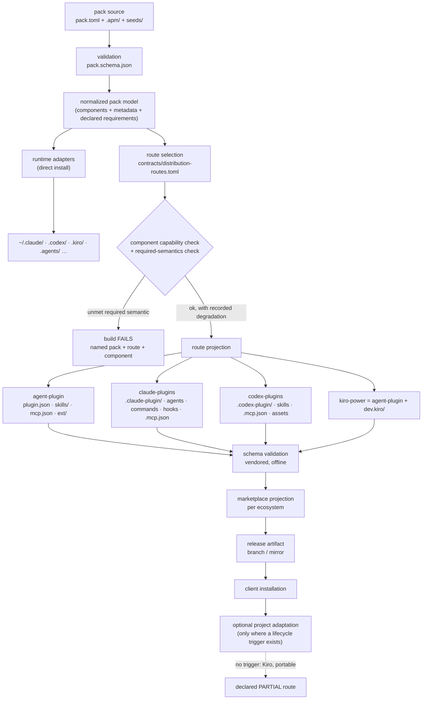

# RFC-0092: First-class distribution routes — portable Agent Plugins, native Claude/Codex packages, and Kiro Powers from one pack model

- **Status:** Accepted
- **Author:** eugenelim
- **Approver:** eugenelim
- **Date opened:** 2026-08-19
- **Date closed:** 2026-08-20
- **Decision weight:** heavy
- **Related** — each gloss says what the prior decision fixed and how this RFC relates:
  - [RFC-0001](0001-bundle-distribution-by-adapter-spec.md) established that one pack source
    projects to many agent tools through a published adapter contract. **Extended:** routes
    become a second consumer of that same source.
  - [RFC-0008](0008-claude-plugins-install-route-parity.md) made "a successful Claude-plugin
    install triggers project adaptation" a contract. **Extended** to a route-neutral trigger.
  - [RFC-0010](0010-apm-install-route-parity.md) did the same for the APM package route, and is
    the closest existing precedent for a route that is not an adapter. **Extended.**
  - [RFC-0011](0011-pack-allowed-adapters.md) constrained which adapters a pack may install
    into, and reserved a future sibling RFC for a native Codex plugin route. **This RFC
    absorbs that reserved scope** rather than leaving it open.
  - [RFC-0012](0012-repo-scope-per-adapter-projection.md) and
    [ADR-0004](../adr/0004-repo-scope-per-adapter-projection.md) rejected a per-IDE plugin
    route on the grounds that "Kiro Powers has no documented install verb." Kiro has since
    documented Powers with git and local import, so that premise has expired. Both are frozen
    accepted records, so **this RFC does not amend them**: acceptance produces a **follow-on
    ADR superseding only that rejected alternative**, with the bidirectional pointers
    `docs/CONVENTIONS.md` requires. Every other conclusion in both records stands.
  - [RFC-0031](0031-catalogue-package-manager-posture.md) settled that this repository is
    package-manager *hygiene*, "not infrastructure — no runtime, no server, no daemon."
    **Extended,** and load-bearing for D7's deferral.
  - [ADR-0021](../adr/0021-pack-manifest-source-of-truth-and-scoped-identity.md) decision D2
    (its own second decision, unrelated to this RFC's D2) made `pack.toml` the single rich
    source with lossy one-directional per-tool projection and namespaced tool metadata.
    **Extended** to routes it did not anticipate.
  - [ADR-0072](../adr/0072-derived-plugin-manifest-mirrors-upstream-schema.md) ruled that a
    locally derived manifest schema mirrors the vendor's and that the real client remains the
    authority on correctness. **Generalized** as the pattern every native route follows.
  - [ADR-0079](../adr/0079-executable-plugin-branch-publisher-identity.md) restricted updates
    to the mutable branch that publishes executable plugin content to one dedicated publisher
    identity. **Inherited:** any new executable route must match it.
  - [RFC-0085](0085-catalogue-source-identity.md) fixed catalogue source identity as root
    `catalogue.toml` plus `packs/`. **Intact.**
  - [ADR-0083](../adr/0083-extend-sast-sca-gate-to-npm-with-audit-and-allowlist.md) extended
    the SAST/SCA gate to npm dependencies with audit and an allowlist. **Intact;** cited as the
    boundary D7 would have to cross.

## Reviewer brief

- **Decision:** whether packaging a pack for an external plugin ecosystem becomes a
  **distribution route** — a first-class concept owned separately from the **runtime
  adapter** — and in what order routes land.
- **Recommended outcome:** accept, with one deliberate departure from the obvious design:
  the generic route *registry* is extracted **after** three real routes exist, not before.
- **Change if accepted:**
  - `install-routes` moves out of `[adapter."claude-code"]` into a route-owned contract, so
    the vendor-neutral `apm` route stops being a child of the Claude adapter.
  - A portable **Agent Plugin** route ships first: 13 of the 21 buildable packs project with
    zero loss.
  - MCP becomes a canonical pack primitive with *refuse-rather-than-drop* secret semantics.
- **Affected surface:** `contracts/`, `packages/agentbundle/agentbundle/build/` and its recipes, the install-marker template,
  the 22 hand-authored per-pack Claude manifests, marketplace generation, and the published
  support claims in `guides/_shared/reference/adapter-support.md`.
- **Stakes:** internally reversible; the *published* Claude marketplace promise is one-way
  and must not break. Every runtime claim in this RFC is documented-only, never verified.
- **Review focus:** (1) is route-vs-adapter the right cut, or is this a second adapter kind?
  (2) is deferring the registry correct, or cowardice? (3) the secret-in-`mcp.json` hole,
  which schema validation provably cannot catch. (4) whether the partial-route claims are
  honest enough.
- **Not in scope:** implementing Copilot; a universal agents/rules format; replacing
  `agentbundle install`; moving seeds into portable packages; and MCP-from-package-registries,
  which is recorded as a **deferred direction** (D7) so the primitive does not foreclose it.

## The ask

**Recommendation.** Add a distribution-route layer alongside runtime adapters. Keep
`pack.toml` and `.apm/` canonical. Generate a conforming portable Agent Plugin core for
skills and MCP; keep the native Claude Code route and carry it *forward* through every
phase rather than freezing it as legacy; add a native Codex route once its package
machinery is evidence-backed; support Kiro as a portable package plus a `dev.kiro`
extension, declared honestly as a partial route. Represent component support and
degradation machine-readably, and keep seeds and project adaptation as higher-level
capabilities that are explicitly **not** portable plugin components.

**Why now.** Three forces arrived together. The vendor-neutral Agent Plugins specification
reached 1.0.0 with a stable, deliberately small core and vendorable schemas — so a portable
route is finally buildable against something normative. OpenAI shipped a native Codex
plugin package, which RFC-0011 already reserved a sibling RFC for and which is now
documented rather than speculative. And Kiro shipped Powers, invalidating the specific
premise on which RFC-0012 and ADR-0004 rejected a Kiro package route. Meanwhile the
repository has been quietly accumulating the cost of never naming the concept: `apm`, a
vendor-neutral route, is declared as a property of the Claude adapter, and route logic
reaches into adapter contract rows to rewrite them mid-build. The next route makes that
worse; this RFC makes it a named layer instead.

| ID | Question | Recommendation | Why | Decide by | Reviewer action |
| --- | --- | --- | --- | --- | --- |
| D1 | Should plugin packaging be a first-class layer separate from runtime adapters, and when does the generic registry arrive? | Route-owned contract **now**; extract the registry **after** three real routes | The ownership bug is real and cheap to fix; a registry built today would encode `unknown` lifecycle fields for four of six routes as authoritative names | 2026-08-26 | Accept, or argue the registry should lead |
| D2 | What happens to the 22 hand-authored `.claude-plugin/plugin.json` files? | Reduce to a Claude-specific metadata *extension*, reached by first generating the full manifest from `pack.toml` | ADR-0021 D2 and ADR-0072 already point here; the direction is settled, the window is Open question 1 | 2026-09-02 | Accept the direction |
| D3 | Which package outputs are first-class? | `agent-plugin`, `claude-plugins` (unchanged), `codex-plugins`; Kiro as a *configuration* over the portable package; Copilot deferred | Kiro has a distinct marketplace and admission contract but shares the Agent Plugin artifact layout, so it earns a route profile rather than duplicated bytes | 2026-08-26 | Accept the route set |
| D4 | What is the component mapping model? | A machine-readable per-route status for every canonical primitive, with `dropped` reusing the contract's existing vocabulary | The published support matrix already reads projection modes from the contract; this extends one mechanism instead of adding a second | 2026-08-26 | Accept the status set |
| D5 | Does MCP become a canonical pack primitive now? | Yes — with explicit secret-*reference* semantics and a renderer that refuses rather than drops | A secret-bearing header is **schema-valid** against the official portable schema, so conformance cannot protect it | 2026-09-02 | Accept refuse-not-drop |
| D6 | How does a pack declare that dropping a component makes the package unsafe? | Per-pack required-semantics declaration; the build **fails**, not warns | `pre-pr.py` is a gate whose safety *is* its blocking; projected non-blocking it silently becomes advice | 2026-08-26 | Accept fail-closed |
| D7 | MCP servers installed from package registries (npm, PyPI, others) | **Deferred direction.** Not committed; the canonical primitive is designed not to foreclose it, and the supply-chain decision is named rather than smuggled | Worth doing, but it introduces third-party executable code into a pack's runtime surface and deserves its own decision | — | Confirm deferral |
| D8 | Rollout order | Phase 0 contract reconciliation → 1 portable → 2 registry extraction → 3 Codex → 4 Kiro → 5 Copilot + cleanup | The portable route is the cheapest slice with a normative spec and the widest lossless coverage | 2026-08-26 | Accept sequence |

## Terms used in this RFC

A reader arriving from the index needs these before the diagrams. Existing repository
vocabulary is marked *(existing)*; vocabulary this RFC coins is marked *(new here)*.

**The objects.** A **pack** *(existing)* is the distributable unit under `packs/<pack>/` — a
rich `pack.toml` manifest, runtime content in `.apm/`, and optional adopter-facing `seeds/`.
A **canonical primitive** *(existing)* is one kind of runtime content the contract recognizes;
there are exactly nine (`skill`, `agent`, `command`, `hook-body`, `hook-wiring`,
`kiro-ide-hook`, `shared-libs`, `adapter-root-bins`, `user-libs`), each with a declared
`.apm/` source path. **APM** *(existing)* is the repository's existing vendor-neutral package
format, emitted to `dist/apm/<pack>/`. **Self-host** *(existing)* is this repository applying
its own packs to itself, writing `.claude/`, `.codex/`, and `.agents/` at the repo root.

**The transformations.** A **projection** *(existing)* is a generated, deliberately lossy,
one-directional transformation of canonical source into some target's shape; a projection is
never edited by hand and never becomes an authoring input. A **recipe** *(existing)* is the
declarative TOML unit that tells the build which projection to run and where to write it. An
**overlay** *(existing)* is a projection mode that merges content into a shared file rather
than owning a whole file. The **normalized pack model** *(new here)* is the validated
in-memory representation the build produces after reading and checking a pack — the single
thing both adapters and routes consume.

**The two layers this RFC separates.** A **runtime adapter** *(existing)* installs components
directly into a live agent tool's own directories for a given scope — `~/.claude/skills/` and
so on. A **distribution route** *(new here)* packages a pack for an external plugin ecosystem
to consume — a manifest, a component layout, and usually a marketplace entry. Both read the
normalized pack model; neither depends on the other. A route does not have to emit a directory
of its own: where a target consumes another route's package plus a small extension, the route
is a *configuration* over that package, which is exactly the Kiro case in P5.

**Components.** A **portable component** *(new here)* is one the vendor-neutral Agent Plugins
specification standardizes — in version 1.0 that means skills and MCP configuration, and
nothing else. A **native component** *(new here)* is one only a particular client's own
package model supports, such as Claude's agents, commands, or hooks.

**Adaptation and seeds.** A **marker** *(existing)* is the small record a route install writes
(`.adapt-install-marker.toml`) so that a later agent session knows to offer repository-specific
adaptation. **Install-to-adapt parity** *(existing, from RFC-0008)* is a route's ability to
trigger that adaptation — *not* a claim that its runtime output matches another route's. A
**seed** *(existing)* is an adopter-owned governance file a pack delivers once and thereafter
never overwrites; a divergent file gets an `.upstream.<ext>` companion instead. **Seed parity**
*(new here)* is a route's ability to preserve that create-once ownership. **Forward-parity**
*(new here)* is the commitment that the Claude route keeps receiving each phase's new
capability instead of being frozen as a legacy path.

**Vendored** *(existing usage)* means a copy of an external schema stored in this repository so
the build never fetches it at build time. **Lossless**, throughout this RFC, means *no
canonical primitive is dropped* — catalogue metadata with no home in a target manifest may
still be lost, and where that happens it is listed explicitly.

**`${PLUGIN_ROOT}` and `${PLUGIN_DATA}`** are the portable specification's own variables: the
first resolves to the installed package's own directory, the second to a client-managed
writable directory that survives package replacement. Claude's native equivalents are spelled
`${CLAUDE_PLUGIN_ROOT}` and `${CLAUDE_PLUGIN_DATA}`, and the difference is load-bearing rather
than cosmetic — see P7.

### Support-status vocabulary, in one place

Per-component statuses, used in the P6 matrix:

| Status | Meaning |
| --- | --- |
| `native` | carried in the target's own component model |
| `translated` | carried, but transformed — renamed variable, rewritten path, wrapped body |
| `extension` | carried inside a reverse-domain client namespace |
| `degraded` | carried with reduced semantics; **never applied silently** (D6) |
| `dropped` | deliberately absent; recorded and reported |
| `unsupported` | the target has no concept for it |
| `route-only` | not in the package at all — delivered by project adaptation instead |
| `unknown` | first-party documentation does not settle it; never rendered as support |

Whole-route claims, used in P9 and P11:

| Claim | Meaning |
| --- | --- |
| `full` | package loads, components available, adaptation runs, seeds apply |
| `components-only` | components available; **no** project adaptation and **no** seeds |
| `blocked` | the capability is architecturally reachable but a documented prerequisite is missing, so it may not be claimed |
| `runtime-verified` | someone actually loaded it in the named client version. **No route in this RFC has this status.** |

## Problem & goals

### The problem, diagnosed

The repository already builds two external packages — a Claude Code plugin and an APM
package — and it builds them well. What it does not have is a *name* for what they are. The
consequences are visible in three places in the source.

**The concept is filed under the wrong owner.** `contracts/adapter.toml:188` declares
`install-routes = ["cli", "claude-plugins", "apm"]` inside `[adapter."claude-code"]`. The
`apm` route is not Claude-specific in any way — it is a vendor-neutral package format — yet
it is modelled as a property of one runtime adapter. The contract comment states the
consequence plainly: "Kiro, Copilot, and Codex do not declare install-routes."

**The build routes around its own abstraction.** At `packages/agentbundle/agentbundle/build/main.py:669`, `adapter == "apm"`
short-circuits past the adapter table entirely, because APM is not an adapter and the code
knows it. There is no layer for it to be instead.

**Route logic mutates adapter data.** At `packages/agentbundle/agentbundle/build/main.py:741` the Claude plugin route rewrites
projection rows from `target-path`/`mode` to `plugin-target-path`/`plugin-mode`. A packaging
concern reaches into the runtime contract and edits it in flight.

None of this is broken today. All of it gets worse per route added, and three new routes are
now buildable against documented external formats.

### Goals

1. Name the layer: a **distribution route** packages a pack for an external ecosystem; a
   **runtime adapter** installs components into a live agent's directories. Both consume the
   same canonical pack model; neither depends on the other.
2. Ship a conforming portable Agent Plugin package for the components the portable
   specification actually standardizes — skills and MCP — and nothing more.
3. Make degradation machine-readable and loud. A route that cannot carry a component must
   say so in a form the build and the published matrix both read.
4. Preserve the Claude route's behavior and marketplace compatibility through the migration,
   and keep extending it as later phases add capability. **Claude parity is forward-parity:**
   the Claude route is the reference implementation, not a frozen legacy path.
5. Keep seeds and project adaptation outside the portable package, described as separate
   capabilities rather than pretended-equivalent ones.

### Non-goals

Real goals deliberately excluded, not merely bad outcomes:

- **A universal agents, commands, or rules format.** Portable Agent Plugins v1 excludes all
  three, and its 1.1.0 working draft explicitly declines to add them. Inventing one here
  would be a bet against the specification's stated direction.
- **Implementing Copilot in the first slices.** It is in the inventory and the abstraction is
  stress-tested against it, precisely so the design is not Claude-and-Codex-shaped. It is not
  in the commitment.
- **Replacing `agentbundle install`.** Direct installation remains the only route that can do
  everything; plugin routes are additive.
- **Moving seeds into portable packages.** Seeds are adopter-owned and create-once; a plugin
  cache is neither.
- **Making a generated manifest an authoring source.** `ARCHITECTURE.md:52` forbids it and
  this RFC does not seek an exception.
- **Committing to MCP-from-package-registries now.** See D7 — recorded, scoped, and deferred.

## Proposal

### P1 — Current state, as it actually is

```text
packs/<pack>/pack.toml              canonical metadata (rich)
packs/<pack>/.apm/                  canonical runtime primitives
packs/<pack>/.claude-plugin/…json   hand-authored Claude metadata input (22 packs)
                                    — an input to the build, NOT the canonical
                                    metadata source; pack.toml is that
packs/<pack>/seeds/                 adopter-owned, implicit by path
        │
        ├─ recipe per-pack-claude-plugin ─► dist/claude-plugins/<pack>/   (+ hooks compiled,
        │        adapter="claude-code"          marker SessionStart injected, seeds copied)
        ├─ recipe per-pack-apm-package  ─► dist/apm/<pack>/               (.apm copied wholesale,
        │        adapter="apm" → bypass         apm.yml written, marker hook synthesized)
        ├─ recipe marketplace           ─► dist/claude-plugins/marketplace.json
        └─ recipe self-host / overlay   ─► .claude/ .codex/ .agents/ (this repo only)
```

Recipes are already declarative TOML — `[recipe] name / type / adapter / output-subdir`, with
`type` one of `per-pack`, `aggregate`, `overlay`, `composite` — dispatched by `run_recipe`
(`packages/agentbundle/agentbundle/build/main.py:596`). The seam for a route layer exists; what is missing is a contract that
owns it. Today, adding a route means a recipe file *plus* bespoke Python *plus* an entry in
another adapter's `install-routes` list.

Where route and adapter concerns are entangled, precisely: `contracts/adapter.toml:188` (ownership),
`packages/agentbundle/agentbundle/build/main.py:669` (adapter bypass), `packages/agentbundle/agentbundle/build/main.py:741` (contract-row rewriting), `packages/agentbundle/agentbundle/build/main.py:433`/`:456`
(admission policy expressed in Claude's user-cache semantics), and
`packages/agentbundle/templates/install-marker.py:795` (a closed two-value route enum).

### P2 — Target architecture



Runtime adapters and distribution routes are siblings, both fed by the normalized model.
Neither is downstream of the other. That is the whole structural claim.

### P3 — D1: the route contract, and why the registry waits

Two different things are easy to conflate here, so this RFC names them separately and keeps
them in different phases.

- The **route contract** is *data*: a new canonical `contracts/distribution-routes.toml` that
  declares which routes exist and what each one is — identity, package layout, manifest
  projector, component-capability map, marketplace projector, and lifecycle trigger.
  `install-routes` moves here from `[adapter."claude-code"]`. A route may *name* an adapter
  projector but is no longer owned by one. **This lands in Phase 0.**
- The **route registry** is *code*: a generic dispatch layer that reads that contract and
  builds any declared route without route-specific branches. **This lands in Phase 2.**

Declaring routes in a contract does not require a generic engine to consume it — but it does
require *something* to consume it, or the contract is dead metadata that repairs no ownership.
Today `Recipe` has no `route` field at all — its fields are `name`, `type`, `adapter`,
`output_subdir`, `input_subdir`, `output_file`, `units`, `fragment_path`, and `manifest_path` —
and dispatch, the APM bypass, Claude route filtering, and projection rewriting all key on
`adapter`. So Phase 0 includes a deliberately minimal
**route resolver**: `Recipe` gains `route`; the resolver maps a route to its named projector
and, where the route uses one, to an adapter projector. That is a lookup plus a dispatch table,
not a generic engine — no route gains the ability to be built without its own code. Phase 2
then replaces the named branches with generic dispatch. The six fields are the *contract's*
fields in both phases, which is why the same number appears twice.

The migration for `apm` is four steps: move `install-routes` to the route contract; make
recipes reference `route`; move APM's package-writer selection and marker injection behind its
route projector; leave the Claude adapter responsible only for Claude's direct-install
behavior.

It produces **no change in published output**, but calling it "not breaking" would be too glib,
because `install-routes` has real, enumerable consumers inside the repository. These become
Phase 0 acceptance criteria rather than discoveries:

- `contracts/adapter.schema.json:255` constrains `install-routes` with a **closed enum**
  (`cli`, `claude-plugins`, `apm`) — every new route needs a schema change here.
- `packages/agentbundle/agentbundle/_data/adapter.schema.json` is a byte-identical bundled
  copy, held by the parity gate `tools/catalogue/check_contract_parity.py`.
- `packages/agentbundle/tests/build_pipeline/test_contract.py:478` pins Claude's list exactly,
  and `:487` asserts that **no other adapter carries `install-routes`** — a regression guard
  that the re-parenting deliberately invalidates and must therefore rewrite, not delete.
- the marker's `--install-route` values, the generated hook commands that pass them, the
  route-name strings in install state, and the public route documentation.

What remains genuinely unknown is whether any *external* consumer reads
`contracts/adapter.toml` as public configuration. No such consumer is known; the Compatibility
table records that as an assumption with a rollback (a read-through alias), not as a fact.

**Why the generic registry is deferred.** A spike drafted the six-field registry and stress-
tested it against all six routes. Its own conclusion was *appropriately constrained, but not
yet warranted*: for `agent-plugin`, `codex-plugin`, `kiro-power`, and `copilot-plugin` the
registry would hold placeholders, and the honest risk is "turning unknown future behavior
into authoritative-looking names." Two routes exist today; the portable route makes three.
The registry is extracted in Phase 2, against three real implementations, when the six fields
are evidence rather than aspiration. Naming the contract now and extracting the registry
later are separable, and separating them is the point.

### P4 — D2: canonical source and the manifest field mapping

`pack.toml` stays the single rich source of truth and every route manifest is a lossy,
one-directional projection of it — ADR-0021 D2, extended to routes it did not anticipate.
Client-specific metadata lives in the existing `[pack.metadata.<tool>]` namespaces, which the
pack schema already ignores; this RFC adds no new passthrough mechanism and does not make
opaque passthrough the default.

The 22 hand-authored `.claude-plugin/plugin.json` source manifests reduce to a
Claude-specific metadata *extension* carrying only what `pack.toml` cannot express. The route
generates the rest. The staging is: generate the full manifest and diff it against the
hand-authored file for every pack until the diff is empty or explained; then delete the
generated-equivalent fields from source; then keep only the residue.

| `pack.toml` | Agent Plugin `plugin.json` | Claude `.claude-plugin/plugin.json` | Codex `.codex-plugin/plugin.json` | Kiro (Power) | Copilot `plugin.json` | Marketplace entry |
| --- | --- | --- | --- | --- | --- | --- |
| `[pack]` `name` | `name` — **constrained**: 1–64, `[a-z0-9.-]`, alnum ends, no `--`/`..` | `name` | `name` | `name` | `name` (only required field) | entry key |
| `[pack]` `version` | `version` (SemVer recommended, not required) | `version` | `version` | `version` **required** | `version` | entry field |
| `[pack]` `description` | `description` | `description` | `description` | `description` **required** | `description` | entry field |
| `[[pack.maintainers]]` (list) | `author` **object, singular** — needs a policy for multi-maintainer packs | `author` | `author` | `author` **required** | `author` | entry field |
| `[pack.links]` `homepage` / `repository` | `homepage` / `repository` | same | same | same | same | entry field |
| `[pack]` `license` | `license` (free string; `Apache-2.0 OR MIT` survives) | same | same | same | same | entry field |
| `[pack]` `keywords` | `keywords` | `keywords` | `keywords` | `keywords` **required — drives activation** | `keywords` | entry field |
| `[pack]` `display_name`, `categories` | **no home** | — | — | — | `category`, `tags` | `category` restored here |
| `[pack]` `readme` | **no home** (README copied as a file) | file copy | file copy | file copy | file copy | — |
| `[pack.adapter-contract]` `version` | **no home** — internal | — | — | — | — | — |
| `[pack.install]` (`default-scope`, `allowed-scopes`, `allowed-adapters`) | **no home** — route admission input only | — | — | — | — | — |
| `[pack.evals]`, `[pack.first-value]`, `[pack.links]` `documentation` | **no home** — catalogue-only | — | — | — | — | — |
| `$schema` | **required, `const`** — pins the spec version mechanically | n/a | n/a | required | opt-in signal | n/a |

Fields that must never be copied blindly: `name` (four different charset regimes), `author`
(list→object), `keywords` (inert metadata in most formats, *activation input* in Kiro), and
`$schema` (a `const` — a 1.1.0 value fails 1.0.0 validation, which is how version pinning
becomes mechanical rather than conventional).

### P5 — D3: the route inventory

| Route | Output | Status | Justification |
| --- | --- | --- | --- |
| `claude-plugins` | `dist/claude-plugins/<pack>/` | exists, unchanged, **carried forward** | distinct package + marketplace contract |
| `apm` | `dist/apm/<pack>/` | exists; re-parented off the Claude adapter | distinct package contract |
| `agent-plugin` | `dist/agent-plugins/<pack>/` | **new, Phase 1** | normative spec, vendorable schemas, 13/21 packs lossless |
| `codex-plugins` | `dist/codex-plugins/<pack>/` | **new, Phase 3** | distinct manifest, distinct marketplace, distinct hook contract |
| `kiro-power` | *no separate output* — a **route profile** over `agent-plugin` | route profile | Kiro consumes a portable package plus one extension directory, so it earns no second copy of the bytes — but it does own admission validation, activation semantics, and its own verification record |
| `copilot-plugin` | — | inventoried, deferred | native format exists; no adoption pressure yet |

Kiro earning no output of its own is a load-bearing decision, not a shortcut — but it is a
decision about *bytes*, not about ownership, and the distinction matters. Kiro does document a
Powers marketplace with one-click installation and git/local import, so it is **not** true that
Kiro has no marketplace contract; an earlier draft of this RFC overstated that and it is
corrected here. What is true is that a Kiro Power *is* a conforming Agent Plugin plus one
extension directory, so emitting `dist/kiro-powers/` would duplicate the package to gain a
directory — one output per product, which this RFC rejects as a justification.

So `kiro-power` is a **route profile**: it shares the `agent-plugin` artifact and owns
everything genuinely its own — admission validation against Kiro's stricter required-field set
(`version`, `description`, `author`, `keywords` all mandatory, against portable's `$schema` and
`name`), `keywords`-driven activation semantics, its marketplace/submission projection, the
`dev.kiro/` extension, and its own runtime-verification record. A profile is a first-class route
with a shared package layout, not a lesser one.

### P6 — D4: the canonical primitive projection matrix

Every canonical primitive gets a per-route status, drawn from the status vocabulary defined
once in *Terms used in this RFC* above. The statuses are machine-readable and drive both build
diagnostics and the published support matrix; `dropped` is reused from the adapter contract's
existing projection-mode vocabulary rather than inventing a parallel one.

| Canonical primitive | `agentbundle` (direct) | `apm` | `agent-plugin` | `claude-plugins` | `codex-plugins` | `kiro-power` | `copilot-plugin` |
| --- | --- | --- | --- | --- | --- | --- | --- |
| skill | native | native | **native** | native | native | native | native |
| agent / subagent | native | native | **dropped** (excluded from portable v1) | native | unknown | unknown | native |
| command / prompt | native | native | **dropped** | native | unknown | unknown | native |
| hook implementation (body) | native | native | **dropped** | native | translated (JSON wrapper) | unsupported (no Power hook contract) | native |
| hook wiring | native | native | **dropped** | native (compiled) | translated | unsupported | native |
| shared library (`shared-libs`) | native | native | dropped | native | unknown | unknown | unknown |
| user library (`user-libs`) | native | native | dropped | native | unknown | unknown | unknown |
| executable (`adapter-root-bins`) | native | native | dropped | native (`bin/`) | unknown | unknown | unknown |
| IDE event hook (`kiro-ide-hook`) | native (kiro-ide) | native | dropped | dropped | dropped | unknown | dropped |
| MCP server *(new primitive)* | native | native | **native** (`mcp.json`) | translated (`.mcp.json`, var rename) | native (`.mcp.json`) | translated (**server names rewritten on install**) | native (manifest field) |
| rule / steering | — | — | dropped | unknown | unknown | **extension** (`dev.kiro/steering/`) | extension (`com.github.copilot/`) |
| seed | native | native | **route-only** | route-only | route-only | **unsupported** | unknown |
| overlay (shared-file merge) | native | native | unsupported | unsupported | unsupported | unsupported | unsupported |
| test | not exported | not exported | not exported | not exported | not exported | not exported | not exported |
| docs-only content (README) | native | native | file copy | file copy | file copy | file copy | file copy |
| client-specific asset | — | — | dropped | native | native (`assets/`) | unknown | unknown |
| **project adaptation** | **native** | native | unsupported | native (`SessionStart`) | **blocked** (see P9) | **unsupported** | unknown |

`unknown` is used where first-party documentation does not settle it, and is never rendered
as support. Two structural notes the matrix hides. First, the contract declares exactly nine
canonical primitives (`skill`, `agent`, `command`, `hook-body`, `hook-wiring`,
`kiro-ide-hook`, `shared-libs`, `adapter-root-bins`, `user-libs`) and portable v1 carries
exactly one of them — `skill` — plus the new MCP primitive. The portable route is therefore a
*partial* route by construction, and saying so plainly is the point; it is not a downgrade of
ambition but the honest shape of a deliberately small interoperability floor. Second, Claude
and portable discover components **by convention** while Codex and Copilot **declare them as
manifest fields**
(Codex's documented example uses `"skills": "./skills/"`). The route contract's package-layout
field must carry that distinction, or the abstraction will be Claude-shaped.

Corpus impact, measured over the 21 buildable packs (23 directories less the two
underscore-prefixed ones the build skips): **13 are skills-only** and project to a portable
package with no component loss; 6 add only agents; `core` (six canonical kinds: skills, agents, commands, hooks, hook-wiring, kiro-ide-hooks) and
`credential-brokers` (libraries and binaries) are the genuinely hard cases. The portable
route therefore covers 62% of the catalogue losslessly on day one.

### P7 — D5: MCP as a canonical primitive, and D7's deferred direction

MCP is added as a canonical pack primitive. It does not exist today: the contract's primitive
registry has no `mcp` kind and no pack ships MCP configuration, so this is new canonical
surface rather than a re-projection.

The design is a **portable core plus validated native extensions**, not a
lowest-common-denominator schema. The portable schema is strict in ways that force this:
every level is `additionalProperties: false`, so a native field cannot be smuggled into
`mcp.json` at all; stdio requires an explicit `type` that Claude's native form omits; `cwd`
is pattern-restricted to `./`, `${PLUGIN_ROOT}`, or `${PLUGIN_DATA}` prefixes; `env` may not
define `PLUGIN_ROOT` or `PLUGIN_DATA`; and expansion applies only in `args`, `env`, and `cwd`
— **never** in `command`. Claude's `${CLAUDE_PLUGIN_ROOT}` is not a cosmetic rename: a
Claude-style `cwd` is schema-*invalid* portably, so the projection is a real translation.
`PLUGIN_DATA` has no documented Claude equivalent.

**The security consequence is the important part of this decision.** A `streamable-http`
server whose `Authorization` header carries a literal secret **validates cleanly** against
the official portable schema. Schema conformance cannot protect credentials, and the
specification's rule that headers are visible package data is prose, not schema. Therefore:

1. The canonical primitive declares secrets by **reference**, never by value — consistent with
   the repository's existing `credbroker` boundary, which resolves credentials in-process
   without crossing a process boundary to an LLM.
2. **Portable output cannot render a secret reference at all.** Agent Plugins v1 deliberately
   provides no credential-reference or OAuth field; authentication is client-managed. So a
   remote MCP server that requires a credential is **`unsupported` on the portable route** —
   not "referenced", not "degraded". The route refuses that server with a diagnostic naming
   the pack, the server, and the missing mechanism. It does not drop the header silently and
   does not ship a placeholder that fails at authentication time. A native route may carry it
   only where that client documents a credential-provider mechanism, and only after that
   mechanism is verified rather than assumed.
3. A repository-side lint is **defence in depth, not the authorization boundary** — the
   boundary is rule 2. Because a regex for "credential-shaped" values is trivially evaded by
   an innocuous header name, a split value, or an encoding, the lint must be schema-aware and
   fail closed across *every* value-bearing generated field — `headers`, `env`, `args`,
   `cwd`, manifest extension blocks, and copied configuration files — inspecting decoded
   content rather than raw text, and preferring an allowlist of known-public values over a
   denylist of secret-looking ones.

**D7 — MCP servers installed from package registries (deferred direction).** The intent is to
go beyond what portable MCP expresses and let a pack declare an MCP server sourced from npm,
PyPI, or another registry. This RFC does not commit to it; it commits to not foreclosing it,
and to naming the decision it would force.

What the research establishes. Portable `mcp.json` has **no package-source or install field**:
the only expressible form is a stdio `command` that happens to be a fetch-on-run launcher
(`npx`, `uvx`), with the package named in `args` — and `command` is a single token that is
never variable-expanded. An official **MCP Registry** exists at
`registry.modelcontextprotocol.io` but is **preview, not GA**, and hosts versioned
`server.json` *metadata* that indexes npm/PyPI/OCI references rather than hosting artifacts.
MCP itself specifies connection, not installation — the nearest normative statement is that an
stdio client "launches the MCP server as a subprocess." Among the four clients, only **Kiro**
documents a typed `packages[]` descriptor with registry metadata (and only in its enterprise
governance surface); Claude, Codex, and Copilot express package-sourced servers as ordinary
command arguments. Claude's npm *marketplace* source distributes a plugin, not an MCP server
artifact — a distinction easy to conflate and wrong to rely on.

There is already a home for this in the repository, unused: `contracts/pack.schema.json:216`
defines `runtime-dependencies` with an `ecosystem` enum of `pypi`, `npm`, `cargo`, `go`,
`homebrew`, `apt`, `system`, plus `package`, `version`, `optional`, `skills`, `install`, and
`note`. **No pack declares one and nothing consumes them.** A future acquisition descriptor
should extend that shape rather than invent a parallel one — while noting that its free-string
`install` field is exactly the unstructured install command a typed descriptor must replace.

What this RFC does now, to keep the door open: the canonical MCP primitive stays
**transport-first**, keeping *source* separable from *invocation*, so a typed acquisition
descriptor can be added later without redefining existing servers. It adds no implicit
installer and no unstructured install command. The portable projection continues to emit only
what the portable schema admits.

**Deferral is not sufficient on its own, and this is a decision, not a note.** Nothing in the
portable schema stops a pack from declaring `command = "npx"` with a package name in `args`:
that document is schema-valid, and the client would fetch and execute mutable third-party code
at runtime. Deferring D7 would therefore *permit by omission* exactly what D7 defers. So the
canonical MCP primitive ships in Phase 1 with an **admission rule**, enforced at build time:

**For `stdio` servers only** — these clauses concern `command`, which remote transports do not
have:

- `command` must resolve to an executable bundled in the package, addressed
  plugin-relative — not a fetch-on-run launcher.
- Registry launchers and their equivalents are **refused**: `npx`, `npm exec`, `uvx`,
  `pipx run`, `pip`, `go run`, `cargo run`, `docker run`, and any argument vector that names a
  registry package to acquire.
- Shells and bare interpreters as `command` are refused; a bare command name that would
  resolve through the client's executable search path is refused, because what it resolves to
  is not knowable at build time (PATH shadowing).
- The only route past these clauses is the typed, immutable acquisition descriptor D7's own RFC
  must define. Until that exists, the answer is no, and the build says so.

**For `streamable-http` and `sse` servers** there is no `command`, so admission is about the
endpoint instead. Those controls have a single home in the *Security & threat model* row for
SSRF and transport handling, and are not restated here so the two cannot drift apart. A
credential-requiring remote server is additionally `unsupported` on the portable route, per the
rule above.

Nothing in this subsection narrows portable MCP to bundled stdio: the primitive stays
transport-first, and a remote server carrying no `command` is untouched by the stdio clauses.

This makes D7 a genuinely closed door rather than an unlocked one, and it is why the follow-on
RFC is scoped as *permitting* something rather than *restricting* it.

Why it is deferred rather than folded in. RFC-0031's posture is "hygiene, not infrastructure —
no runtime, no server, no daemon," so package-sourced MCP is **orthogonal** to that decision
rather than in conflict with it — but it does open a new third-party runtime-acquisition
boundary that the repository does not have today. `make sast` covers repository dependency
inputs including npm audit and its allowlist (ADR-0083), and covers nothing about a runtime
`npx`/`uvx` fetch. And the forced security decision is sharp enough to deserve its own
argument: **a fetched MCP subprocess must have a verifiable, immutable identity before it may
execute.** An exact version string is not that — OCI digests are content-addressed and
independently verifiable, while npm and PyPI need a hash-locked resolved closure plus an
explicit provenance trust policy (npm provenance, PEP 740 attestations — both available,
neither mandated by the installers). Lifecycle/postinstall script execution is a separate
policy decision again. That is an RFC, not a subsection.

### P8 — D6: route capability and the failure model

A pack declares the semantics it *requires*, and the build fails when a selected route
cannot preserve them:

```toml
[pack.route-requirements]
hooks = "required"
blocking-pre-tool = "required"
project-adaptation = "required"
```

Failure is loud and specific — pack, route, primitive, and the reason — rather than a warning
that a maintainer learns to scroll past. The distinction the model must enforce:

| Condition | Behavior |
| --- | --- |
| Required semantic unavailable on a route | **build fails**; route not emitted for that pack |
| Optional component unavailable | emitted; status recorded as `dropped`; reported in the build summary and the support matrix |
| Pack declares no requirements and has only portable components | emitted silently |
| Route exists but pack is ineligible (scope, consent) | route skipped for that pack, with the reason named |
| Degradation that changes a safety property | **never automatic** — requires an explicit per-pack opt-in |

The concrete case that justifies fail-closed: `pre-pr.py` is a Git pre-push gate whose
protective value *is* its ability to block. Projected onto a non-blocking event it becomes
advice, and nothing is prevented — while the package still claims the pack is supported. The
worked examples the follow-on spec must pin: a skill-only pack (all routes, clean); a
skill+MCP pack (portable clean unless a secret is referenced); a hook-dependent governance
pack (portable route **refused**, not degraded); a pack with custom agents (portable
`dropped`, Claude native); a pack with adopter-owned seeds (`route-only` everywhere,
`unsupported` on Kiro); and a pack requiring install-to-adapt (Claude only today).

### P9 — Project adaptation and seeds across routes

The install→adapt chain is what makes this repository's packs more than a skills bundle: a
successful route install writes an adaptation marker, and a later session turns that marker
into repository-aware adaptation. RFC-0008 and RFC-0010 made that a route contract for Claude
plugins and APM respectively. This RFC generalizes the *entry point* — a route-neutral
lifecycle contract with route identity, package identity, and scope — without pretending
every route can reach it.

It cannot, and the honesty matters more than the generalization:

| Route | Lifecycle trigger | Adaptation | Seeds | Claim |
| --- | --- | --- | --- | --- |
| `agentbundle` direct | the CLI itself | yes | yes, create-once + `.upstream` | full |
| `apm` | synthesized hook | yes | yes | full |
| `claude-plugins` | `SessionStart` + `enabledPlugins` consent | yes | yes | full |
| `codex-plugins` | `SessionStart` **exists**, prerequisites do not | **blocked** | blocked | **components-only** |
| `agent-plugin` | none in the spec | no | no | **components-only** |
| `kiro-power` | **none documented** | no | no | **components-only** |

The Codex row is the one that will surprise people, so it is stated precisely. Codex documents
a `SessionStart` hook — the event exists. What is missing is everything the marker needs
around it: no documented plugin-root equivalent of `CLAUDE_PLUGIN_ROOT`, so the marker cannot
locate its own `pack.toml`; no persistent-data equivalent of `CLAUDE_PLUGIN_DATA`, so it
cannot retain the hash that makes it idempotent; and no documented plugin-enablement state
equivalent to `enabledPlugins`, so it cannot establish consent or choose a scope. Codex
install-to-adapt parity is therefore **not available today and must not be claimed** — it is
blocked on documentation, not on our implementation. A seven-step manual verification protocol
is recorded for the phase that attempts it, and its conclusion will be provisional until run.

Seeds keep their existing semantics unchanged on every route that has them: create-once,
adopter-owned, `.upstream.<ext>` companions on divergence, delivery recorded in state so
upgrades reuse the same protection. No route overwrites an adopter-modified file because a
package was updated. A route that cannot install seeds says `unsupported`, never "equivalent".

### P10 — D-marketplace: per-ecosystem projection, no shared canonical

Each ecosystem gets its own marketplace projection from the same catalogue; no vendor's
marketplace manifest becomes the canonical catalogue. `catalogue.toml` plus `packs/` remains
source identity (RFC-0085), and a `dist` artifact is never accepted as a catalogue source.

| Ecosystem | Manifest | Sources available |
| --- | --- | --- |
| Claude Code | `.claude-plugin/marketplace.json` | relative, GitHub, git URL, `git-subdir`, npm; `ref` and exact `sha` pinning |
| Codex | `~/.agents/plugins/marketplace.json` (user), `.agents/plugins/marketplace.json` (workspace) | documented locations; source descriptor forms to be pinned in its route spec |
| Copilot | `.github/plugin/marketplace.json` | deferred |
| Agent Plugins | **none — the spec does not define one** | distribution is out of portable scope |

The Codex marketplace is **required from the first Codex slice, not deferred**. The tempting
shortcut — letting Codex read the existing Claude marketplace as a transition bridge — does
not exist: OpenAI documents *converting* a Claude Code plugin for submission and states that
Claude marketplace listings and approvals do not transfer. There is no documented route by
which Codex loads `.claude-plugin/marketplace.json`. Any design that assumed otherwise
(including this RFC's own first draft premise) is wrong.

Immutable references are preferred for release artifacts and mutable refs confined to
development. Enterprise mirroring works by cloning the published artifact branch or vendoring
`dist/<route>/`; no route requires network access at build time.

### P11 — D-support: tiered claims, and what "supported" may not mean

The published matrix already refuses a boolean: it reads projection modes from the contract
and carries per-tool caveats and a `Full`/`Partial` tier. This RFC extends that mechanism
rather than adding a second one, and separates claims that are currently conflated:

1. schema/package conformance — the manifest validates
2. portable component support — skills and MCP load
3. native component support — per component kind
4. marketplace support — discoverable and installable
5. project-adaptation support — the marker actually runs
6. seed parity — create-once ownership preserved
7. upgrade/uninstall lifecycle
8. **runtime verification** — someone loaded it in the client

A machine-readable support record carries `format_version`, `client`, `surface`,
`client_version`, `package_format`, `components`, `project_adaptation`, `seed_behavior`,
`upgrade_behavior`, `verification_method`, `verified_at`, `evidence`, and
`known_limitations`. Two rules follow, and both bite immediately: **a package that validates
but has never been loaded in the client is not runtime-verified** — which is the status of
*every* new route in this RFC — and **a client that loads skills but drops hooks is not
"supported" for a hook-dependent pack.** Trust prompts are part of the claim, not a footnote:
a route whose install requires a trust decision the adopter may decline cannot claim
unconditional support. Claims are retired per client *version*, not per client.

### P12 — D-identity: one pack version, many artifacts

One pack version drives every route artifact; route-specific version divergence requires an
explicit recorded rationale and is expected to stay empty. Pack identity remains the pack
name; each route normalizes it to its own charset regime, and a normalization that is not
reversible must be recorded rather than recomputed. Skill names, MCP server names, and
marketplace entry names each get one owner.

The known collision hazards: portable names forbid `--` and `..` and uppercase; Kiro **rewrites
MCP server names on install** (`supabase-local` becomes `power-supabase-supabase-local`), so a
canonical server name is not the installed name and nothing may depend on the latter; and
reverse-domain extension namespaces must be allocated, not improvised. Schema version pinning
is mechanical because `$schema` is a `const`: a manifest declaring 1.1.0 fails 1.0.0
validation, so a silent spec drift is a build failure rather than a surprise.

### P13 — D8: rollout

**Phase 0 — contract reconciliation.** Move `install-routes` into the route contract;
re-parent `apm`; introduce the terminology and the support-claim vocabulary; verify current
Claude route behavior byte-for-byte against golden fixtures. No output changes.

**Phase 1 — portable Agent Plugin route.** Vendor the 1.0.0 `plugin` and `mcp` schemas with
licence and provenance; generate `plugin.json`; project skills; add the canonical MCP
primitive with refuse-not-drop secrets; support reverse-domain extension directories; pin
deterministic output. 13 packs land losslessly. Claude route carried forward unchanged.

**Phase 2 — registry extraction.** With three real routes, extract the six-field registry and
delete the special cases it subsumes. Claude becomes one consumer of the route API rather
than the hidden default path.

**Phase 3 — native Codex route.** Generate `.codex-plugin/plugin.json` and the native
marketplace; reuse hook machinery behind a Codex JSON wrapper; **do not claim adaptation
parity** until the plugin-root, persistent-data, and enablement prerequisites are documented;
run the manual verification protocol and record the result. The route **does** ship without
those prerequisites, as an explicitly `components-only` route, because skills and MCP deliver
value without adaptation; that is decided here, not left open.

**Phase 4 — Kiro Power.** Emit the portable package plus `dev.kiro/`; decide whether steering
becomes a canonical authoring primitive (see Open questions); document the adaptation and
seed limitations as `unsupported`, not as caveats.

**Phase 5 — Copilot and cleanup.** Copilot route if adoption justifies it; retire the
generated-equivalent fields from the hand-authored Claude manifests; update the public
matrices; keep compatibility aliases for one release with a named expiry.

Claude parity is **forward-parity** throughout: each phase that adds a capability to the route
layer asks what the Claude route gains from it, and the answer is recorded. The Claude route
is not migrated onto a legacy path and left there.

## Options considered

**D1 — where route logic lives** (MECE along *ownership of packaging behavior*):

1. *Do nothing.* Keep adding route branches inside the Claude adapter. Cheapest today; every
   new route re-touches `packages/agentbundle/agentbundle/build/main.py:669` and `:741`, and `apm` stays mis-parented. Rejected: the
   cost is per-route and three routes are now buildable.
2. *Route-owned contract, registry deferred.* **Adopted.** Fixes ownership immediately;
   defers the abstraction until three real routes exist.
3. *Full generic registry now.* Matches the intuitive design and this RFC's original brief.
   Rejected on spike evidence: four of six routes would contribute placeholder lifecycle and
   consent fields, and a registry that encodes `unknown` as a named field obscures missing
   contract acquisition rather than removing special cases.
4. *Model package formats as a second adapter kind.* Rejected: it reuses a word whose
   established meaning in this repo is a runtime target with scope and projection rules, and
   the two have genuinely different lifecycles.
5. *Agent Plugins as the only output, extensions for everything else.* Rejected on the
   specification's own direction — v1 excludes hooks, agents, commands, rules, and LSP, and
   the 1.1.0 working draft explicitly keeps excluding them pending format convergence. Claude
   users would lose eight of the nine canonical component kinds.

**D3 — Kiro as a route, a profile, or nothing** (MECE along *how much Kiro gets*):

1. *Do nothing — no Kiro Power route at all.* Keep the existing direct Kiro runtime adapters
   and ship no package for Kiro. This is the current state and a real governance option, since
   RFC-0012 and ADR-0004 chose it once already. *Rejected,* but on new evidence rather than by
   default: the premise for that rejection was that Powers had no documented install verb, and
   Kiro now documents git and local import plus a Powers marketplace. Doing nothing now
   forfeits a route whose package is a byproduct of the portable route we are building anyway.
2. *A separate `dist/kiro-powers/` output.* *Rejected:* a Power is a conforming Agent Plugin
   plus `dev.kiro/`, so this duplicates the whole package to gain one directory.
3. *A route profile over the `agent-plugin` artifact.* **Adopted.** Kiro's stricter
   required-field set (`version`, `description`, `author`, `keywords` all mandatory, against
   portable's `$schema` and `name`), its marketplace and submission behavior, and its
   activation semantics are genuinely its own — but they are validation and projection
   concerns, not a reason to emit the bytes twice.

**D5 — MCP schema strategy.** A lowest-common-denominator MCP schema was rejected because it
destroys transport and environment semantics the portable spec already models correctly.
Skipping MCP entirely was rejected because it forfeits half of the portable specification's
standardized surface for no gain.

**D2, D4, D6, D8** had a clearly dominant option and are recorded as one-line rationales in
The ask rather than padded into taxonomies: the metadata direction is already settled by
ADR-0021 D2; the projection statuses extend the contract's existing `dropped` vocabulary; the
fail-closed rule follows from a single unarguable example; and the rollout order follows from
which route has a normative spec.

## Risks & what would make this wrong

**The strongest case against this proposal.** We are building a distribution layer whose
most-wanted route (Codex) cannot deliver the capability that distinguishes this repository —
install-to-adapt — and whose flagship new route (portable) carries only 13 of 21 packs and
none of `core`'s six canonical kinds. A reviewer could reasonably argue the honest scope is
"publish skills-only packs portably" and that "distribution routes" is architecture ahead of
demand. The rebuttal is narrow and should be judged on its merits: the ownership defect is
real, already paid for, and cheap to fix; and 62% lossless coverage of the catalogue is not a
marginal slice.

**Falsifiable assumptions, and what each would change:**

| Assumption | If false | Consequence |
| --- | --- | --- |
| Portable core stays skills+MCP | Agent Plugins 1.2+ admits hooks or agents | the portable/native split loses its main justification; routes converge and this layering is over-built |
| Codex lacks plugin-root/persistent-data/enablement | OpenAI documents them | Phase 3 moves ahead of Phase 2; the D-adaptation table's Codex row flips to `full` |
| Kiro has no Power-install lifecycle | Kiro ships one | Kiro stops being a partial route; the honesty caveats are removed |
| Six registry fields will stabilize | they still contain `unknown` after three routes | registry extraction is wrong permanently, not just early; routes stay hand-written |
| `contracts/adapter.toml` is not public config | an external consumer reads it | the `apm` re-parenting becomes a breaking change requiring an alias and a deprecation window |
| Schema conformance is not a security control | — | already known false; mitigated by the repo-side credential lint, which must exist before Phase 1 ships |

**Honest drawbacks.** The route contract adds a concept a contributor must learn before
touching the build. Deferring the registry means Phase 1 adds a third hand-written route,
temporarily increasing duplication before reducing it. And the support-claim vocabulary makes
the published matrix *less* flattering — several cells become `unknown` or `components-only`
where prose previously implied more.

## Security & threat model

This section is mandatory at this weight: the design ships executable content, launches local
processes, configures remote endpoints, publishes to marketplaces, persists plugin data, and
writes into adopter repositories. An independent security review of this RFC returned two
blockers and six majors; the text below is the post-review position, and it distinguishes
**controls that exist today** from **controls this RFC requires before a phase may ship**. A
control described as existing was checked against the code.

| Threat | Existing control | Required by this RFC |
| --- | --- | --- |
| Executable hooks shipped in a package | hooks originate only from `.apm/` source; Claude route has a hook-consent gate | no route synthesizes executable content beyond the marker; consent gate required per route before hooks may ship |
| **Fetch-on-run MCP acquisition** (`npx`, `uvx`) | none — a launcher command is schema-valid | **build-time admission rule refusing registry launchers, shells, bare interpreters, and PATH-resolved bare commands (P7).** Deferring D7 without this would permit by omission |
| Malicious local MCP binary; PATH shadowing; ambient environment disclosure | structured `args` (no shell string); `cwd` pattern-restricted by the portable schema | plugin-relative bundled commands only; a minimal sanitized child environment; per-client runtime proof before MCP support is claimed |
| **Credential leakage into a published package** | none — a secret-bearing header is **schema-valid**, so conformance cannot see it | remote MCP requiring a credential is **`unsupported` on portable output**; schema-aware fail-closed lint over every value-bearing field as defence in depth |
| SSRF; transport downgrade; header forwarding | endpoints are declared in reviewed source | HTTPS-only destinations; loopback/private/link-local excluded; redirect revalidation; reviewed-host inventory; **`sse` unsupported** absent a documented exception with runtime evidence |
| Path traversal; symlink and hard-link escape | **partial and inconsistent**: `packages/agentbundle/agentbundle/build/main.py:643` `_assert_under` confines the per-pack output root; `copytree(..., symlinks=True)` at `packages/agentbundle/agentbundle/build/main.py:934` deliberately does *not* dereference, so a pack cannot exfiltrate a link target into `dist/`; `packages/agentbundle/agentbundle/build/adapter_root_bins.py:254` and `packages/agentbundle/agentbundle/build/hook_wiring_rules.py:120` reject symlinks. The build does **not** use the blessed `file_safety` helpers | route spec names mandatory source-read and output-write callsites; **reject** link-like and hard-linked pack entries rather than preserving them; post-write tree validation per artifact |
| Compromised marketplace source; mutable refs | release entries can pin `ref`/`sha` | immutable references for releases; mutable refs confined to development |
| **Publishing a new executable route** | ADR-0079 binds one dedicated publisher identity to **one exact ref**; `packages/agentbundle/agentbundle/build/main.py:44` hard-codes `_DIST_BRANCH = "claude-plugins-dist"` | ADR-0079 does **not** extend automatically. Each executable route must land its **own** equivalent — protected ref, scoped publisher identity, environment gate, pinned actions, recorded evidence — as an acceptance condition of that route |
| Poisoned persistent plugin data | none for portable `PLUGIN_DATA` | per-plugin data contract: dedicated directory, typed content, validation and trust attribution on read, migration/clear policy, and **package-controlled content is never interpreted as instructions** |
| Adaptation in an untrusted repository | Claude marker uses pre-resolved jails, atomic replace, and hash gating; consent from `enabledPlugins`. **The APM branch infers repo scope from writer-path containment under cwd/home** (`packages/agentbundle/templates/install-marker.py:753`) | adaptation stays disabled for any route lacking documented consent, root, persistent-data, and scope semantics; the cwd-inference path is not carried into new routes |
| Reverse-domain extension collision; schema confusion | unknown namespaces are ignored per spec; `$schema` is a `const`, protecting the *core* document version only | canonical namespace ownership registry; each extension schema defined and versioned; duplicate, colliding, or undeclared extension content refused before publication |
| Third-party MCP binaries from registries (**D7**) | n/a | out of scope by decision, and now closed by the admission rule above rather than merely postponed |

Secure defaults: no route grants MCP or hook permissions; no route installs secrets; no
lifecycle script executes silently; and no route claims a capability whose consent mechanism
is undocumented.

**Evidence discipline.** Every external-client behavior in this RFC is
**documentation-verified**, never runtime-verified — including Kiro's MCP name rewriting,
Codex's hook semantics, and every client's consent-prompt behavior. The schema experiments
prove what the *schema* accepts and rejects; they prove nothing about client enforcement. No
security or support claim may be promoted until a recorded per-client manual test covers
install, prompt, enable/decline, subprocess launch, redirect and header behavior, storage
isolation, and uninstall.

## Compatibility & migration

| Consumer | Behavior | Migration | Rollback |
| --- | --- | --- | --- |
| Claude marketplace users (`/plugin marketplace add`) | **unchanged** | none | n/a |
| Per-pack Claude plugin users | **unchanged** — same output path, same manifest bytes | none | n/a |
| APM users | unchanged outputs; route re-parented internally | none | revert the contract move |
| Direct `agentbundle` users | unchanged | none | n/a |
| Enterprise catalogue / mirrors | unchanged; new routes add directories | mirror the new `dist/<route>/` if wanted | ignore new dirs |
| Pack maintainers with hand-authored Claude manifests | changed **in Phase 5 only** | generated-equivalent fields removed after a zero-diff proof; residue kept as an extension | keep the hand-authored file |
| Adopters relying on seeds and adaptation | unchanged on existing routes; new routes declare `components-only` | none | n/a |
| Anyone reading `contracts/adapter.toml` as public config | `install-routes` moves | none known — treated as internal; if a consumer surfaces, an alias and a deprecation window are required | keep a read-through alias |

Golden fixtures pin the Claude and APM outputs byte-for-byte across Phase 0 and Phase 2, which
is what makes "unchanged" a testable claim rather than an intention.

## Evidence & prior art

**Repository.** `contracts/adapter.toml:188` (routes owned by the Claude adapter);
`packages/agentbundle/agentbundle/build/main.py:596` (recipe dispatch), `:669` (APM adapter bypass), `:741` (route rewriting
adapter rows), `:433`/`:456` (Claude-shaped admission); `packages/agentbundle/templates/install-marker.py:795` (closed route
enum), `:274` (consent via `.claude/settings*.json` `enabledPlugins`);
`packages/agentbundle/agentbundle/commands/_common.py:145` (create-once seeds and `.upstream`); `ARCHITECTURE.md:52` (no generated
projection is an authoring dependency), `:127` (contract parity gate);
`docs/architecture/pack-manifest.md:3` (`pack.toml` single rich source, manifests
deliberately lossy); `docs/architecture/catalogue.md:31` (the listing consumed by
`/plugin marketplace add`), `docs/architecture/overview.md:45` (the published
`dist/claude-plugins/<pack>/.claude-plugin/` path);
`guides/_shared/reference/adapter-support.md` (tiered claims read from the contract).

**Prior decisions.** RFC-0011:168 reserved *codex-plugins-install-route-parity* — including
`dist/codex-plugins/<pack>/.codex-plugin/plugin.json` and a marketplace aggregate — which this
RFC absorbs. `docs/rfc/0012-repo-scope-per-adapter-projection.md:186` and
`docs/adr/0004-repo-scope-per-adapter-projection.md:70` rejected a Kiro route because "Kiro
Powers has no documented install verb"; Kiro has since documented Powers with git and local
import. Because both are frozen accepted records, this RFC **proposes a superseding ADR scoped
to that one rejected alternative** rather than amending them in place — the same instrument
RFC-0091 used via ADR-0089. Their other conclusions are intact.
ADR-0021 D2 (rich source, lossy one-way projection, namespaced tool metadata) and ADR-0072
(derived manifest mirrors upstream; the client remains the oracle) are extended, not amended.
ADR-0079 (publisher identity for a mutable executable branch) is the precedent any new
executable route must match.

One pre-existing contradiction, recorded rather than fixed here:
`docs/specs/claude-plugins-publish-and-discover/spec.md:64` promises a pack contains
`.claude/skills/`, while the later `docs/specs/claude-plugin-hook-parity/spec.md:314` requires
that no `<pack>/.claude/` be emitted. The latter is the operative shape; the former is frozen
text.

**External** (all documented, none runtime-verified; retrieved 2026-08-19). Agent Plugins
1.0.0 specification, `schemas/1.0.0/{plugin,mcp}.schema.json`, `LICENSE.md` (spec CC-BY-4.0,
schemas Apache-2.0), `GOVERNANCE.md`, `FUTURE_CONSIDERATIONS.md` (no conformance suite or
validator specified), and `spec/1.1.0.md` (strengthens schemas, MCP, and variable behavior;
explicitly does **not** add hooks, agents, commands, rules, or LSP). Claude Code plugins and
marketplace references. Codex `build-plugins`, `hooks`, and changelog. OpenAI's
`submit-claude-plugin` guide (conversion, not compatibility). Kiro Powers create/install
documentation (`dev.kiro/steering/`, keyword activation, MCP name rewriting). GitHub Copilot
CLI plugin and hooks references, and the VS Code Agent Plugins page (`$schema` opt-in is
additive; Copilot natives under `com.github.copilot/`).

For D7: the MCP Registry quickstart and aggregator docs (preview; `server.json` metadata
indexing npm/PyPI/OCI, not artifact hosting); the MCP transports specification (stdio clients
launch a subprocess — connection, not installation); `npm exec`, `uv` tools, and `pipx run`
documentation; PEP 740 and the OCI image descriptor specification for artifact identity and
attestation. Repository-side: `contracts/pack.schema.json:216` (the unused
`runtime-dependencies` shape), RFC-0031 D1 ("hygiene, not infrastructure"), and ADR-0083 with
`Makefile:283` (the current SAST/SCA boundary).

## Experiment / validation

Seven de-risking experiments ran before this draft. Results that changed the proposal:

- **Portable projection (validated).** `packs/contracts` — verified skills-only — projected to
  a portable package that **passes** validation against the vendored 1.0.0 schema, with no
  name, version, or keyword normalization required. Lost with no portable home: `readme`,
  `display_name`, `categories`, `adapter-contract.version`, all `[pack.install]`,
  `[pack.evals]`, `[pack.first-value]`, and `links.documentation`.
- **Schema discrimination (validated).** The validator was proved to discriminate rather than
  rubber-stamp: an absolute `cwd`, a `${CLAUDE_PLUGIN_ROOT}` `cwd`, a typeless stdio server
  (Claude's native form), an `env` defining `PLUGIN_ROOT`, an extra `timeout` field, a native
  `hooks` key on `plugin.json`, an unknown top-level key, an uppercase/underscored name, and a
  1.1.0 `$schema` value all correctly **fail**. A header carrying a literal secret **passes** —
  the finding that shaped D5.
- **Hook reuse (static proof).** `session-start.py` and `work-loop-check.py` are reusable
  behind a Codex JSON wrapper; `pre-pr.py` is **not safely reusable** and is the blocking-
  dependent case behind D6.
- **Marker under Codex (static proof).** Negative; see P9. A seven-step manual protocol is
  recorded for Phase 3 and its conclusion will be marked provisional until executed.
- **Registry spike.** Negative-leaning: constrained but not yet warranted, which moved
  registry extraction from Phase 1 to Phase 2.

Validation planning for release: schema conformance, static package validation, and golden
fixtures are automated and offline. Loader integration and live runtime tests are **manual and
per-client**, and no route may advance to a `runtime-verified` claim without a record naming
client, version, surface, OS, install route, components tested, date, evidence, and
limitations. Determinism, path containment, symlink behavior, file ordering, line endings,
executable modes, multi-pack marketplace generation, duplicate identities, and component
collisions are all fixture-pinned.

## Open questions

1. **Deprecation window for the hand-authored Claude manifests.** Recommended default: one
   release with a zero-diff proof per pack before any field is removed. Owner: eugenelim.
   Decide by 2026-09-02.
2. **Does Kiro steering become a canonical authoring primitive?** `dev.kiro/steering/` has no
   source in `.apm/` today, so projecting it means new authoring surface. Recommended default:
   ship Phase 4 with an empty extension point and no invented content; revisit only if an
   adopter asks. Owner: eugenelim. Decide by Phase 4.

## Follow-on artifacts

- **ADR — distribution routes are separate from runtime adapters.** The durable record of the
  layering; the single most important follow-on.
- **ADR — superseding the Kiro-route rejection**, scoped to that one rejected alternative in
  RFC-0012 and ADR-0004, with the bidirectional pointers `docs/CONVENTIONS.md` requires. This
  is the correct instrument: an RFC cannot amend a frozen accepted record, which is why
  RFC-0091 used ADR-0089 for the same shape of correction.
- **Spec — distribution-route contract** (`contracts/distribution-routes.toml`, the six fields,
  route admission, and the `apm` re-parenting migration with its byte-for-byte fixtures).
- **Spec — portable Agent Plugin projection** (manifest derivation, skills layout, vendored
  schemas with provenance, determinism, extension namespaces).
- **Spec — canonical MCP primitive** (source shape, secret-by-reference, refuse-not-drop
  rendering, the credential lint, per-route projection).
- **Spec — Codex plugin route** (manifest, native marketplace, hook wrapper, and the manual
  verification protocol).
- **Spec — hook semantic compatibility** (the per-event, per-dimension model behind D6).
- **Spec — runtime verification and support claims** (the machine-readable record and the
  retirement rule).
- **RFC — MCP servers from package registries** (D7's deferred direction: a typed acquisition
  descriptor extending the unused `runtime-dependencies` shape, an immutable-artifact-identity
  requirement, a provenance trust policy, a lifecycle-script policy, and its relationship to
  RFC-0031's posture and the `make sast` boundary).
- **Convention edit** — the route/adapter vocabulary in `docs/CONVENTIONS.md`.
- **Guide updates** — shipped *with* each phase's capability, not batched into a terminal
  documentation wave.

Deliberately **not** required by acceptance: a Copilot route spec, a Kiro steering primitive,
or a marketplace projection spec beyond what the Codex route needs.

## Errata

This RFC is Accepted: the body above is preserved as the original decision
record. Corrections found during implementation are appended here and signed by
the approver.

- **2026-08-21 (Approver: eugenelim) — P6 corrects three Claude-plugin
  capability cells to `dropped`.** The accepted matrix labels `shared-libs`,
  `user-libs`, and `adapter-root-bins` as native on `claude-plugins`, but the
  pre-migration writer emits none of those primitives. Their Claude-plugin
  status is therefore `dropped`; APM remains native for all three. The lossless
  pre-migration oracle at
  `packages/agentbundle/tests/fixtures/distribution-routes/golden.json` and its
  mutation-sensitive construction test provide the implementation evidence.
  This correction changes no output and adds no projector.
