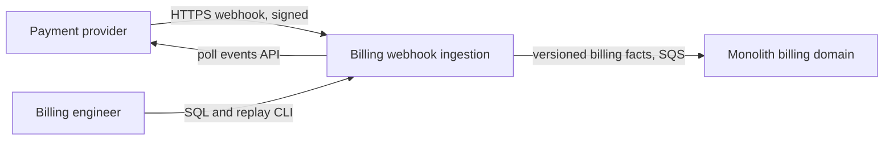
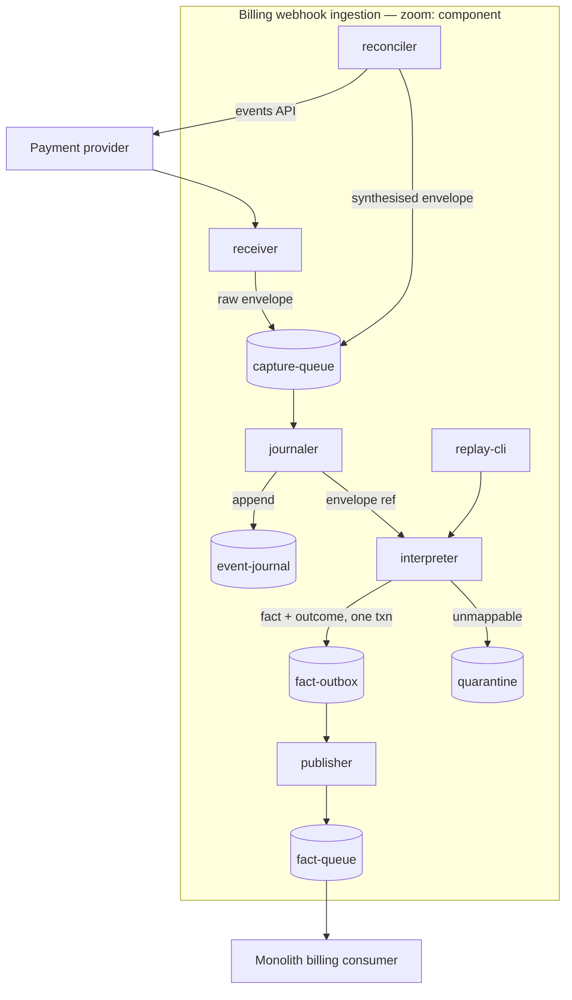
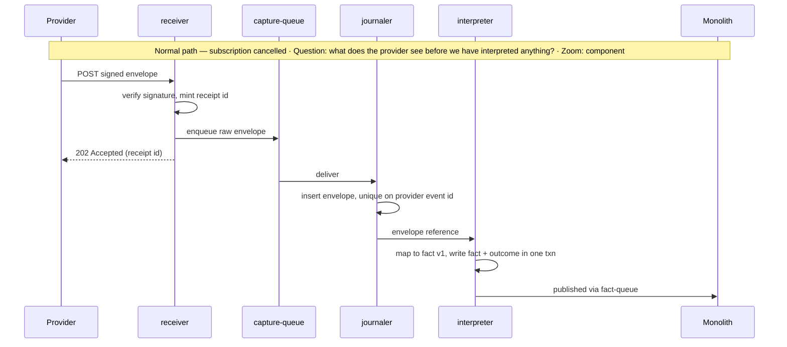

# Subsystem Design — Billing Webhook Ingestion

**Decision sought:** Approve a two-stage capture-then-interpret ingestion
subsystem on the team's existing API Gateway, Lambda, SQS and Postgres, with a
scheduled provider reconciler, replacing the monolith's inline webhook
endpoint.
**Author(s):** Billing team architecture pairing
**Status:** Draft
**Last updated:** 2026-09-20
**Reviewers:** Billing team, platform on-call, SOC 2 control owner

Knowledge surface detected: this repository's architecture-lenses corpus only.
No vendor platform skill or provider documentation is reachable here, so every
figure marked *(ungrounded)* is an assumption to verify before build, never a
binding contract.

## 1. Scope and Context

What does this subsystem own, what does it explicitly not own, and why does the
boundary sit there rather than somewhere else?

| In scope | Out of scope | Why |
| --- | --- | --- |
| Receiving, authenticating and durably capturing provider webhooks | The provider's retry and delivery behaviour | The provider's contract is external and fixed; the subsystem absorbs it |
| Interpreting captured envelopes into versioned internal billing facts | Deciding what a billing fact means to the product | Interpretation changes with the provider; product meaning belongs to the monolith |
| The 90-day evidence record of what the provider said and what we emitted | The monolith's subscription table | Two writers to one subscription record is a contradiction, not redundancy |
| Detecting and repairing divergence from the provider | Money movement, refunds, outbound provider mutation | Ingestion is read-side only; an outbound path doubles the trust boundary for no incident in evidence |

**Goals**

- Replaying any captured envelope any number of times produces exactly one
  billing fact and one downstream effect, proven by a CI replay test.
- The receiver answers within 500 ms at p99 under 10× today's event rate, below
  the provider's retry timeout *(ungrounded)*.
- After a 60-minute Postgres outage, the capture backlog drains to zero within
  15 minutes of restoration, with no envelope lost.
- Divergence between provider and product subscription state is detected within
  60 minutes, against eleven days in the reference incident.
- For any customer and any instant in the last 90 days, one query returns every
  envelope received and fact emitted, in under 10 seconds.

**Non-goals**

- The subsystem is not the record of product-side subscription state. A reader
  who expects the carve-out to move that table is reading a larger change.
- It is not a general event bus. Other domains subscribe to the published fact
  queue rather than adding topics here.
- It does not remove the monolith's billing logic, only its ingestion path.



Question: which parties cross the subsystem boundary, and in which direction?
Zoom: system context.

The boundary falls at *interpretation of the provider's vocabulary*: that is
what the provider changes without warning, and what the monolith should never
have to track. Moving subscription state the other way would give one record
two authorities, which is a correctness defect rather than a redundancy.
Walking the decomposition rubric over the candidate children — receiver,
interpreter, reconciler — none carries a live architectural decision of its own,
so all three stay rows in the structural model.

## 2. Structural Model

What are this subsystem's internal elements, how do they relate to each other,
and at what zoom level are we looking?

| Element | Type | Responsibility | Zoom |
| --- | --- | --- | --- |
| `receiver` | Lambda behind API Gateway | Verify the signature, mint a receipt id, enqueue the envelope, answer 2xx | component |
| `capture-queue` | SQS standard queue | Hold raw envelopes while the journal is unavailable | component |
| `journaler` | Lambda | Write each envelope once into the journal, keyed by provider event id | component |
| `event-journal` | Postgres schema, append-only | Hold raw envelopes and interpretation outcomes for 90 days | component |
| `interpreter` | Lambda | Map an envelope to zero or more versioned billing facts, or to a quarantine row | component |
| `fact-outbox` | Postgres table | Hold emitted facts until publication is confirmed | component |
| `publisher` | Lambda | Move outbox rows onto the fact queue and mark them published | component |
| `fact-queue` | SQS standard queue | Deliver facts to the monolith | component |
| `reconciler` | EventBridge schedule and Lambda | Compare the provider's event list against the journal, re-enqueue gaps | component |
| `replay-cli` | Operator tool | Re-drive selected journal rows through interpretation | component |

| From | To | Nature | Protocol |
| --- | --- | --- | --- |
| `receiver` | `capture-queue` | publishes-to | async message |
| `capture-queue` | `journaler` | triggers | async event-source mapping |
| `journaler` | `event-journal` | owns | transactional write |
| `journaler` | `interpreter` | publishes-to | async message |
| `interpreter` | `fact-outbox` | owns | same transaction as the journal outcome row |
| `publisher` | `fact-queue` | publishes-to | async message |
| `fact-queue` | monolith | delivers-to | async message, at-least-once |
| `reconciler` | `capture-queue` | publishes-to | async message, synthesised envelope |
| `replay-cli` | `interpreter` | calls | direct invoke |



Question: where does an envelope become a fact, and what survives if that step
fails? Zoom: component.

The zoom is component because the live decision is which failures stay
isolated, and seams between deployables decide that. The load-bearing seam is
`journaler` → `interpreter`: capture is schema-agnostic and cannot fail on a
payload change, interpretation is schema-aware and fails loudly. Each element
answers a goal in the scope table — `reconciler` the 60-minute detection goal,
`fact-outbox` the exactly-one-effect goal, `event-journal` the 90-day
answerability goal.

Three trust boundaries are crossed: the public internet at `receiver`, which
rejects an unsigned request before any write; the account boundary at the
provider events API, where an egress credential lives; and the ownership
boundary at `fact-queue`, where our guarantees end.

## 3. Runtime Model

How does this subsystem behave at runtime, on the normal path and when
something goes wrong?

| Scenario | Trigger | Path |
| --- | --- | --- |
| Subscription cancelled at the provider | Provider POSTs `subscription.cancelled` | normal |
| Provider retries after our timeout while Postgres is down | Provider POSTs the same event id twice, journal unavailable | failure / recovery |



```mermaid
sequenceDiagram
    participant Prov as Provider
    participant Rec as receiver
    participant CQ as capture-queue
    participant Jr as journaler
    participant PG as Postgres
    Note over Prov,PG: Failure / recovery — provider retry during a database outage · Question: what is lost, duplicated, or delayed? · Zoom: component
    Prov->>Rec: POST envelope E (attempt 1)
    Rec->>CQ: enqueue E
    Rec-->>Prov: 202 Accepted
    CQ->>Jr: deliver E
    Jr->>PG: insert
    PG-->>Jr: connection refused
    Jr-->>CQ: nack, message returns after visibility timeout
    Prov->>Rec: POST envelope E (attempt 2, same event id)
    Rec->>CQ: enqueue E again
    Rec-->>Prov: 202 Accepted
    Note over PG: Postgres restored
    CQ->>Jr: redeliver both copies
    Jr->>PG: insert; second copy violates the unique key and is dropped
```

These two runs together decide the three incidents in evidence. The normal path
acknowledges before interpreting, removing the timeout that caused the
double-charge. The failure path absorbs duplication at a unique key rather than
a retry policy — the difference between tolerating the provider's retries and
hoping to avoid them.

## 4. Contracts and Invariants

What must always hold true across every boundary this subsystem exposes, and
how would a violation be caught?

| Semantic name | Parties | Inputs/outputs | Identity | Compatibility | Failure semantics | Invariant | Enforcement | Verification |
| --- | --- | --- | --- | --- | --- | --- | --- | --- |
| Webhook intake | provider → `receiver` | Provider JSON in, 202 with receipt id out | Provider signature over the raw body | Unknown fields are captured, never rejected | Bad signature returns 401 before any write; any other error returns 5xx so the provider retries | An accepted envelope is durable before the 202 is sent | Enqueue confirmed before response | Chaos drill: kill the journal, confirm 202s continue and nothing is lost |
| Billing fact | subsystem → monolith | Versioned fact envelope with `fact_id`, `subject_id`, `occurred_at`, `schema_version` | `fact_id`, deterministic from provider event id and fact index | Additive fields only within a major; a breaking change publishes a new `schema_version` alongside the old | At-least-once delivery; consumer discards a `fact_id` it has applied, and ignores a fact older than the one applied for that subject | One provider event yields the same `fact_id` set on every replay | Deterministic id derivation plus outbox | Contract test in both repositories, run on every publisher change |
| Evidence query | operator → `event-journal` | Customer id and time range in, envelopes plus outcomes out | IAM role with read-only grant, logged | Column additions only; no destructive schema change inside the 90-day window | A query outside retention returns an explicit out-of-window marker, never an empty result | Every envelope has exactly one terminal outcome: applied, quarantined, or ignored-by-rule | Check constraint on the outcome table | Nightly job asserting zero envelopes without a terminal outcome after one hour |

The third invariant is load-bearing: an envelope with no terminal outcome is
how an event goes missing quietly, the shape of the eleven-day incident. A
mandatory outcome turns a silent gap into a countable number an alert fires
on. The billing-fact contract pushes ordering onto the consumer as a
monotonicity rule, because a FIFO queue would buy ordering the provider never
gave us.

## 5. Data and State

Who owns each piece of data or state this subsystem touches, how does it change
over its lifecycle, and what must stay consistent?

| Element | State it owns | Lifecycle | Consistency requirement |
| --- | --- | --- | --- |
| `receiver` | stateless | n/a | n/a |
| `capture-queue` | In-flight raw envelopes | Created on receipt, retired on journal write or at the retention bound *(ungrounded)* | None beyond at-least-once delivery |
| `journaler` | stateless | n/a | n/a |
| `event-journal` | Raw envelope, headers, receipt id, received-at, outcome | Created once per provider event id, outcome updated once, archived at 90 days | An envelope and its outcome are never observed in different transactions |
| `interpreter` | stateless | n/a | n/a |
| `fact-outbox` | Unpublished facts | Created with the outcome row, retired on publish confirmation | A fact exists in the outbox if and only if its journal outcome says applied |
| `publisher` | stateless | n/a | n/a |
| `fact-queue` | In-flight facts | Created on publish, retired on consumer ack | None beyond at-least-once delivery |
| `reconciler` | High-water mark per event type | Advanced after each successful sweep | Advanced only after the gap re-enqueue is confirmed |
| `replay-cli` | stateless | n/a | n/a |

The journal owns the raw envelope rather than the receiver because durability
outlives the request, and rather than the interpreter because evidence must
survive a failed interpretation. The outbox invariant is strict — one
transaction — because a fact downstream with no journal outcome is unauditable,
and a SOC 2 audit reads the journal. Everything else is eventual, absorbed by
the identity rules in the contract model of section 4.

Retention is 90 days hot in Postgres for the answerability goal, then archived
to object storage under the same encryption and access controls; the archive
horizon and the personal-data fields inside payloads need the SOC 2 control
owner's ruling.

## 6. Deployment and Operations

How is this subsystem deployed, operated, and observed once it is running?

| Deployment unit | Runs as | Scaling | Observability |
| --- | --- | --- | --- |
| `receiver` | Lambda behind API Gateway | Concurrency scales with request rate; reserved concurrency caps blast radius on the shared account | p99 response time and non-2xx rate, per event type |
| `journaler` and `interpreter` | Lambda, SQS event-source mapping | Scales with queue depth up to a configured maximum concurrency | Age of the oldest message on `capture-queue`; quarantine row count |
| `publisher` | Lambda on a short schedule | Fixed low concurrency; one writer per outbox partition | Outbox depth and oldest unpublished row age |
| `reconciler` | Lambda on an EventBridge schedule | One invocation per sweep window | Gaps found per sweep — a non-zero value that persists is the divergence alarm |
| `event-journal` | Existing Postgres cluster, separate schema and role | Storage growth is linear in event volume | Storage headroom; envelopes lacking a terminal outcome after one hour |

Physical placement matches the structural model, so no topology diagram is
drawn. The shape buys a cost floor of Postgres storage alone, which matters for
a two-engineer team with no platform budget. The signals in this deployment
table separate a provider problem, a database problem, a mapping problem and a
consumer problem without reading code.

Subsystem deploys are independent of monolith deploys, which takes the deploy
off the ingestion path — the direct cause of the forty-minute loss.

## 7. Quality Scenarios and Verification

For each quality attribute that matters here, what scenario proves it holds,
and how do we verify that?

| Source | Stimulus | Environment | Artifact | Response | Measurable target | Business consequence | Mechanism | Verification |
| --- | --- | --- | --- | --- | --- | --- | --- | --- |
| Provider | Sends the same event id three times | Normal | `journaler`, `interpreter` | One journal row, one fact, one downstream effect | Exactly 1 of each, 0 duplicates | A duplicate charge and a refund conversation | Unique key on provider event id plus deterministic `fact_id` | Replay test in CI on every merge |
| Postgres | Becomes unavailable for 60 minutes | Degraded | `receiver`, `capture-queue` | Receiver keeps accepting; backlog drains after restore | 0 envelopes lost; backlog at 0 within 15 min of restore | Reconstructing events by hand cost two engineers 1.5 days | Capture queue sits in front of the database | Quarterly game day with the database stopped |
| Provider | Drops or delays a cancellation entirely | Normal | `reconciler` | Gap detected and re-enqueued | Detected within 60 min | 11 days of service given away free | Scheduled sweep against the provider events API | Synthetic suppressed event, monthly |
| Provider | Changes a payload shape without a version bump | Normal | `interpreter` | Envelope quarantined, captured intact, alert raised | 0 envelopes lost; alert within 5 min | Silent mis-billing across every affected customer | Schema-agnostic capture; strict interpretation | Fuzzed-payload test against the interpreter |
| Billing engineer | Asks what happened to one customer 80 days ago | Normal | `event-journal` | Envelopes and outcomes returned | Under 10 s | Audit finding; support cannot answer | Indexed 90-day journal | Timed query in the monthly audit rehearsal |

Each target is a number an alert is built from, unlike the "make it reliable"
framing the incidents were reviewed under. The 60-minute detection target comes
from how long the business tolerates serving a cancelled customer, not from what
the sweep can achieve. The 15-minute drain target is the load-sensitive one: it
holds while volume stays inside the Lambda concurrency cap, and crossing that
cap triggers a revisit of interpreter batching.

## 8. Implementation Mapping

Where does each element in the model above actually live in source, build, and
deployment?

| Semantic element | Source owner | Build unit | Deployable | Verification |
| --- | --- | --- | --- | --- |
| `receiver` | Billing team, `services/billing-ingest/receiver` | `receiver` package | Lambda behind API Gateway | Signature-rejection test; p99 load test |
| `capture-queue`, `fact-queue` | Billing team, `infra/billing-ingest` | Infrastructure-as-code module | SQS queues with dead-letter queues | Drill asserting redrive from each dead-letter queue |
| `journaler` | Billing team, `services/billing-ingest/journaler` | `journaler` package | Lambda with SQS event-source mapping | Duplicate-insert test |
| `event-journal`, `fact-outbox` | Billing team, `services/billing-ingest/schema` | Migration set | Schema in the existing Postgres cluster | Constraint test; no-orphan nightly job |
| `interpreter` | Billing team, `services/billing-ingest/interpreter` | `interpreter` package | Lambda | Fuzzed-payload test; golden-envelope fixtures per event type |
| `publisher` | Billing team, `services/billing-ingest/publisher` | `publisher` package | Scheduled Lambda | Outbox drain test |
| `reconciler` | Billing team, `services/billing-ingest/reconciler` | `reconciler` package | Scheduled Lambda | Synthetic suppressed-event drill |
| `replay-cli` | Billing team, `tools/billing-replay` | CLI package | Operator workstation, assumed role | Replay idempotence test, shared with the duplicate-insert test |
| Billing fact contract | Billing team, consumed by monolith | Shared schema package | Versioned artifact | Contract test running in both repositories |

The mapping is one-to-one except in two places. `event-journal` and
`fact-outbox` share a build unit because one transaction writes both, and
splitting them lets two migration sets disagree about it. The fact contract has
no runtime deployable: it is a versioned schema artifact both sides depend on,
which makes the cross-repository contract test possible.

## 9. Decisions, Alternatives, and Risks

**Decisions**

- Separate capture from interpretation. A provider payload change then costs a
  quarantine queue and a redeploy, not lost events.
- Absorb duplicates at a unique key on the provider event id, and make every
  fact identity deterministic, rather than trying to make delivery exactly-once.
- Publish facts as idempotent, monotonic state assertions, so the monolith needs
  no ordering guarantee the provider never gave us.
- Add a reconciler that polls rather than trusting delivery, because the design
  cannot detect an event the provider never sent.

**Alternatives considered**

- **Harden the monolith endpoint in place.** An inbox table and an async worker
  inside the monolith, no new deployable, weeks rather than a quarter.
  **Rejected because:** monolith deploys stay on the ingestion path, and a
  deploy during a provider outage is exactly the third incident.
- **Provider events onto an EventBridge bus as the capture layer.** Less code in
  the receiver and a managed retry surface. **Rejected because:** it needs a
  managed-service case, depends on a partner integration we cannot confirm here
  *(ungrounded)*, and leaves the 90-day journal in place anyway — it removes the
  smallest component while adding a dependency.
- **An ordered log, Kinesis or equivalent, instead of queue plus journal.** A
  single durable append-only stream with replay built in. **Rejected because:**
  ordering is the one property the provider does not give us, so we pay for an
  unusable guarantee, and per-customer lookup over 90 days still needs an
  indexed store. It becomes right if volume outgrows a Postgres journal.

**Risks**

- **The provider changes a field's meaning without changing its shape.** The
  interpreter maps it happily and bills wrongly. *Accepted unmitigated:* no
  structural control catches it; the reconciler's drift count is the only
  signal, and it is a lagging one.
- **The reconciler's provider API has unknown rate limits.** A sweep that
  throttles silently degrades the 60-minute detection target to nothing.
  *Mitigation:* the sweep emits its own success metric and alarms on absence,
  not just on failure.
- **Operational, 3am: the monolith consumer stalls and the outbox grows.**
  Postgres storage fills, which takes the journal down with it and stops
  capture. *Mitigation:* outbox depth alarm well below storage headroom, and a
  documented pause switch that stops publication without stopping capture.
- **At-least-once delivery meets a non-idempotent consumer path.** The
  double-charge returns, now harder to see. *Mitigation:* the contract test runs
  in the monolith's repository and fails its build, not ours.
- **Two engineers, one quarter, nine event types.** *Mitigation:* cutover runs
  one event type at a time, so an unfinished quarter leaves a working hybrid,
  not a half-migration.

## 10. Rollout, Migration, and Reversal

How does this subsystem roll out, migrate any existing data or state, and
reverse cleanly if it needs to come back out?

The shape is shadow traffic, then per-event-type cutover behind a flag. Phase
one registers the new endpoint alongside the monolith's and captures only,
validating signature handling and journal throughput against real traffic with
zero product effect. Phase two publishes facts, and the monolith consumes them
in compare-only mode, logging divergence against its own inline result.

Phase three flips one event type at a time, highest volume last, and removes
the monolith's inline handler only after all nine run clean for two weeks. No
historical data migrates: the journal starts empty, and the 90-day window is
fully useful 90 days after phase one.

Reversal at any phase is a per-event-type flag flip, because the monolith's
inline handler stays registered until the final step. After it, reversal means
re-enabling the handler from source control — a deploy, not a flag, and the
two-week clean run is what buys the right to accept that. Billing on-call owns
each cutover window; platform on-call is paged only for the shared Postgres
cluster.

## 11. Open Questions

- What are the provider's retry timeout, retry schedule, and signature
  algorithm? The provider's official documentation answers it; the 500 ms p99
  goal stays unverified until then.
- Does the provider expose an events-list API with 90 days of history, and at
  what rate limit? The provider account manager can confirm; without it the
  reconciler needs a different mechanism.
- What is the maximum retention of the capture queue? AWS SQS documentation
  answers it, and the 60-minute outage goal depends on the answer.
- Can the provider deliver to two endpoint URLs at once? Phase one assumes so;
  the provider dashboard settles it in minutes.
- Which payload fields are personal data for SOC 2, and does the journal need
  field-level redaction? The SOC 2 control owner decides.
