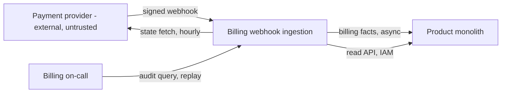
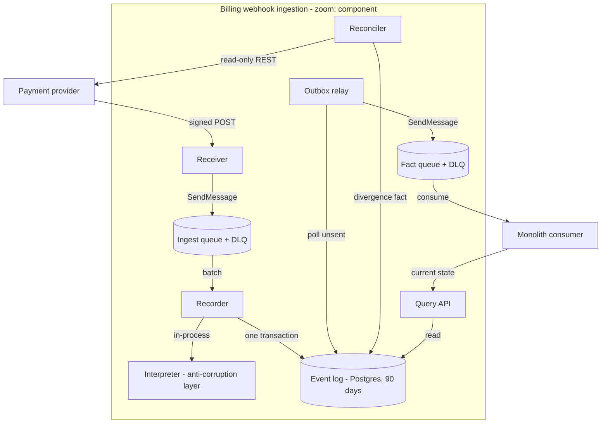
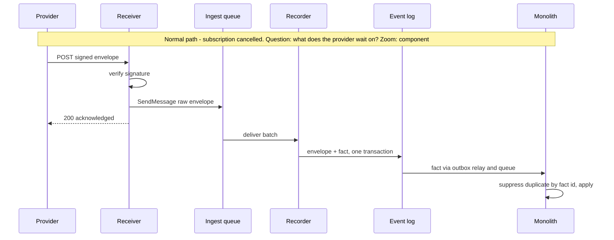
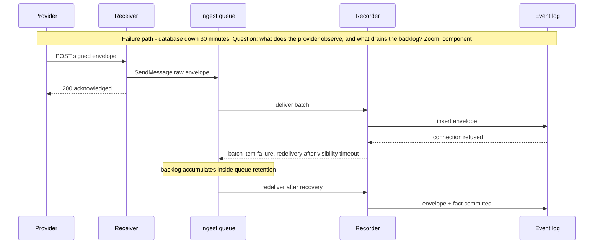

# Subsystem Design — Billing Webhook Ingestion

**Decision sought:** Approve durable capture before interpretation as this
subsystem's structure, and a fact stream plus read API as its boundary with the
monolith.
**Author(s):** Billing team architect
**Status:** Draft
**Last updated:** 2026-09-20
**Reviewers:** Billing team, platform on-call, SOC 2 control owner

## 1. Scope and Context

What does this subsystem own, what does it explicitly not own, and why does the
boundary sit there rather than somewhere else?

| In scope | Out of scope | Why |
| --- | --- | --- |
| Receiving and authenticating provider webhooks | Calling the provider to change subscriptions | Outbound writes carry a different identity and audit profile |
| Deciding what a provider payload means in our terms | Deciding what the product does about it | Interpretation needs the provider's vocabulary; behaviour needs the product's |
| The 90-day record of what the provider said and what we concluded | The monolith's subscription tables | One authority per value; that table is a derived copy |
| Detecting divergence between provider state and our conclusion | Repairing the monolith's data | Detection needs provider access; repair needs the monolith's rules |

**Goals**

- No acknowledged event is lost across a 30-minute deploy or database outage,
  verified by a game day.
- p99 acknowledgment latency under 500 ms at 10x current peak receipt.
- Divergence between provider state and our conclusion is detected within one
  reconciliation cycle of 1 hour.
- Any engineer answers "what did the provider tell us, and what did we do" for
  one customer at any point in the last 90 days, in under 5 minutes.
- A provider redelivery of a seen event produces zero additional domain
  effects.

**Non-goals**

- **Exactly-once delivery to the monolith.** Delivery is at-least-once with a
  stable fact identity, and the consumer suppresses the duplicate. Exactly-once
  across a process boundary is a guarantee neither side can honour.
- **Preserving provider send order.** The provider does not guarantee it, so
  ordering our receipt orders the wrong thing. The contract model in section 4
  names the version rule that replaces it.
- **A general-purpose event bus.** One provider, nine event types, one
  quarter.

*Question: which parties cross this subsystem's boundary, and in which
direction? Zoom: context.*

The boundary falls at meaning, not at transport. Parsing payloads in the
monolith is how one endpoint grew nine event types and three incidents, and
writing subscription rows from here would split billing rules across two
repositories.

## 2. Structural Model

What are this subsystem's internal elements, how do they relate to each other,
and at what zoom level are we looking?

| Element | Type | Responsibility | Zoom |
| --- | --- | --- | --- |
| Receiver | Lambda | Verify signature, enqueue raw envelope, acknowledge | component |
| Ingest queue | SQS queue + DLQ | Hold raw envelopes until durably recorded | component |
| Recorder | Lambda | Store the envelope, suppressing a duplicate event id | component |
| Interpreter | Module in Recorder | Map payload to a billing fact, or quarantine it | component |
| Event log | Postgres, monthly partitions | Hold envelopes, outcomes, facts, quarantine rows | component |
| Outbox relay | Lambda, 10s schedule | Move committed facts onto the fact queue | component |
| Fact queue | SQS queue + DLQ | Carry facts to the monolith's consumer | component |
| Reconciler | Lambda, hourly | Compare provider state to our last fact, emit divergence | component |
| Query API | Lambda URL, IAM auth | Serve current state and the audit trail | component |
| Replay command | Operator CLI | Re-emit facts for a customer or window | component |

| From | To | Nature | Protocol |
| --- | --- | --- | --- |
| Provider | Receiver | calls | signed HTTPS POST |
| Receiver | Ingest queue | publishes-to | SQS |
| Ingest queue | Recorder | delivers-to | event source, partial batch failures |
| Recorder | Event log | owns | one SQL transaction per envelope |
| Outbox relay | Fact queue | publishes-to | SQS |
| Fact queue | Monolith | delivers-to | SQS, monolith-owned consumer |

*Question: which element owns each step between an inbound webhook and a fact
the monolith can consume? Zoom: component.*

The zoom stops at the element that owns a decision or a failure. Receiver and
recorder are separate because acknowledgment must survive a database outage, so
the durable hop between them is a queue. The interpreter is a module, not a
deployable, because it holds no state and splitting it would give one contract
two homes.

Dependency direction runs inward, from transport adapters through application
services to the domain, with the event log behind a repository interface.
Nothing outside the interpreter knows a provider field name, which confines the
next unannounced payload change to one module.

Three trust boundaries cross this model: the provider hop, which carries
untrusted input and fails closed on signature verification; the monolith hop,
internal but cross-team and carrying no provider payloads; and the event log,
which sits in SOC 2 scope with its own retention and key policy.

## 3. Runtime Model

How does this subsystem behave at runtime, on the normal path and when
something goes wrong?

| Scenario | Trigger | Path |
| --- | --- | --- |
| Subscription cancelled | Provider posts `subscription.cancelled` | normal |
| Database unavailable during a deploy | Postgres refuses connections for 30 minutes | failure / recovery |

The normal path is sequenced because the provider's timeout decides whether we
get a duplicate, and acknowledgment precedes any product-owned resource. The
failure path is sequenced because it is the third incident: the 30 minutes that
lost events becomes a backlog that drains itself.

Two behaviours carry that path: partial batch failures, so one poison message
does not return a healthy batch, and queue redelivery instead of an in-process
retry loop, so an outage never amplifies into provider-facing retries.

## 4. Contracts and Invariants

What must always hold true across every boundary this subsystem exposes, and
how would a violation be caught?

| Semantic name | Parties | Inputs/outputs | Identity | Compatibility | Failure semantics | Invariant | Enforcement | Verification |
| --- | --- | --- | --- | --- | --- | --- | --- | --- |
| Webhook receipt | Provider, Receiver | Provider JSON in; 200 or 401 out | Signature over the raw body | Unknown fields stored verbatim, never rejected | 401 stores nothing; any other error returns 5xx so the provider retries | An acknowledged envelope is durable before the 200 | Enqueue precedes response | Test asserting no 200 without a message id |
| Envelope record | Recorder, Event log | Raw body, headers, receipt time | `provider_event_id` | Additive columns; body stays raw `jsonb` | Duplicate insert is a no-op | One event id yields one envelope row | Unique index, conflict-ignore insert | Replay the same envelope ten times |
| Billing fact | Subsystem, Monolith | `fact_id`, `subscription_id`, `type`, `provider_version`, `occurred_at`, payload | `fact_id`, stable across replays | Additive fields; a new type is ignorable | At-least-once; consumer suppresses by `fact_id` | A fact is emitted only after its envelope commits | Transactional outbox | Contract test in both repositories |
| Fact ordering | Subsystem, Monolith | `provider_version` per `subscription_id` | Per subscription | Consumer discards a version not greater than applied | A late or reordered fact is dropped, not applied | Applied state never moves backwards | Consumer-side version check | Reorder-injection contract test |
| Audit read | Query API, auditor | Customer and window in; envelopes and outcomes out | IAM principal, logged per call | Additive fields | A bad window errors, never returns empty | Every envelope returns with its outcome | Outcome keyed to envelope, left join | Quarterly audit drill |

Each invariant closes one incident class. Durability before acknowledgment plus
duplicate suppression closes the double charge, because the provider's retry now
reaches an idempotent insert. The version rule closes the class behind the
eleven-day stale subscription, where a late earlier event overwrites a later
conclusion.

Fact ordering is enforced outside this subsystem, which makes it the weakest.
The reconciler covers that gap by detecting the divergence a regressed consumer
causes.

## 5. Data and State

Who owns each piece of data or state this subsystem touches, how does it change
over its lifecycle, and what must stay consistent?

| Element | State it owns | Lifecycle | Consistency requirement |
| --- | --- | --- | --- |
| Receiver | stateless | n/a | n/a |
| Ingest queue | In-flight raw envelopes | Created on receipt, deleted on record, DLQ after three | Durable within queue retention; not an audit store |
| Recorder | stateless | n/a | n/a |
| Interpreter | stateless | n/a | n/a |
| Event log | Envelopes, outcomes, facts, quarantine rows | Written once, outcome appended, partition dropped at 90 days | Envelope and outcome commit together |
| Outbox relay | The sent marker it updates | Marker set after a confirmed send | Marker never precedes the send |
| Fact queue | In-flight facts | Created by the relay, deleted on acknowledgment, DLQ after three | Durable within queue retention; rebuildable |
| Reconciler | Last-compared cursor per subscription | Advanced each cycle | Advancing is idempotent; a re-run re-compares safely |
| Query API | stateless | n/a | n/a |
| Replay command | stateless | n/a | n/a |

The event log owns truth for two questions and nothing else does: what the
provider told us, because it stores raw bytes before interpretation, and what we
concluded, because the outcome commits in the same transaction. The monolith's
subscription table is a derived copy, so losing it costs a replay rather than an
investigation.

Retention is 90 days by monthly partition drop, which meets the audit window
without a delete job, and neither queue is an audit source. A legal hold flag
blocks the drop, because an audit opened on day 89 must not race it.

## 6. Deployment and Operations

How is this subsystem deployed, operated, and observed once it is running?

| Deployment unit | Runs as | Scaling | Observability |
| --- | --- | --- | --- |
| Receiver | Lambda behind a function URL | Reserved concurrency below the account limit | p99 acknowledgment latency; 401 rate; throttles |
| Recorder | Lambda, SQS event source | Concurrency capped to bound Postgres connections | Age of oldest message; batch failure rate; quarantine rate |
| Outbox relay | Lambda, 10-second schedule | Concurrency of one | Oldest unsent fact age |
| Reconciler | Lambda, hourly schedule | Concurrency of one | Divergences per cycle; provider API error rate |
| Query API | Lambda function URL | On demand | Calls by principal; p95 query latency |
| Event log | Postgres on the existing RDS instance | Vertical, shared with the monolith | Connection saturation; oldest partition age |
| Ingest and fact DLQs | SQS | n/a | Depth alarm at one message, paging billing on-call |

Placement matches the structural model in section 2, so this section adds no
second diagram. Every compute unit is a Lambda the team already operates, and
the only stateful component sits on an instance that already exists — what two
engineers and one quarter buy.

Sharing that instance is the one accepted shared failure domain, tolerable
because the acknowledgment path never touches Postgres, so an instance-wide
outage costs freshness rather than data. Section 9 names the trigger to move
it.

The alarms separate symptom from cause. Rising queue age at a flat quarantine
rate means the recorder or database is slow; the reverse means the provider
changed a payload; divergences with both flat mean a consumer is dropping
facts.

## 7. Quality Scenarios and Verification

For each quality attribute that matters here, what scenario proves it holds, and
how do we verify that?

| Source | Stimulus | Environment | Artifact | Response | Measurable target | Business consequence | Mechanism | Verification |
| --- | --- | --- | --- | --- | --- | --- | --- | --- |
| Provider | Redelivers after our response times out | normal | Recorder, event log | No second fact | 0 extra effects over 10 redeliveries | Another double charge | Unique event id, conflict-ignore insert | Duplicate-injection test in CI |
| Deploy | 30-minute database outage while events arrive | degraded | Ingest queue, recorder | Keeps acknowledging, then drains | 0 lost; drained 15 minutes after recovery | Another 40-minute loss and 1.5 engineer-days | Durable queue ahead of the database | Quarterly game day |
| Provider | Cancels a subscription we never hear about | normal | Reconciler | Emits a divergence fact | Detected within 1 hour | 11 days of service to a cancelled customer | Hourly comparison against the provider API | Synthetic divergence injected weekly |
| Provider | Changes a payload shape without a version bump | degraded | Interpreter | Quarantines, keeps recording, alarms | 0 malformed facts; alarm in 5 minutes | Wrong state applied silently | Strict parse with a quarantine state | Shape-drift fixture |
| Auditor | Asks what happened for one customer last month | normal | Query API, event log | Returns every envelope and outcome | Under 5 minutes within 90 days | A failed SOC 2 evidence request | Envelopes and outcomes in one store | Quarterly audit drill |
| Provider | 10x current peak receipt rate | peak | Receiver | Acknowledges without triggering retries | p99 under 500 ms | Retry storms become duplicate work | Enqueue-only receiver, reserved concurrency | Load test before phase 2 |

Every row is a past incident, an audit obligation, or the growth case, and the
first three targets map to the three incidents in order. That mapping is the
argument that this design answers them rather than rearranging them.

Two targets rest on assumptions: the 500 ms figure sits below a response window
section 11 raises as unconfirmed, and 10x is a planning multiple, not a
forecast.

## 8. Implementation Mapping

Where does each element in the model above actually live in source, build, and
deployment?

| Semantic element | Source owner | Build unit | Deployable | Verification |
| --- | --- | --- | --- | --- |
| Receiver | Billing team, `billing-ingest/receiver` | `receiver` | Receiver Lambda | Signature and enqueue-before-ack tests |
| Ingest queue and DLQ | Billing team, `billing-ingest/infra` | CDK stack | SQS queues | Assertion on redrive policy and DLQ wiring |
| Recorder | Billing team, `billing-ingest/recorder` | `recorder` | Recorder Lambda | Duplicate-injection and batch-failure tests |
| Interpreter | Billing team, `billing-ingest/domain` | `domain` | inside Recorder Lambda | Per-event-type and shape-drift fixtures |
| Event log | Billing team, `billing-ingest/migrations` | migration set | Postgres database | Migration test on unique index and partitions |
| Outbox relay | Billing team, `billing-ingest/relay` | `relay` | Relay Lambda | Outbox-lag monitor; crash-after-send test |
| Fact queue and DLQ | Billing team, `billing-ingest/infra` | CDK stack | SQS queues | Contract test consuming a published fact |
| Billing fact contract | Billing team, `billing-ingest/contracts` | shared schema | n/a | Contract test run in both repositories |
| Reconciler | Billing team, `billing-ingest/reconciler` | `reconciler` | Reconciler Lambda | Synthetic divergence test |
| Query API | Billing team, `billing-ingest/query` | `query` | Query API Lambda | Audit drill; IAM denial test |
| Replay command | Billing team, `billing-ingest/tools` | `tools` | operator CLI | Replay-idempotence test on a seeded window |

The mapping is one-to-one except twice: the interpreter ships inside the
recorder, and the fact contract has no runtime because both sides compile
against it. Both exist so a change to parsing or to the fact shape fails a test
rather than a customer.

## 9. Decisions, Alternatives, and Risks

What did we decide, what did we reject, and what could still go wrong?

**Decisions**

- **Durable capture before interpretation.** Nothing product-owned sits on the
  acknowledgment path, which keeps receipt working while Postgres is down.
- **A standard queue with version-based conflict resolution, not FIFO.** The
  consumer resolves by `provider_version` per subscription.
- **A transactional outbox rather than a direct publish.** A crash between an
  uncovered commit and send emits a fact with no record, or the reverse.
- **A strict interpreter with an explicit quarantine state.** The provider has
  changed a shape once without a version bump, and quarantining beats
  guessing.

**Alternatives considered**

- **Harden the existing synchronous endpoint.** An idempotency-key table, a
  retry wrapper and tighter timeouts in the monolith, with no new deployable. A
  reasonable engineer picks this on cost, and it does close the double charge.
  **Rejected because:** acceptance stays coupled to the product database and the
  deploy, so the 40-minute loss recurs, and the audit question has no store to
  answer from.
- **EventBridge as the spine, with its archive as the replay source.** A bus, a
  schema registry, and archive replay for a window — the shape a larger team
  picks.
  **Rejected because:** it is a new managed service needing a case, and its
  archive replays provider events rather than our interpretations, so the 90-day
  audit question would still need this event log.
- **SQS FIFO with a message group per subscription.** Strict per-customer
  ordering and content-based deduplication, with no consumer-side version check.
  **Rejected because:** it orders our receipt rather than the provider's sends,
  buying a guarantee that does not match truth, and one poison message then
  blocks every later event for that customer.

**Risks**

- **The monolith's consumer is the weakest link.** Duplicate suppression lives
  in a repository this team does not own, and a regression re-opens the
  double-charge class. Mitigation: its pipeline runs the contract test, and the
  reconciler catches the divergence within an hour.
- **Quarantine grows silently after a provider change.** Queues drain,
  dashboards look healthy, and facts stop for one event type. Mitigation: the
  quarantine rate pages rather than sitting on a dashboard.
- **Operational, 3am: the DLQ fills during a malformed-payload storm.** On-call
  chooses between redriving and waiting, under time pressure. Mitigation: the
  runbook says wait, because the event log holds every envelope and a later
  redrive is reproducible.
- **The reconciler is the piece most likely cut for time.** It alone closes the
  stale-subscription and silent-gap incidents, yet looks optional beside the
  ingest path. Mitigation: it ships in phase 2, ahead of the Query API.
- **Shared RDS instance, accepted unmitigated.** An instance-wide incident costs
  freshness, not data, and separating it now costs a quarter the team does not
  have. The trigger to move is either database incidents above two per quarter
  or a SOC 2 requirement for separate key scope; the move is a migration, not a
  redesign, because no other element addresses the instance directly.

## 10. Rollout, Migration, and Reversal

How does this subsystem roll out, migrate any existing data or state, and
reverse cleanly if it needs to come back out?

Rollout is phased with a shadow period, and the existing endpoint keeps serving
throughout. Phase 1 registers the subsystem as a second provider destination,
recording and interpreting every event while emitting no facts, and the team
compares its conclusions against the inline handler daily. Phase 2 starts the
reconciler and lets the monolith consume two low-risk event types behind a
feature flag.

Phase 3 moves the remaining seven types, then reduces the inline handler to a
logger for a week before deleting it. No historical data migrates: the event log
starts empty and reaches full 90-day coverage 90 days after phase 1, so the
audit goal lands then rather than at launch.

Reversal is the feature flag plus the retained handler until phase 3 deletes
it, after which it means restoring the handler from source control and
replaying any missed window from the event log. The billing team lead owns each
phase window; platform on-call is paged only for DLQ depth and queue age.

## 11. Open Questions

What remains genuinely unresolved, and who or what could resolve it?

- What is the provider's documented response window and retry schedule? The
  500 ms target assumes one; the billing team confirms it from the provider's
  documentation before the load test.
- Does the provider support two active webhook destinations? Phase 1's shadow
  period depends on it; provider support can answer, and a no turns phase 1 into
  a replay of captured traffic.
- Does the SOC 2 control owner accept billing evidence in a database sharing an
  instance with product data? Their answer decides whether the shared-instance
  trigger fires now.
- Can any event type exceed the queue's per-message size limit? Thirty days of
  measured payload sizes decides whether the receiver enqueues an object-store
  pointer instead of the body.
- Will the monolith's owning team run this subsystem's contract test in their
  pipeline? The ordering and duplicate invariants depend on a yes before
  phase 2.
