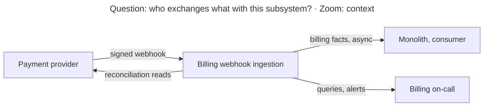
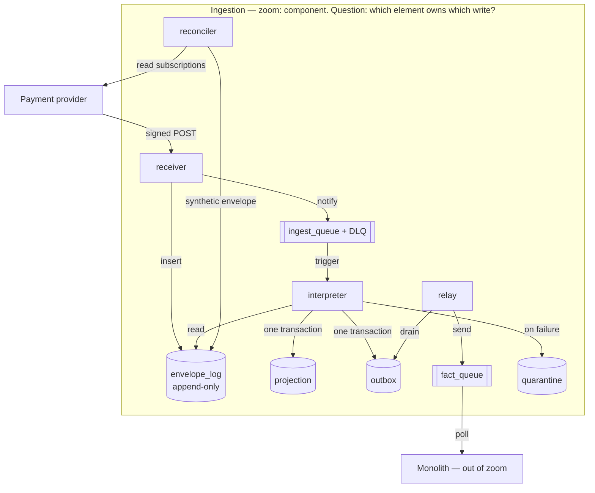
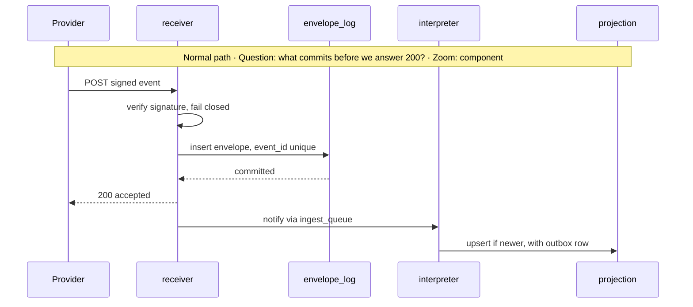

# Subsystem Design — Billing Webhook Ingestion

**Decision sought:** Adopt an accept-then-interpret ingestion subsystem whose
append-only envelope log is the authority for what the provider said, and whose
projection the monolith consumes as a subscriber.
**Author(s):** Billing team architect
**Status:** Draft
**Last updated:** 2026-09-20
**Reviewers:** Billing team, platform on-call, SOC 2 control owner

Knowledge surfaces detected: none, so every provider and AWS figure below is an
assumption, grounded per section 11.

## 1. Scope and Context

What does this subsystem own, what does it explicitly not own, and why does the
boundary sit there rather than somewhere else?

<!-- model -->
| In scope | Out of scope | Why |
| --- | --- | --- |
| Receiving, authenticating, and recording provider webhooks | Calling the provider to change subscriptions | Outbound commands carry their own authorization and idempotency |
| Authority for provider-asserted subscription state | Authority for entitlement | Entitlement mixes plan state with trials and grants the provider never sees |
| Detecting gaps between provider truth and our record | Invoicing, dunning, tax | Those read state, never the raw stream |
| The 90-day record of what arrived and what we did | Multi-year financial archive | Finance retention has a different control owner |
| Publishing billing facts the monolith subscribes to | Writing the monolith's subscription tables | A writer in another team's schema is a co-owner |

**Goals**

- Every webhook the provider records as delivered stays recoverable from our
  store for 90 days, with zero lost across any component's deploy.
- A duplicate delivery of one event id produces one billing effect.
- Provider-asserted state is confirmed daily, so an undelivered cancellation
  surfaces within 24 hours rather than eleven days.
- p99 acknowledgement stays under 500 ms at ten times current volume.
- One query answers what the provider said about a customer and what we did.

**Non-goals**

- **Restoring global ordering of provider events.** A reader may assume the
  design fixes ordering. It makes arrival order irrelevant instead, by the
  precedence invariant in section 4.
- **Replacing the monolith's subscription table.** It stays, fed by published
  facts, so the monolith's read paths need no change this quarter.
- **Self-healing on a malformed payload.** It waits for a human; guessing at
  billing semantics is the worse failure.



<!-- rationale -->
The boundary follows ownership of truth, not ownership of code. The provider
owns what happened commercially, this subsystem owns the record of what the
provider said, and the monolith owns what the product does about it.

The boundary that hurts most if crossed the other way is the write into the
monolith's tables. A subsystem writing a schema it does not own inherits that
schema's migrations, locks, and incident response — the coupling this carve-out
exists to remove.

## 2. Structural Model

What are this subsystem's internal elements, how do they relate to each other,
and at what zoom level are we looking?

<!-- model -->
| Element | Type | Responsibility | Zoom |
| --- | --- | --- | --- |
| `receiver` | Lambda behind API Gateway | Verify, persist, acknowledge | component |
| `envelope_log` | Postgres append-only table | Every accepted envelope verbatim, with arrival time and outcome | component |
| `ingest_queue` | SQS queue with dead-letter queue | Decouple acknowledgement from interpretation | component |
| `interpreter` | Lambda | Turn one envelope into a billing fact, under the precedence guard | component |
| `projection` | Postgres table | Provider-asserted state per subscription, rebuildable | component |
| `outbox` | Postgres table | Facts awaiting publication | component |
| `relay` | Lambda, one-minute schedule | Drain outbox rows to the fact queue | component |
| `fact_queue` | SQS queue | The monolith's subscription point | component |
| `reconciler` | Lambda, daily schedule | Diff provider state against the projection | component |
| `quarantine` | Postgres table plus operator queries | Failed envelopes and their reason | component |

| From | To | Nature | Protocol |
| --- | --- | --- | --- |
| `receiver` | `envelope_log`, `ingest_queue` | writes, publishes-to | sync insert, then async notify |
| `interpreter` | `projection`, `outbox`, `quarantine` | writes | sync SQL, one transaction |
| `relay` | `fact_queue` | publishes-to | async send |
| `reconciler` | provider API | calls | sync HTTPS, read-only |
| monolith | `fact_queue` | subscribes-to | async, at-least-once |



<!-- rationale -->
The zoom is component because the live decision is which element owns which
write; an element appears only when it owns a distinct write or failure mode.

Splitting `receiver` from `interpreter` answers the double-charge incident.
Acknowledgement needs only a signature check and one insert, so the retry timer
stops before any billing semantics run, and those then run as often as needed
with nobody watching.

`outbox` and `relay` exist because a database transaction does not protect an
external side effect: writing the projection and sending to `fact_queue`
directly is a dual write that loses one of the two on a crash.

Three trust boundaries cross this model — the provider edge, unauthenticated
until the signature verifies; the monolith edge, crossing team ownership with no
shared credentials; and the operator edge into SOC 2-scoped payloads, which
section 6 gives a separate role.

## 3. Runtime Model

How does this subsystem behave at runtime, on the normal path and when something
goes wrong?

<!-- model -->
| Scenario | Trigger | Path |
| --- | --- | --- |
| New event interpreted | An event we have not seen | normal |
| Duplicate after our timeout | A retry of a recorded event | failure / recovery |
| Out-of-order arrival | A cancellation before the update it supersedes | failure / recovery |
| Projection unavailable | The interpreter cannot commit | failure / recovery |
| Undelivered event | The reconciler finds state we never got | failure / recovery |
| Uninterpretable payload | A shape change with no version bump | failure / recovery |



```mermaid
sequenceDiagram
    participant Prov as Provider
    participant R as receiver
    participant EL as envelope_log
    participant I as interpreter
    participant P as projection
    Note over Prov,P: Failure and recovery · Question: where does each attempt stop? · Zoom: component
    Prov->>R: POST event E, a retry after our timeout
    R->>EL: insert envelope E
    EL-->>R: unique violation
    R-->>Prov: 200 accepted, already recorded
    Prov->>R: POST event F, accepted and notified
    R->>I: notify
    I->>P: upsert fact F
    P-->>I: connection error
    I-->>I: abort, no partial write
    Note over I,P: SQS redelivers with backoff; past the redrive limit it lands in the DLQ
```

<!-- rationale -->
These two runs carry the argument. The normal path shows the only work inside
the retry window is a verify and an insert; the failure run shows a duplicate
stopping at a unique constraint, and an outage aborting a transaction that had
published nothing.

The other four scenarios use the same two mechanisms: precedence decides
ordering, an undelivered event becomes a synthetic envelope, and an
uninterpretable payload takes the quarantine branch.

## 4. Contracts and Invariants

What must always hold true across every boundary this subsystem exposes, and how
would a violation be caught?

<!-- model -->
| Semantic name | Parties | Inputs/outputs | Identity | Compatibility | Failure semantics | Invariant | Enforcement | Verification |
| --- | --- | --- | --- | --- | --- | --- | --- | --- |
| Webhook receipt and envelope identity | provider → `receiver` → `envelope_log` | Signed JSON in, status out; envelope row written | Signature over the raw body; row keyed by event id | Unknown types and fields store; only consumed fields validate; corrections are new envelopes | 401 on a bad signature; 5xx on internal error, so the provider retries; a duplicate insert counts as success | Acknowledged only after one immutable row per event id commits | Unique index; `UPDATE`/`DELETE` revoked from the app role | Failed-insert, tampered-body, duplicate-replay, grant assertions |
| Fact precedence | `interpreter` → `projection` | Envelope in, projection row out | Subscription id | No sequence field falls back to stated occurrence time, and records that | A stale fact records applied-no-op | The projection holds the highest-precedence fact, whatever the arrival order | Conditional upsert on the stored precedence | Permutation property test |
| Fact publication | `interpreter` → monolith | Typed fact: subscription, state, precedence, source event | Fact id equals the envelope id | Additive only; a semantic change is a new type | At-least-once; consumers deduplicate on fact id | Each committed projection change has one outbox row, eventually published | Same-transaction write; relay marks published after a send | Consumer contract test; alert on rows past five minutes |
| Forensic answerability | `envelope_log` → operator | Customer id in; ordered envelopes and outcomes out | Authenticated operator, read-only role | Query set versioned with the schema | A missing envelope is a reconciler finding, never a silent empty result | Every envelope carries an outcome for 90 days | Outcome column not null, set in the interpreter's transaction | Daily count of null outcomes past an hour |

<!-- rationale -->
Each invariant is load-bearing because its violation is silent: a broken receipt
loses events nobody misses until an audit, a broken identity double-charges, and
broken precedence leaves a cancelled customer active.

Enforcement names a database constraint or a grant wherever one can carry the
rule, because an application-level duplicate check is a check-then-act race
under concurrent redelivery, and these Lambdas run concurrently by construction.

Compatibility is written against a provider that has already changed a shape
with no version bump. Storing unknown fields and validating only consumed ones
makes an addition inert, and a consumed-field change lands in quarantine.

## 5. Data and State

Who owns each piece of data or state this subsystem touches, how does it change
over its lifecycle, and what must stay consistent?

<!-- model -->
| Element | State it owns | Lifecycle | Consistency requirement |
| --- | --- | --- | --- |
| `receiver`, `interpreter`, `relay`, `reconciler` | stateless | n/a | n/a |
| `envelope_log` | Raw envelopes and their outcome | Created on receipt; outcome set once; deleted at 90 days | Strict: outcome and projection change commit together, so none is seen applied without its effect |
| `projection` | Provider-asserted state and its precedence marker | Created on first fact; updated only by a higher-precedence fact | Strict inside the subsystem, eventual toward the monolith with a five-minute alert |
| `outbox` | Facts pending publication | Created in the interpreter's transaction; marked published by the relay; deleted at seven days | Strict with `projection`: a change with no outbox row is a defect the outbox-age alert catches |
| `quarantine` | Failed envelopes with reason and attempt count | Created on failure; retired when an operator resolves it | Strict with `envelope_log`: the envelope row persists with outcome `quarantined` |
| `fact_queue` | In-flight facts | Created by the relay; retired on acknowledgement | Eventual; the monolith deduplicates on fact id |

<!-- rationale -->
`envelope_log` owns the raw payload because the value of a raw record is that
nobody has interpreted it. Once a caller stores its own reading, that reading is
what survives — and the incident needing the original is the one where it was
wrong.

The projection is eventual toward the monolith by choice: strictness there means
a synchronous call that puts the monolith's availability back inside the retry
window. Retention length comes from the answerability goal and the SOC 2 scope,
not from storage cost.

## 6. Deployment and Operations

How is this subsystem deployed, operated, and observed once it is running?

<!-- model -->
| Deployment unit | Runs as | Scaling | Observability |
| --- | --- | --- | --- |
| `receiver` | Lambda on its own API Gateway stage | Scales with request rate; reserved concurrency caps blast radius | p99 ack, 5xx rate, signature rejections |
| `interpreter` | Lambda on an SQS event source mapping | Scales with queue depth, capped below the connection budget | Oldest-message age, DLQ depth |
| `relay` | Lambda, one-minute schedule | Single concurrency; batch grows with backlog | Age of the oldest unpublished outbox row |
| `reconciler` | Lambda, daily schedule | Fixed; paginates under the provider's rate limit | Drift count, and coverage, so a throttled run alerts on partial coverage |
| Retention job | Lambda, daily schedule | Fixed; bounded delete batches | Rows deleted, oldest remaining envelope |
| Subsystem Postgres | Managed database, all four tables | Vertical; retention holds size flat | Connection saturation, replication lag, table growth |

<!-- rationale -->
Placement matches the structural model in section 2, so this design carries no
topology diagram. Each element is its own deployment unit for one reason:
`receiver` stays deployable without touching interpretation, which keeps a
deploy from losing events.

The two alerts that matter at 3am are oldest-message age and DLQ depth. Both say
the provider is still being acknowledged while we no longer act on what it says
— the shape of incident two, and the condition no dashboard carries. Operations
get three runbooks: drain a DLQ, resolve a quarantine, rebuild the projection.

SOC 2 lands on a logged operator read role, append-only grants, and a retention
job that makes deletion a mechanism.

## 7. Quality Scenarios and Verification

For each quality attribute that matters here, what scenario proves it holds, and
how do we verify that?

<!-- model -->
| Source | Stimulus | Environment | Artifact | Response | Measurable target | Business consequence | Mechanism | Verification |
| --- | --- | --- | --- | --- | --- | --- | --- | --- |
| Provider | Retries after a timeout | Normal | `receiver`, `envelope_log` | Recorded as a duplicate; no new fact | 1 fact per event id over 10,000 replays | A double charge and a refund | Unique index; interpretation off the retry path | CI replay harness |
| Provider | Cancels, but the webhook never arrives | Degraded delivery | `reconciler`, `projection` | Daily diff emits a synthetic envelope | Drift found within 24 h; 0 past 48 h | Eleven days of service given away | Provider read diffed against state | Drill suppressing a webhook |
| Deploy | Every component redeploys mid retry storm | Peak | `receiver`, `ingest_queue` | Acknowledgement continues, or the provider retries into a healthy instance | 0 envelopes absent that the provider recorded delivered | Two engineers rebuilding by hand | Stateless receiver; log before ack | Deploy-under-load test |
| Product database | Unavailable ten minutes | Degraded | `interpreter`, `ingest_queue` | Receipt continues; interpretation backs off | 0 lost; drained in 15 min | State lags, never diverges | Queue decoupling; transactional interpretation | Fault-injection drill |
| Provider | Sends 10× volume in one burst | Peak | `receiver` | Acknowledges inside the provider's timeout | p99 under 500 ms at 10× | Retries escalate into a self-inflicted storm | One verify, one indexed insert | Load test on a production-shaped database |
| Provider | Changes a consumed field, no version bump | Normal | `interpreter`, `quarantine` | Quarantines with the raw body; alerts; publishes nothing | 0 misinterpreted facts; alert in 5 min | Silent corruption of billing state | Validate consumed fields only; fail closed | Mutated-payload contract test |

<!-- rationale -->
These targets sit where a number changes a decision: the 500 ms budget keeps the
design inside the provider's timeout, and forces provisioned concurrency on
`receiver` if a load test misses it.

The three scenarios drawn from the incidents come first because each names the
mechanism that turns a recurrence into a non-event. Two figures they lean on are
ungrounded: the provider's timeout and retry schedule, and the API Gateway
integration timeout with the Lambda cold-start profile.

## 8. Implementation Mapping

Where does each element in the model above actually live in source, build, and
deployment?

<!-- model -->
| Semantic element | Source owner | Build unit | Deployable | Verification |
| --- | --- | --- | --- | --- |
| `receiver` | `billing-ingest/receiver` | `receiver` package | `receiver` Lambda | Signature-rejection, commit-before-ack tests |
| `interpreter` | `billing-ingest/interpreter` | `interpreter` package | `interpreter` Lambda | Permutation and mutated-payload tests |
| `relay` | `billing-ingest/relay` | `relay` package | `relay` Lambda | Publication test with an injected failure |
| `reconciler` | `billing-ingest/reconciler` | `reconciler` package | `reconciler` Lambda | Suppressed-webhook staging drill |
| `envelope_log` | `billing-ingest/schema` | Migration set | Subsystem Postgres | Unique-index and grant assertions |
| `projection` | `billing-ingest/schema` | Migration set | Subsystem Postgres | Rebuild-from-log test |
| `outbox` | `billing-ingest/schema` | Migration set | Subsystem Postgres | Same-transaction test; outbox-age monitor |
| `quarantine` | `billing-ingest/schema` | Migration set | Subsystem Postgres | Alert test; resolution drill |
| `ingest_queue` | `billing-ingest/infra` | Infrastructure module | SQS queue plus DLQ | Redrive-policy assertion |
| `fact_queue` | `billing-ingest/infra` | Infrastructure module | SQS queue | Consumer contract test, monolith suite |

<!-- rationale -->
Every source path is billing-team owned, and the mapping is one-to-one except
for the four tables, which share one migration set and one database. They
participate in the same transactions, so splitting them trades the guarantees in
section 4 for an isolation nobody needs here. `fact_queue` is verified outside
this repository, because a consumer test the producer writes proves only what
the producer believes.

## 9. Decisions, Alternatives, and Risks

What did we decide, what did we reject, and what could still go wrong?

**Decisions**

- **Accept and persist before interpreting**, so the retry window bounds only a
  verify and an insert.
- **The log is the authority; the projection is derivable**, making a rebuild
  routine rather than a reconstruction from the provider's dashboard.
- **Precedence from the payload, not delivery order**, since the provider
  guarantees no ordering.
- **Transactional outbox**, the only shape that keeps a projection change and
  its fact from diverging on a crash.
- **Daily reconciliation**, since only a detector makes a silent miss visible.

**Alternatives considered**

- **Keep the endpoint in the monolith and make it idempotent.** Add a unique
  constraint on event id and move slow work to a background job — the cheapest
  option, and a reasonable pick under a two-engineer quarter. **Rejected
  because:** acknowledgement stays coupled to the monolith's deploy and
  database, the specific cause of the forty-minute loss.
- **SQS FIFO with subscription id as the message group.** Ordering per
  subscription comes from the queue and the precedence logic disappears.
  **Rejected because:** FIFO preserves the order we received events in, not the
  order they occurred in, so a retry of an earlier event still lands after a
  later one and the guard is needed anyway, at a throughput cap.
- **A streaming service as the durable log.** The stream is the log, replay is
  native, consumers are independent. **Rejected because:** the record must be
  queryable per customer for 90 days, which an index answers in one lookup; it
  adds a service the team does not run; and it removes the outbox, restoring
  the dual write.

**Risks**

- **Not every event type may carry a precedence field.** The fallback is only as
  good as the provider's clock. *Mitigation:* audit all nine types in week one
  and quarantine a type with neither field rather than guessing.
- **Operational: the DLQ fills at 3am and the on-call engineer has never drained
  one.** Events stay safe in the log while the projection diverges.
  *Mitigation:* drill the runbook before launch and link it from the alert.
- **A provider schema change could quarantine every event at once.** Failing
  closed is correct and also total. *Accepted unmitigated:* a wrong billing fact
  costs more than a late one, and the raw bodies make the fix a replay.

## 10. Rollout, Migration, and Reversal

How does this subsystem roll out, migrate any existing data or state, and
reverse cleanly if it needs to come back out?

The shape is shadow traffic, then a flag flip, in four phases. Phase one ships
`receiver` and `envelope_log` behind a second webhook endpoint registered
alongside the monolith's, so both receive every event and only the monolith
acts; this alone ends the event-loss class. Phase two ships `interpreter`,
`projection`, and a comparison job, run until it reports zero disagreements for
seven straight days.

Phase three ships `outbox`, `relay`, and `fact_queue`, with the monolith
consuming behind a flag defaulted off. Phase four flips the flag, and the old
registration is removed a week later. No data migration is required: the
projection builds itself forward from phase one.

Reversal is the flag in every phase, because the monolith's inline handling
stays registered until phase four plus one week. After that it costs a
re-registration and a redeploy from a tagged commit — the one-way door, which
opens only after seven clean comparison days and one rebuild drill. The billing
lead owns each phase gate; the on-call engineer holds the phase-four window.

## 11. Open Questions

What remains genuinely unresolved, and who or what could resolve it?

- What is the provider's webhook timeout and retry schedule? *Resolved by:* the
  provider's documentation, before the 500 ms target is fixed.
- What are the binding API Gateway integration timeout and Lambda cold-start
  profile at our concurrency? *Resolved by:* the installed AWS serverless skill
  or current service quotas, not memory.
- Does every one of the nine event types carry a monotonic sequence field?
  *Resolved by:* a payload audit in build week one, deciding whether the
  section 4 fallback is an edge case.
- What retention applies beyond 90 days, and who owns that archive?
  *Resolved by:* the SOC 2 control owner and finance.
- Which SOC 2 evidence conventions, alerting standards, and prior billing
  architecture records exist? None is reachable this session. *Resolved by:*
  the billing lead naming them before review.
