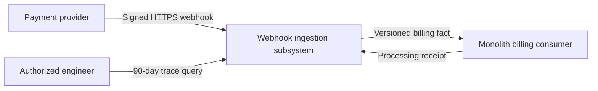
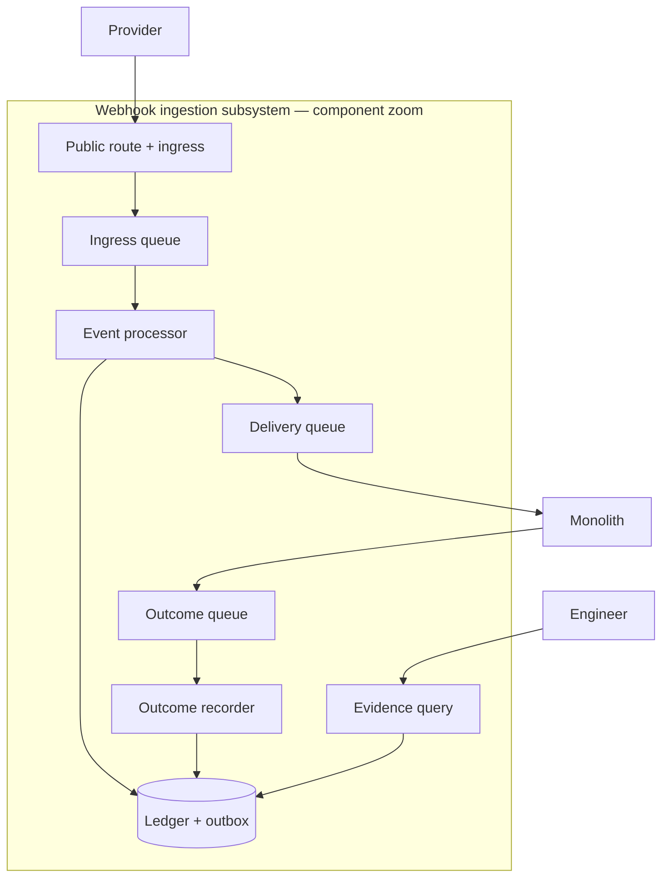
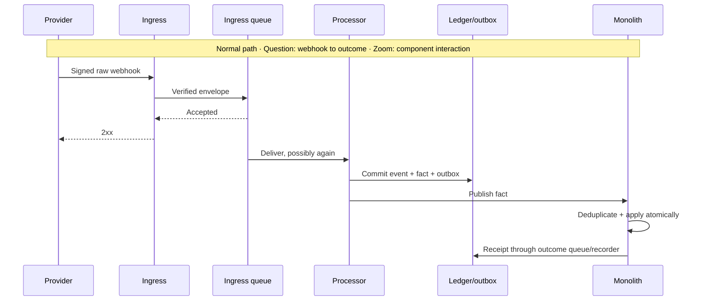
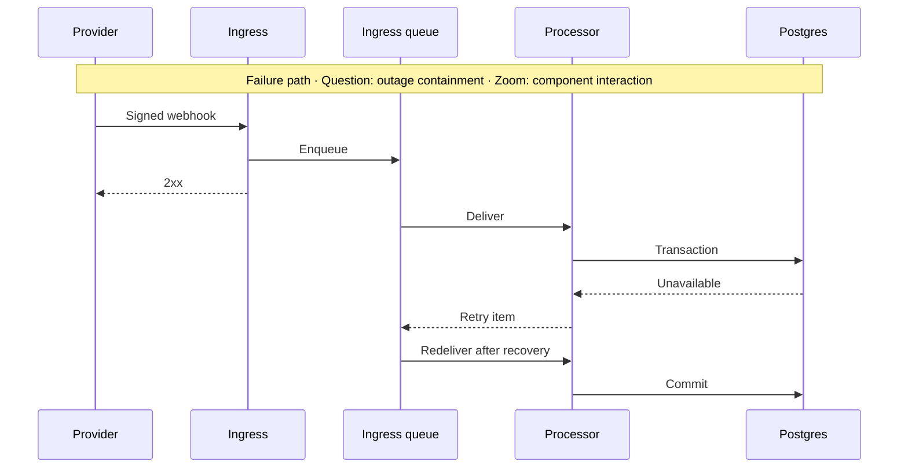

# Subsystem Design — Billing Webhook Ingestion

**Decision sought:** Approve a queue-first webhook-ingestion subsystem and its asynchronous fact-and-receipt boundary with the monolith.
**Author(s):** Billing team
**Status:** Draft
**Last updated:** 2026-09-20
**Reviewers:** Billing engineering, platform engineering, security/compliance, monolith owner
**Context surface:** The supplied brief and in-repository architecture-lens corpus were available. Organization standards, telemetry, provider documentation, and official AWS contracts were not, so marked assumptions require confirmation.
**Architecture gate self-check:** DA1 PASS; DA2 PASS; DA3 PASS; DA4 PASS; DA5 PASS; DA6 PASS; DA7 PASS; DA8 PASS; DA9 PASS; DA10 PASS.

## 1. Scope and Context

What does this subsystem own, what does it explicitly not own, and why does the boundary sit there rather than somewhere else?

| In scope | Out of scope | Why |
| --- | --- | --- |
| Authenticate, durably accept, deduplicate, normalize, retain, replay, and trace provider webhooks | Charging, refunds, and subscription policy | The provider and billing domain remain money and subscription authorities. |
| Publish versioned billing facts and record consumer outcomes | The monolith's subscription store and business rules | The monolith is a consumer, not a co-owner of ingestion. |
| One provider, nine event types, and a 90-day operator trace | Multi-provider abstraction and analytics | Two engineers have one quarter. |

**Goals**

- Acknowledge 99% of authenticated webhooks within 2 seconds, including during a 30-minute product-database outage.
- Produce at most one billing effect per provider event identifier despite retries.
- Preserve every acknowledged event and outcome for at least 90 days; return 99% of customer trace queries within 5 seconds.
- Quarantine unsupported payloads and alert within 5 minutes without emitting an invalid fact.

**Non-goals**

- Replace the monolith's subscription model.
- Promise ordering the provider does not supply.
- Build a general event platform or customer-facing viewer.

**Diagram question:** Where does ingestion ownership begin and end? **Zoom:** system context.

This boundary removes Postgres and the monolith from the public response path while keeping provider-specific semantics in one adapter. The [source problem](./source-problem.md) establishes the incidents, AWS stack, team size, SOC 2 scope, and fixed ownership choices; all other local facts are assumptions or open questions.

## 2. Structural Model

What are this subsystem's internal elements, how do they relate to each other, and at what zoom level are we looking?

| Element | Type | Responsibility | Zoom |
| --- | --- | --- | --- |
| Public route and ingress | Endpoint/process | Terminate HTTPS, verify raw-body signature, enqueue, then acknowledge. | Component |
| Ingress queue and DLQ | Store | Buffer verified envelopes and isolate exhausted retries. | Component |
| Event processor | Process | Deduplicate, validate, normalize, persist, and publish. | Component |
| Evidence ledger and outbox | Store | Own raw evidence, attempts, facts, delivery state, and receipts. | Component |
| Delivery queue | Boundary store | Decouple fact delivery from monolith availability. | Component |
| Outcome queue and recorder | Store/process | Persist the monolith's terminal processing receipt. | Component |
| Evidence query endpoint | Process | Return an authorized customer trace without raw database access. | Component |

| From | To | Nature | Protocol |
| --- | --- | --- | --- |
| Public route and ingress | Ingress queue | Publishes | Versioned SQS envelope |
| Ingress queue | Event processor | Triggers | SQS event source |
| Event processor | Ledger/outbox | Writes | PostgreSQL transaction |
| Event processor | Delivery queue | Publishes after commit | Versioned SQS fact |
| Monolith | Outcome recorder | Publishes receipt | Versioned SQS receipt |
| Evidence query endpoint | Ledger | Reads | Parameterized SQL through a read-only role |

**Diagram question:** Which component owns each step from receipt to proven outcome? **Zoom:** subsystem component.

These elements separate public trust, buffering, semantic conversion, business delivery, and evidence access because each has a different failure or access policy. They remain one document because they share one owner and quality model; no child has an independent decision plus another decomposition criterion.

API Gateway is the proposed new managed endpoint because the subsystem needs a public TLS boundary independent of the monolith. An approved equivalent may replace it without changing section 4's contracts.

## 3. Runtime Model

How does this subsystem behave at runtime, on the normal path and when something goes wrong?

| Scenario | Trigger | Path |
| --- | --- | --- |
| Accepted event reaches billing | Authenticated webhook | Normal |
| Postgres is unavailable | Processor transaction fails | Failure/recovery |
| Event repeats or cannot be normalized | Provider or transport retry; schema mismatch | Recovery/quarantine |

**Diagram question:** How does one webhook become a proven billing outcome? **Zoom:** component interaction.

**Diagram question:** Does a database outage lose an acknowledged webhook? **Zoom:** failure interaction.

Queue-first acknowledgement turns database failure into backlog growth. A crash after commit causes replay; the unique provider ID reuses the outbox record, and the monolith inbox prevents a second effect.

An incompatible event is retained as `quarantined` and emits no fact. Processing makes no synchronous provider call, so provider API failure pauses only events that explicitly need reconciliation.

## 4. Contracts and Invariants

What must always hold true across every boundary this subsystem exposes, and how would a violation be caught?

| Semantic name | Parties | Inputs/outputs | Identity | Compatibility | Failure semantics | Invariant | Enforcement | Verification |
| --- | --- | --- | --- | --- | --- | --- | --- | --- |
| Provider webhook | Provider, ingress | Raw body + selected headers / HTTP status | Provider signature and replay rule, unverified | Preserve raw bytes; tolerate optional additions; require envelope fields | Invalid identity fails; enqueue failure returns retryable non-2xx; 2xx follows queue acceptance | No unauthenticated or non-durable request is acknowledged | Verify before parse; enqueue before response | Provider fixtures, altered-body and replay tests |
| Ingress envelope v1 | Ingress, processor | Raw body, provider ID/type, receipt time, trace ID | IAM queue policy | Additive optional fields; new parser for a major version | At-least-once/unordered are unverified AWS assumptions; exhaustion enters DLQ | Raw evidence is immutable | Hash, schema, unique provider ID | Contract, duplicate, reorder, and DLQ tests |
| Billing fact v1 | Processor, monolith | Fact/source/customer IDs, times, semantic payload | IAM queue policy | Additive optional fields; reject unsupported major | Delivery may repeat; invalid fact receives rejected receipt | One fact ID causes at most one committed domain transition | Inbox key in same transaction as subscription update | Consumer contract and duplicate-delivery tests |
| Processing receipt v1 | Monolith, recorder | Fact ID, applied/ignored/rejected result, reason, aggregate version | IAM queue policy | Additive optional fields; stable result enum | Missing receipts age into an alert | Every fact is terminal or visibly pending | Unique fact ID; append-only attempts | Round-trip test and receipt-lag monitor |
| Evidence query | Engineer, query endpoint | Customer/time range / trace | Corporate identity plus billing-support role | Versioned export | Deny unauthorized or excessive query | Read-only, audited access | Scoped DB role and range bounds | Authorization, mutation-denial, audit tests |

These contracts make duplicates harmless instead of claiming exactly-once transport. The business guarantee sits at the monolith transaction and is evidenced by its receipt.

Provider IDs, signing, retry responses, and ordering fields are discovery predicates. Identity and required-schema uncertainty fail closed, while retained raw evidence permits repair.

## 5. Data and State

Who owns each piece of data or state this subsystem touches, how does it change over its lifecycle, and what must stay consistent?

| Element | State it owns | Lifecycle | Consistency requirement |
| --- | --- | --- | --- |
| Public route and ingress | Stateless | n/a | n/a |
| Ingress queue and DLQ | Verified envelope in transit | Created before 2xx; removed after processing or retained for redrive | An acknowledged event remains recoverable until ledger commit. |
| Event processor | Stateless | n/a | n/a |
| Evidence ledger and outbox | Raw envelope/hash, attempts, fact, outbox, receipt, access audit | Append from first processing; retain trace at least 90 days; purge daily after expiry | Event, fact, and outbox commit atomically; raw evidence never mutates. |
| Delivery queue | Fact in transit | Retain until consumer success or redrive | Fact and source IDs remain stable. |
| Outcome queue and recorder | Receipt in transit; recorder stateless | Retain until ledger append | Conflicting duplicate receipts cannot overwrite silently. |
| Evidence query endpoint | Stateless | n/a | n/a |

Postgres owns the evidence record because it is already operated and can atomically persist ledger and outbox state. The monolith alone owns subscription truth; the subsystem owns the provider statement, interpretation, delivery, and reported outcome.

Raw payloads use approved encryption and restricted columns, while customer references are indexed only for the required trace. Security/compliance must confirm deletion, backup, restore, and legal-hold rules.

## 6. Deployment and Operations

How is this subsystem deployed, operated, and observed once it is running?

| Deployment unit | Runs as | Scaling | Observability |
| --- | --- | --- | --- |
| Public route + ingress | API Gateway + Lambda | Request-driven; capped against quotas | Auth failures, 4xx/5xx, latency, enqueue failures |
| Ingress transport | SQS + DLQ | Managed; retention exceeds verified recovery window | Depth, oldest age, sent/received delta, any DLQ item |
| Event processor | Lambda SQS consumer | Capped to safe DB connections; partial failures | Success, quarantine, errors, duration, throttles |
| Evidence store | Dedicated schema/role on existing Postgres | Measured storage and connection thresholds | Transaction latency, connections, growth, restore result |
| Delivery transport | SQS + DLQ | Consumer-controlled drain | Depth, oldest age, redrives, receipt lag |
| Outcome recorder | Lambda SQS consumer | Within DB connection budget | Errors, conflicts, missing receipts |
| Evidence query | Authenticated Lambda endpoint | Low concurrency; bounded ranges | Denials, latency, errors, audit delivery |

Placement matches section 2's structure, so no second topology diagram is needed. Billing owns alarms, mappings, redrive/quarantine runbooks, and on-call response; platform owns shared AWS and Postgres health.

Cost follows requests, Lambda duration, and retained Postgres bytes. Track cost per 1,000 events and storage growth; measured pressure triggers compression, payload offload, or an independent store.

AWS binding contracts have low confidence. The installed AWS guidance supports queue buffering, idempotency, DLQs, least privilege, and correlated telemetry, but its official-documentation tool was unavailable and web access was excluded; platform engineering must verify timeout, payload, retention, delivery, retry, concurrency, and quota behavior before build.

## 7. Quality Scenarios and Verification

For each quality attribute that matters here, what scenario proves it holds, and how do we verify that?

| Source | Stimulus | Environment | Artifact | Response | Measurable target | Business consequence | Mechanism | Verification |
| --- | --- | --- | --- | --- | --- | --- | --- | --- |
| Provider | Same valid event arrives 100 times | Normal | End-to-end path | Deduplicate | One ledger event; at most one domain transition | Duplicate charge/state | Unique IDs and transactional inbox | Duplicate/reorder test |
| Postgres | Unavailable 30 minutes | Degraded | Ingress/queue | Buffer and retry | Zero acknowledged loss; 99% ack under 2 seconds; drain in 15 minutes after restore | Missing billing changes | Queue-first ack and bounded workers | Fault drill |
| Provider schema | Required field changes | Normal | Processor | Quarantine and alert | 100% raw retention; zero invalid facts; alert in 5 minutes | Silent stale state | Validation and quarantine | Mutated fixtures |
| Monolith | Unavailable 2 hours | Degraded | Delivery queue | Retain and redeliver | Zero loss; receipt backlog clears in 30 minutes after recovery | Undetected stale billing | Queue, DLQ, receipt alarm | Consumer outage drill |
| Engineer | Query customer over 90 days | Normal | Evidence query | Return complete timeline | 99% under 5 seconds; 100% access audit | Slow support/audit failure | Indexed correlation and read-only API | Seeded history test |
| Attacker | Unsigned, altered, replayed body | Normal | Ingress | Deny before enqueue | 100% test corpus denied; zero queue writes | Forged billing fact | Raw signature and replay check | Negative security suite |
| Provider API | Unavailable 60 minutes | Degraded | Processor | Continue self-contained events; quarantine dependent ones | Zero ingress errors from API outage; quarantine visible in 5 minutes | Cascading outage | No synchronous lookup | Dependency-block test |

Reliability ranks first because loss and duplication caused customer harm. Data integrity ranks second because schema and order can silently corrupt state, while operability ranks third because the 11-day detection gap made a correctable fault persist.

These are proposed targets, not observed baselines. Reviewers may replace a number only with another externally testable target tied to the same business consequence.

## 8. Implementation Mapping

Where does each element in the model above actually live in source, build, and deployment?

| Semantic element | Source owner | Build unit | Deployable | Verification |
| --- | --- | --- | --- | --- |
| Public route and ingress | Billing infrastructure/ingestion | Proposed `billing-webhook/infra` and `/ingress` | Ingress stack/Lambda | Route, signature, raw-body, enqueue tests |
| Ingress queue and DLQ | Billing infrastructure | Proposed `billing-webhook/infra` | Ingress stack | Retention and redrive tests |
| Event processor | Billing ingestion | Proposed `billing-webhook/processor` | Processor Lambda | Fixture, duplicate, reorder, fault tests |
| Evidence ledger and outbox | Billing data | Proposed `billing-webhook/storage` | Postgres migrations | Constraint, retention, restore tests |
| Delivery queue | Monolith integration | Proposed `billing-webhook/contracts` + infrastructure | Delivery stack | Compatibility and IAM tests |
| Outcome queue and recorder | Billing ingestion | Proposed `billing-webhook/outcomes` | Outcome stack/Lambda | Duplicate, conflict, lag tests |
| Evidence query endpoint | Billing operations | Proposed `billing-webhook/evidence-query` | Query Lambda/route | Authorization, audit, latency tests |

These are logical discovery targets because repository layout was outside the permitted evidence. Packaging may combine deployables, but the contract library remains shared with the monolith so both sides run the same compatibility fixtures.

## 9. Decisions, Alternatives, and Risks

What did we decide, what did we reject, and what could still go wrong?

**Decisions**

- **Queue before acknowledgement.** Database and monolith outages do not consume the provider response window.
- **At-least-once delivery with idempotent effects.** Inbox/outbox records turn transport ambiguity into safe replay.
- **Postgres evidence ledger for 90 days.** It meets trace needs with an operated store this quarter.
- **Fact plus outcome-receipt boundary.** The monolith keeps subscription authority while the subsystem proves the outcome.
- **Quarantine uncertainty.** Unsupported versions or conflicting results cannot mutate billing state.

**Alternatives considered**

- **EventBridge with archive/replay.** It adds routing and fan-out. **Rejected because:** one consumer does not justify another managed service, and authentication, semantic deduplication, receipts, and customer-indexed evidence still remain.
- **Synchronous monolith call.** It is operationally simple. **Rejected because:** database and deploy failures recreate the timeout and retry coupling behind the incidents.
- **Object store plus metadata database.** It scales raw retention independently. **Rejected because:** unknown volume does not yet justify a second lifecycle; measured storage pressure is the revisit trigger.

**Risks**

- **Provider contract mismatch.** Bad signature, ID, retry, or ordering assumptions can reject or stale valid events. Mitigate with authoritative contracts, recorded fixtures, and quarantine for unproven ordering.
- **Poison event stalls work at 3 a.m.** Mitigate with partial batch failure, DLQ isolation, oldest-age paging, and an exercised redrive runbook.
- **Postgres outage exceeds queue retention.** Mitigate with verified maximum safe retention, recovery-budget alarms, restore drills, and an independent-store trigger.
- **Billing data leaks through logs or queries.** Mitigate with redaction, encryption, least privilege, audited access, and timed purge.
- **Missing consumer receipt hides non-application.** Mitigate with pending timers, outbox-to-receipt reconciliation, and a terminal-state alarm.
- **Lambda burst exhausts DB connections.** Mitigate with concurrency caps, small pools, queue-age alarms, and load tests.

## 10. Rollout, Migration, and Reversal

How does this subsystem roll out, migrate any existing data or state, and reverse cleanly if it needs to come back out?

Launch is phased. The monolith first copies authenticated events into a shadow envelope while remaining authoritative; the new path records and normalizes all nine types but suppresses delivery, and the billing team compares mappings and trace output.

Next, the monolith deploys its transactional inbox and receipt outbox behind an event-type allowlist. The provider endpoint moves to new ingress as configuration permits, while delivered facts call the existing billing-domain operations.

Rollback returns routing to the old handler, disables new fact publication, and drains already acknowledged IDs. The monolith inbox uses the provider ID across both paths, so overlap cannot create a second effect; no queue or ledger is deleted during rollback.

Billing on-call owns cutover with platform support. Advancement requires no unexplained shadow differences, passed duplicate/outage drills, a successful trace query, and empty DLQs.

## 11. Open Questions

What remains genuinely unresolved, and who or what could resolve it?

- What are the provider's signature, replay, acknowledgement, retry, identifier, payload, ordering, and endpoint-cutover contracts? The provider integration owner and authoritative provider documentation must answer.
- Which event types carry snapshots, versions, or deltas, and how should stale facts affect state? Billing product/domain owners must define this with fixtures.
- Can approved AWS settings satisfy the 2-second acknowledgement, 24-hour minimum outage buffer, payload, retry, concurrency, and quota needs? Platform engineering must verify official current contracts.
- Which SOC 2 controls govern encryption, secret custody, access, audit, backup, deletion, and legal hold? Security/compliance and control owners must approve the mapping.
- What are peak rate, payload distribution, Postgres headroom, and recovery time? SRE/database owners must supply measurements or approve a load test.
- Which targets and page ownership can two engineers sustain? Billing engineering and SRE must ratify them before launch.

