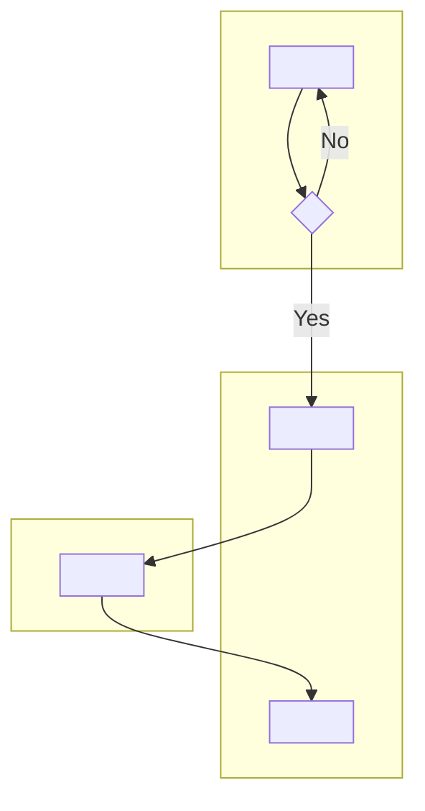
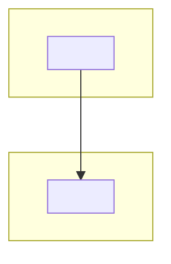

# Process Map: <L3 Process Name>

## SIPOC

<!-- Bound the process before drawing any swimlane.
     Suppliers and Customers here are internal process participants,
     not the end customer (that is the journey map's domain). -->

| Suppliers | Inputs | Process | Outputs | Customers |
| --- | --- | --- | --- | --- |
| <who/what provides the key inputs — teams, systems, external parties> | <what arrives at the start — documents, data, requests> | **<L3 process name>** | <what the process produces — deliverables, decisions, state changes> | <who receives the output — teams, systems, downstream consumers> |

---

## As-is swimlane

<!-- L4 activities across actor lanes.
     Each subgraph is one actor lane.
     Use decision nodes (diamond shape in mermaid: {Decision?}) for gateways.
     Mark handoffs (arrows between lanes) explicitly. -->

---

## As-is pain/waste register

<!-- For each pain or waste source in the as-is flow, record one row.
     Location: actor lane + step name.
     Type: delay | rework | duplication | handoff-loss | exception-volume -->

| Location | Pain / waste type | Impact | To-be change |
| --- | --- | --- | --- |
| <Actor lane — Step name> | <type> | <observable effect on time, quality, or outcome> | <which to-be change addresses this> |

---

## To-be swimlane

<!-- Target state: show structural changes from the as-is.
     Eliminated handoffs, moved decision gates, reassigned actors. -->

---

## As-is → to-be delta

<!-- Only steps that change appear here. Unchanged steps are omitted.
     Rationale column explains which pain/waste is addressed. -->

| Step | As-is | To-be | Rationale |
| --- | --- | --- | --- |
| <L4 activity name> | <what happens today> | <what should happen> | <which waste it removes and why> |

---

## Seams

<!-- Cross-reference downstream and upstream consumers by name. -->

**Produces for `frame-intent` (`product-engineering` pack):** this map is the
"current-state process map" input that `frame-intent` uses as a brownfield
constraint. Hand off the resolved path of this file when running `frame-intent`.

**Cross-reference `blueprint-service`:** <!-- fill in only when the process is
customer-triggered — name the blueprint artifact that covers the customer-facing
layer of the same journey. Delete this line when the process has no customer
touchpoint. -->

---

## Open questions

<!-- Conflicts between documents, gaps in SME knowledge, or assumptions to
     validate before this map is consumed downstream. -->

- [ ] <question>
