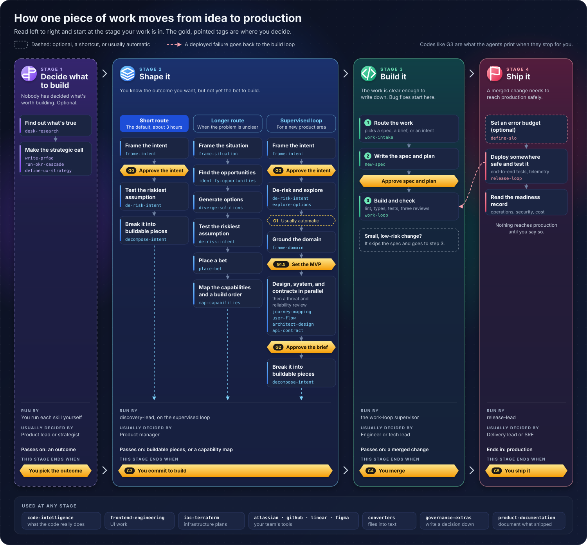

# The operating model: how work flows from idea to production

This page shows how one piece of work moves from idea to production, which
packs help at each stage, and where you make the calls.

## The handoff chain

Follow one piece of work from idea to production and it passes through four
stages. Each stage ends when a person on your team makes a decision. The guides
call the stages *Decide what to build*, *Shape it*, *Build it*, and *Ship it*.

Most work doesn't travel the whole way. A bug fix starts at *Build it*. A small
change to an existing product often goes from a written intent straight to the
build loop.

[](the-three-loops-overview.svg)

Start at the stage your work is in. The gold, pointed tags are the points where
the agent stops and waits for you.

The full map below shows every route, step, skill, and decision, plus who runs
each stage. Select either picture to open it at full size.

[](the-three-loops-lifecycle.svg)

When any piece of work finishes, or you abandon it, `close-work` from `core`
tidies it up.

### Three ways through *Shape it*

Every route through *Shape it* ends the same way: you decide the work is ready
and hand it to the build loop. They differ in how much ground they cover first.

- **The short route** is where most teams start. You write the intent, test its
  riskiest assumption, and break it into pieces the build loop can take. Plan on
  about three hours.
- **The longer route** replaces the short one with six steps: a situation,
  opportunities, options, a test of the riskiest assumption, a bet, and a
  capability map with a suggested build order. Take it when you can't yet say
  what the problem is, or when the bet is big enough that someone will ask for
  the reasoning later.
- **The supervised loop** is the right-hand column of *Shape it*. `discovery-lead`
  walks every gate, brings in design, architecture, and contract work side by
  side, and has two reviewers check for threats and reliability problems before
  you see the brief. Use it for a new product area.

[Shape what to build](../../README.md#p2--shape-what-to-build--3-hours) walks
the short and longer routes. [Walk a discovery end to end](../../product-engineering/tutorials/walk-a-discovery-end-to-end.md)
walks the supervised loop.

### Which pack does what

| Stage | What happens | Pack | What you decide |
| --- | --- | --- | --- |
| Decide what to build | Gather evidence, graded by how much you can trust it | `desk-research` | Whether the evidence is enough to act on |
| Decide what to build | Make the strategic call | `product-strategy` | Which outcome you are committing to |
| Shape it | Frame the intent and test the bet | `product-engineering` | Whether the problem is specific enough |
| Shape it | Map the journey and the screens | `experience-design` | Whether the design is ready |
| Shape it | Sketch the system and its interfaces | `architect`, `contracts` | Whether the concept holds up |
| Shape it | Pull it together into a decision brief and a backlog | `product-engineering` | Whether to commit to build |
| Build it | Write the spec and plan, then build and review | `core` | The spec, the plan, and the merge |
| Ship it | Deploy somewhere safe, test it, and watch it run | `release-engineering` | Whether it goes to production |

A few packs don't belong to one stage. You reach for them whenever the moment
comes up:

- `code-intelligence` when you need to know what the code really does before
  you change it.
- `frontend-engineering` and `iac-terraform` for UI and infrastructure work
  inside the build.
- `atlassian`, `github`, `linear`, and `figma` to pull work in from your team's
  tools and report progress back out.
- `converters` to turn PDFs, slides, and other files into text an agent can read.
- `governance-extras` to write down a decision as an ADR or RFC, at any stage.
- `product-documentation` to document what you shipped.

### If you see a gate code

The agents print a short code when they stop for you. This is what each one is
asking.

| Code | What you're deciding | Product Engineering calls it |
| --- | --- | --- |
| G0 | Is the problem real, and is this the right bet? | Approve the intent |
| G1 | Does the de-risked plan still hold? Usually automatic | |
| G1.5 | What's in the first version, and what's out? | |
| G2 | Is the decision brief good enough to build from? | Approve the decision brief |
| G3 | Are you ready to hand this to the build loop? | Commit to build |
| G4 | Is this merged change ready for release testing? | |
| G5 | Does it go to production? | |

Discovery, build, and release each have their own supervising agent:
`discovery-lead`, the `work-loop` supervisor, and `release-lead`. None of them
runs inside another. They meet at G3 and G4, and nothing crosses either line,
or reaches production at G5, until you say so.

### The same flow, step by step

This list carries everything the pictures show, in words.

1. **Decide what to build** (optional). `desk-research` finds out what's true.
   `product-strategy` makes the strategic call with skills such as
   `write-prfaq`, `run-okr-cascade`, or `define-ux-strategy`. The stage ends
   when you pick the outcome.
2. **Shape it**, by one of three routes. Each one ends at G3, when you commit
   to build.
   - *Short route, the default:* `frame-intent`, then you approve the intent
     (G0), then `de-risk-intent`. `decompose-intent` breaks it into pieces the
     build loop can take.
   - *Longer route:* `frame-situation`, `identify-opportunities`,
     `diverge-solutions`, `de-risk-intent`, `place-bet`, and `map-capabilities`.
     It passes on a capability map with a suggested build order.
   - *Supervised loop:* `frame-intent` and G0, then `de-risk-intent` and
     `explore-options`. G1 usually passes on its own. `frame-domain` grounds
     the domain and you set the MVP (G1.5). Design, system, and contract work
     run in parallel, followed by a threat and reliability review. You approve
     the brief (G2), and `decompose-intent` breaks it into buildable pieces.
3. **Build it.** `work-intake` picks a spec, a delivery brief, or a minimum
   intent. `new-spec` writes the spec and plan, and you approve both.
   `work-loop` builds, runs lint, type checks, and tests, and gets three cold
   reviews. A small, low-risk change skips the spec. The stage ends at G4, when
   you merge.
4. **Ship it.** `define-slo` sets an error budget if you want one.
   `release-loop` deploys to a throwaway environment, tests end to end, and
   watches telemetry. A deployed failure goes back to the build loop as a build
   task. You read the readiness record, and the stage ends at G5, when you ship
   it to production.

## Why three loops, not one

Shipping software is three jobs: working out what to build, building it, and
getting it into production. One agent loop can't run all three well, so the
catalogue gives each job its own loop.

**Some mistakes are cheap and some aren't.** You can explore five product
shapes in an afternoon and throw four away. A bad production release can't be
taken back as easily. One level of caution is wrong for both: too slow for
exploring, too loose for shipping.

**Different people make the calls.** Whether an idea is worth building is a
business decision. Whether the code compiles is a mechanical check. Whether a
running system meets its service levels is an operations judgment.

**Each loop fails in its own way.** Discovery fails when it settles on the
wrong product. Build fails when the code doesn't work. Release fails when
something breaks in production. Each needs its own checks and its own
reviewers.

## The discovery loop

**Pack:** `product-engineering` | **Agent:** `discovery-lead` | **Scope:** user

Discovery takes a raw product signal and shapes it before anyone writes code.
What you end with is an intent you approved, written at the right size: an
initiative, a capability, or a single feature. Product Engineering doesn't need
`core` installed, and it doesn't write the repository's delivery contract.

How it works:

- **It compares before it chooses.** The agent explores five candidate product
  shapes side by side against the customer and the job they're trying to do,
  so the best one wins on comparison instead of the first idea getting polished.
- **Several specialists work at once.** Product, UX, architecture, and safety
  lenses each write their findings to a shared workspace the agent calls the
  blackboard. They never pass results to each other through chat.
- **Sub-problems stay in the same tree.** A sub-problem you find along the way
  becomes a child of the intent you're working on, and the same loop shapes it.
  It doesn't turn into a separate project.
- **Your decisions can't be rewritten.** Each verdict goes into an append-only
  log, chained by hash, so the agent can't forge or change a decision after you
  made it.

You decide at four points:

- **G0:** the value. Is the problem real, who has it, and is it worth a bet?
- **G1.5:** the MVP boundary. Which features are in the first bet?
- **G2:** the converged intent, including its riskiest assumptions and how
  you'll test them.
- **G3:** the hand-off. Is this ready for the repository's build loop?

→ [Discovery loop guide](../../product-engineering/) · [Walk a discovery end-to-end](../../product-engineering/tutorials/walk-a-discovery-end-to-end.md)

## The build loop

**Pack:** `core` | **Agent:** `work-loop` supervisor | **Scope:** repo

This is the inner loop, and it works on its own. `work-intake` reads what you
describe and picks a route. `intake-intent` records a minimum intent.
`author-delivery-brief create|continue` coordinates work that spans several
specs or repositories. `new-spec` writes one contract for one change you can
ship by itself. An intent from Product Engineering uses the same routes, and
`core` doesn't need that pack installed. Every build then runs plan, execute,
gate, review, and decide.

How it works:

- **The spec is reviewed twice before you see it.** A cold shaping review checks
  that the contract is observable and bounded. Then an adversarial review reads
  the spec and plan together and checks that the plan can deliver the contract.
  Neither replaces the code review that comes after.
- **The ceremony matches the risk.** Small, low-risk work runs in direct-light
  mode, straight from your request, with an adversarial review and no saved
  spec. Full mode writes a spec and plan when something raises the risk: a
  design you can't predict, a new dependency, a compliance surface, work shared
  between people, or a destructive operation. File count doesn't decide it.
- **The gates are real.** Lint, type checks, and tests run as gates. The agent
  can't report success while one of them is red.
- **Three reviewers read every change cold.** The adversarial reviewer looks for
  drift between spec, plan, and code. The security reviewer works from OWASP
  2025, ASVS, and STRIDE. The quality reviewer looks at testability,
  observability, and reliability. Each starts fresh, with no stake in the design.
  The loop keeps fixing until they say `Clean — ready to commit.`
- **Security depth follows the change.** The security checklist loads only the
  sections for the boundaries a change crosses, such as auth, secrets, user
  input, deserialization, file I/O, or LLM code.
- **Lessons stick.** When a run finds a gap in the project's conventions, it
  proposes an edit to the file that owns the rule. The fix stays with the
  project instead of vanishing when the session ends.

In full mode you approve the spec, then the plan, before any code is written.
The merge at the end is yours in both modes. Direct-light mode saves no spec, so
it skips the approval pair. Between those points the loop runs on its own. It
brings blockers to you, and it sorts concerns and nits by whether a tool can fix
them.

→ [Core pack guide](../../core/) · [The `core` pack as a system](../../core/explanation/core-pack.md)

## The release loop

**Pack:** `release-engineering` | **Agent:** `release-lead` | **Scope:** repo

This is the outer loop. It takes the build the inner loop finished and tests it
**deployed**: running in an environment like production, not on a developer's
machine.

How it works:

- **It only deploys to throwaway environments.** The release loop never touches
  production. Its environments hold no real user data, can't reach production,
  are kept apart from each other, and are torn down afterwards. That isolation is
  what makes it safe to leave running.
- **What can be undone runs on its own.** Deploying to a throwaway environment,
  running end-to-end tests, watching telemetry, redeploying, and tearing down
  all run without you. First real users, data migrations, spend over a
  threshold, and the production ship always wait for you.
- **A deployed failure goes back to the build loop.** It arrives in `work-loop`
  as a build task, not as a raw error for you to pass along. The inner loop
  fixes it and the outer loop redeploys.
- **It stops when the evidence says so.** The loop keeps going until the canary
  meets its service levels, the changed areas have end-to-end coverage, flaky
  tests are below the threshold, and the error budget isn't spent.
- **You get a record, not a thumbs-up.** The release-readiness record gives the
  convergence result, the operations and security verdicts, and the cost and
  budget status.

You decide once, at **G5**: does it go to production? No setting, mode, or
flag skips it, and the agent never moves past it on its own.

→ [Release loop guide](../../release-engineering/) · [The release loop explained](../../release-engineering/explanation/the-release-loop.md)

## Where each loop is installed

Each loop installs where its work happens:

- **Discovery installs per person (user scope).** Shaping happens in documents
  like Notion pages, Figma files, and slide decks, not in a repository. That's
  why `discovery-lead` brings its own reviewer agents: it can't count on `core`
  being installed.
- **Build installs per repository (repo scope).** `core` goes into the
  repository that holds the code. Its reviewer agents are available to any other
  pack installed in that repository.
- **Release installs in the same repository as build.** It needs `core` and
  reuses its reviewers, which only works because both live in the same
  repository.

So G3 is where the work moves from your documents into the repository. What it
turns into depends on its size. A single feature can become one spec. A
capability or an initiative can become an RFC, several child intents, or a
delivery brief that coordinates RFCs and specs. A repository without Product
Engineering starts at the same intent, delivery brief, or spec.

## How much the agents do on their own

The more permanent an action, the more the agent waits for you:

| What happens | Examples | How the agent behaves |
| --- | --- | --- |
| Runs on its own | Exploring product shapes, writing and running tests, deploying to throwaway environments, fixing build failures | Keeps going without you |
| Brings it to you | A blocker in the build loop, or the release loop reaching its stop point | Pauses and shows you where things stand |
| Waits for your yes | G0, G1.5, G2, and G3 in discovery, the merge, and G5 in release | Doesn't move until you approve |

## Install the loops

Install them in this order:

```bash
# 1. The build loop. The release loop needs it.
agentbundle install --pack core

# 2. The discovery loop, at user scope so it follows you across repositories
agentbundle install --pack product-engineering --scope user

# 3. The release loop, into the same repository as core
agentbundle install --pack release-engineering
```

Or install the `full-ceremony` profile. It installs `core` with
`governance-extras`, `product-documentation`, and `monorepo-extras` in one
command. Add the other loops as your team needs them.

You only need the loops your team uses. Most teams start with `core`. They add
`product-engineering` once product conversations start happening in documents
instead of in GitHub issues.
