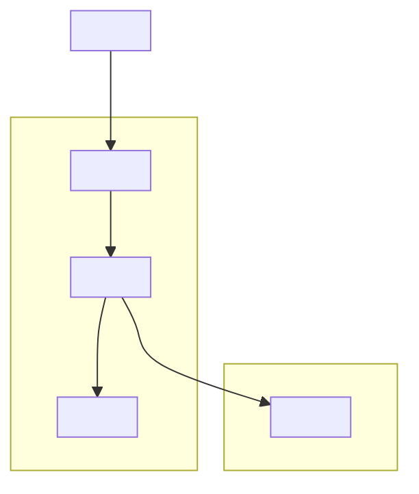
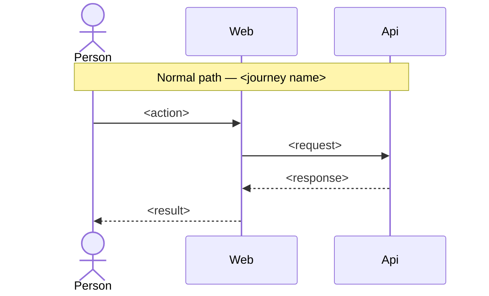
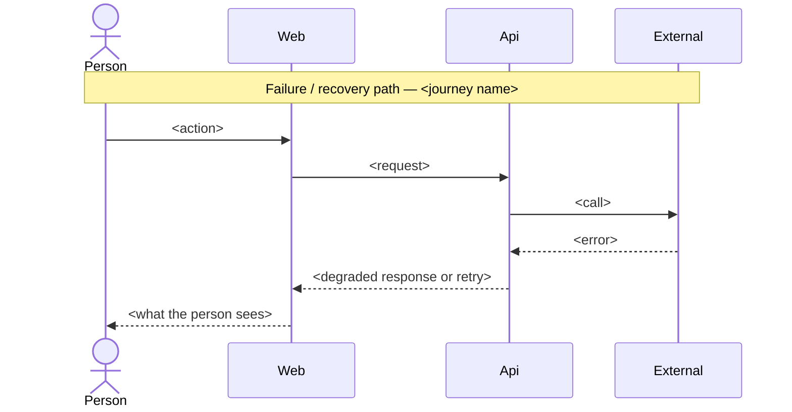

<!-- Application/system design — a whole application or system, zoomed to
     the people, systems, and containers around it. Same spine as
     subsystem-design.md; the difference is zoom, not shape. This zoom stops
     at Container: it does not descend into a container's internal parts —
     those belong in the subsystem-design.md for whichever container needs
     them. Every section
     opens with the question it answers, and every modelled section puts the
     model before the prose that explains it. Cite evidence inline or link
     out; never accumulate it in an appendix. -->

# Application/System Design — <one-phrase name>

**Author(s):** <names>
**Status:** Draft | Under review | Accepted | Superseded
**Last updated:** <YYYY-MM-DD>
**Reviewers:** <names or teams expected to sign off>

## 1. Scope and Context

What does this application or system own, what does it explicitly not own,
and which stakeholders' concerns does that boundary answer?

<!-- model -->
| In scope | Out of scope | Why |
| --- | --- | --- |
| <capability this system owns> | <capability another system owns instead> | <the reason the boundary falls here> |
| <…> | <…> | <…> |

**Stakeholder concerns**
- <Stakeholder> — <the concern this system must answer for them>.

**Goals**
- <Testable from the outside — "p95 < 200ms at 10x current load", not "fast".>

**Non-goals**
- <Something a reasonable reader might assume is in scope. Name why it's out.>

<!-- rationale -->
<Explain why the boundary sits where the table places it, and which
stakeholder concern would go unanswered if a capability crossed the line the
other way.>

## 2. Structural Model

What are the people, systems, and containers around this application, how do
they relate, and at what zoom level are we looking?

<!-- model -->
| Element | Type | Responsibility | Zoom |
| --- | --- | --- | --- |
| <name> | Person | <one sentence> | context |
| <name> | System | <one sentence> | context |
| <name> | Container | <one sentence> | container |

| From | To | Nature | Protocol |
| --- | --- | --- | --- |
| <element> | <element> | <uses / calls / publishes-to> | <sync API / async event / UI> |

<!-- rationale -->
<Explain why Person, System, and Container are the right grain here — no
finer, no coarser — and why the relationships shown are the ones that matter
at this zoom.>

## 3. Runtime Model

How does an end-to-end user or event journey move through this system, on the
normal path and when something goes wrong?

<!-- model -->
| Journey | Trigger | Path |
| --- | --- | --- |
| <journey name> | <the user action or event that starts it> | normal |
| <journey name> | <the user action or event that starts it> | failure / recovery |

<!-- rationale -->
<Explain why this journey is the one worth sequencing end to end — what a
user or downstream event expects on the normal path, and what "safe" looks
like when the failure/recovery path fires instead.>

## 4. Contracts and Invariants

What must always hold true across every boundary this system exposes to
another system or to its users, and how would a violation be caught?

<!-- model -->
| Semantic name | Parties | Inputs/outputs | Identity | Compatibility | Failure semantics | Invariant | Enforcement | Verification |
| --- | --- | --- | --- | --- | --- | --- | --- | --- |
| <contract name> | <system, system> | <request / response shape> | <how a party is identified> | <backward / forward rule> | <what happens on violation> | <what must always hold> | <how it's enforced — API contract, schema, SLA> | <how it's verified — contract test, monitor, audit> |

<!-- rationale -->
<Explain why each invariant matters at the system-to-system level — what
breaks for a partner or a user if it stops holding.>

## 5. Data and State

What data domains does this system hold, who has authority over each domain,
and what must stay consistent?

<!-- model -->
| Data domain | Authority | Lifecycle | Consistency requirement |
| --- | --- | --- | --- |
| <domain name> | <the system that is the authority for it> | <created / updated / retired — by what event> | <what must never be observed inconsistent, and across what window> |

<!-- rationale -->
<Explain why the named system is the authority for each domain rather than a
consumer of it, and why the consistency requirement is strict or eventual.>

## 6. Deployment and Operations

How is this system deployed, operated, and observed once it is running?

<!-- model -->
| Deployment unit | Runs as | Scaling | Observability |
| --- | --- | --- | --- |
| <container from section 2> | <platform-managed service / cluster workload> | <scaling trigger and bound> | <the signal an operator watches> |

<!-- rationale -->
<Explain why this is the deployment shape and what operational property it
buys. Add a topology diagram only when physical placement differs from the
structural model above; when placement matches structure, say so here
instead of drawing a second diagram.>

## 7. Quality Scenarios and Verification

For each quality attribute that matters at this zoom, what scenario proves it
holds, and how do we verify that?

<!-- model -->
| Source | Stimulus | Environment | Artifact | Response | Measurable target | Business consequence | Mechanism | Verification |
| --- | --- | --- | --- | --- | --- | --- | --- | --- |
| <who or what triggers it> | <the event> | <normal / degraded / peak load> | <the system under test> | <what the system does> | <the number that decides pass/fail> | <what happens to the business if it fails> | <how the response is achieved> | <how the scenario is checked — load test, chaos drill, monitor> |

<!-- rationale -->
<Explain why this scenario, at this target, is the one worth writing down at
the system level, and what business consequence follows if the target is
missed.>

## 8. Implementation Mapping

Where does each element in the model above live at product, repository, and
platform level, and who owns it?

<!-- model -->
| Semantic element | Product | Repository | Deployable | Platform | Team |
| --- | --- | --- | --- | --- | --- |
| <element from section 2> | <product line it belongs to> | <repository it lives in> | <the deployment unit from section 6> | <the platform it runs on> | <the team that owns it> |

<!-- rationale -->
<Explain any place this mapping is not one-to-one — a container split across
repositories, or a team owning more than one container — and why that split
is deliberate rather than drift. This zoom stops here: it does not descend
into internal components, files, or the mechanism a container uses to keep
its own core independent of its edges — that belongs in the subsystem-design.md
for whichever container needs it.>

## 9. Decisions, Alternatives, and Risks

What did we decide, what did we reject, and what could still go wrong?

**Decisions**
- <Decision, one phrase.> <Why this and not the alternative below.>

**Alternatives considered**
- **<Alternative — one phrase.>** <What it would have looked like.>
  **Rejected because:** <specific property, not "didn't fit">.

**Risks**
- **<Risk, one phrase>.** <How it manifests. Mitigation, or explicitly
  *accepted unmitigated* with the reason.>

## 10. Rollout, Migration, and Reversal

How does this system roll out, migrate any existing data or state, and
reverse cleanly if it needs to come back out?

<Migration and launch shape: big-bang, phased, shadow-traffic, dark launch,
feature-flag. The rollback story — concrete, not aspirational. Who is on the
hook for the rollout window.>

## 11. Open Questions

What remains genuinely unresolved, and who or what could resolve it?

- <Question, with the person, team, or measurement that could answer it.>

<Omit this section entirely in an authored document when there are no honest
open questions left — an empty section is not evidence that none exist.>
