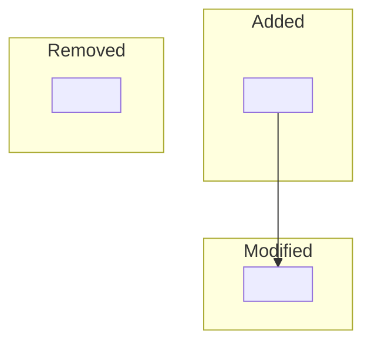
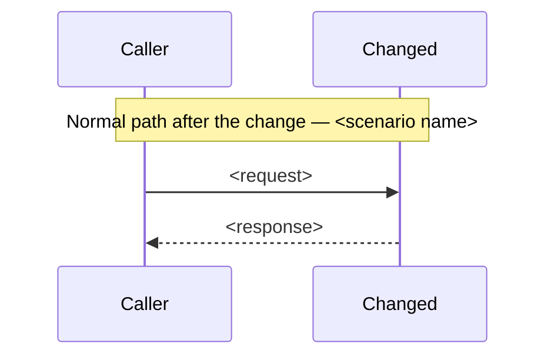
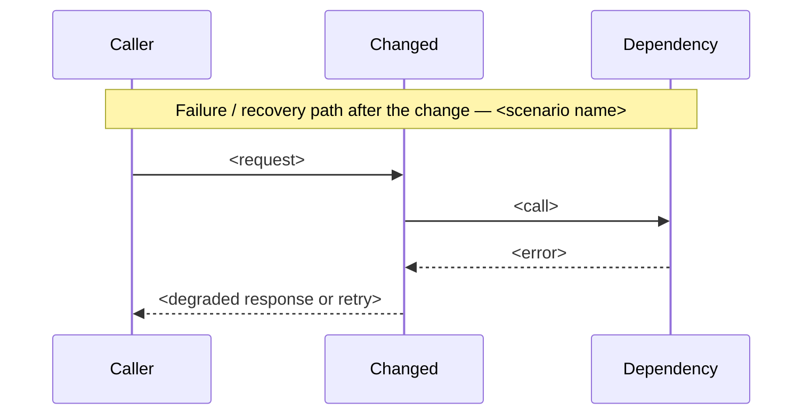

<!-- Architecture change design — a change to an existing architecture. This
     document records only the delta from a baseline; it links to unchanged
     context rather than copying it. Every section opens with the question it
     answers, and every section puts the model (a delta table or diagram)
     before the prose that explains it. Cite evidence inline or link out;
     never accumulate it in an appendix. -->

# Architecture Change — <one-phrase name>

**Author(s):** <names>
**Status:** Draft | Under review | Accepted | Superseded
**Last updated:** <YYYY-MM-DD>
**Reviewers:** <names or teams expected to sign off>

**Baseline — current architecture:** <link to the authoritative
current-architecture artifact this change is a delta from — the
subsystem-design.md or application-system-design.md it amends>

This document requires that current-architecture artifact and links to it by
name rather than restating it. It records only what changes: it never repeats
unchanged structure, runtime behavior, contracts, data shape, deployment, or
quality posture from the baseline, and it never carries a second embedded
current-state assessment alongside the one the baseline already holds.

## 1. Scope and Baseline

What is changing, and what baseline artifact does this delta assume?

<!-- model -->
| Delta item | In scope | Why it's changing |
| --- | --- | --- |
| <item> | <yes/no> | <the reason> |

| Unchanged context | Link |
| --- | --- |
| <what stays as-is> | <link to the baseline section that already covers it> |

<!-- rationale -->
<Explain why this set of items is the whole delta — what a reader would
wrongly assume is unaffected, and why everything not listed here is safe to
leave linked rather than restated.>

## 2. Structural Change

Which elements and relationships are added, removed, or modified from the
baseline, and which are simply linked because they don't change?

<!-- model -->
| Element or relationship | Change type | Baseline reference |
| --- | --- | --- |
| <element/relationship> | added / removed / modified | <link to baseline, or "new" if added> |

<!-- rationale -->
<Explain why each added or removed element is necessary for the change, and
why a modified element's new shape is compatible with everything the baseline
says still calls it.>

## 3. Runtime Change

How do runtime paths differ from the baseline, including any temporary
dual-run or migration behavior?

<!-- model -->
| Journey or scenario | Change type | Baseline reference |
| --- | --- | --- |
| <scenario> | new / modified / retired | <link to baseline, or "new"> |

<!-- rationale -->
<Explain what changes about the runtime behavior a caller experiences, and
whether the change requires a dual-run window where both the old and new
paths must work at once.>

## 4. Contract and Invariant Change

Which contracts or invariants are introduced, changed, or retired by this
change, and how does that affect every existing party?

<!-- model -->
| Semantic name | Change type | Baseline reference | Compatibility during transition | Enforcement | Verification |
| --- | --- | --- | --- | --- | --- |
| <contract name> | new / widened / narrowed / retired | <link to baseline, or "new"> | <what old callers can still assume during rollout> | <how it's enforced> | <how it's verified> |

<!-- rationale -->
<Explain why the compatibility rule during transition is sufficient — what an
existing caller that has not yet migrated would observe, and why that
observation is safe.>

## 5. Data/State Migration

How does existing data or state move from its old shape to its new shape, and
what happens if migration fails partway through?

<!-- model -->
| Data element | Old shape | New shape | Migration mechanism | Rollback |
| --- | --- | --- | --- | --- |
| <element> | <baseline shape, or link> | <new shape> | <backfill / dual-write / lazy migrate — with the trigger> | <what a partial migration leaves behind, and how it's undone> |

<!-- rationale -->
<Explain why the chosen migration mechanism is safe for data already in
flight, and what a reader operating the rollback would need to know that
isn't in the table.>

## 6. Deployment/Operational Change

What changes in how this is deployed, operated, or observed, relative to the
baseline?

<!-- model -->
| Deployment unit | Change type | Baseline reference |
| --- | --- | --- |
| <unit> | new / modified / retired | <link to baseline, or "new"> |

<!-- rationale -->
<Explain what an operator needs to change about how they watch or scale this
system, and why nothing else in the deployment shape needs to move.>

## 7. Quality Regression and Verification

Which quality attributes could regress because of this change, and how do we
verify they didn't?

<!-- model -->
| Attribute at risk | Baseline target | Stimulus that could regress it | Verification |
| --- | --- | --- | --- |
| <attribute> | <link to the baseline's measurable target> | <what about this change could push against it> | <how the regression is checked — before/after load test, canary comparison> |

<!-- rationale -->
<Explain why this attribute is the one at risk from this specific change —
not a general restatement of the baseline's quality posture — and why the
named verification would actually catch a regression before rollout
completes.>

## 8. Build Mapping

Where does each changed element map to in source, build, and deployment, and
how does that differ from the baseline mapping?

<!-- model -->
| Semantic element | Change type | Source owner | Build unit | Deployable | Verification |
| --- | --- | --- | --- | --- | --- |
| <element> | new / modified / retired | <team or owning path> | <package/module> | <deployment unit from section 6> | <the test or check that proves the mapping holds> |

<!-- rationale -->
<Explain any place the build mapping itself is changing — a build unit
splitting, merging, or moving owner — separately from the runtime elements
it builds.>
