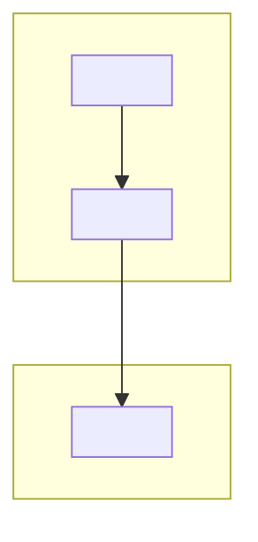
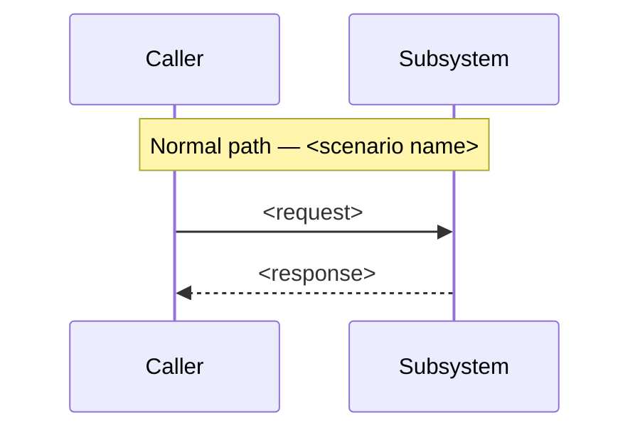
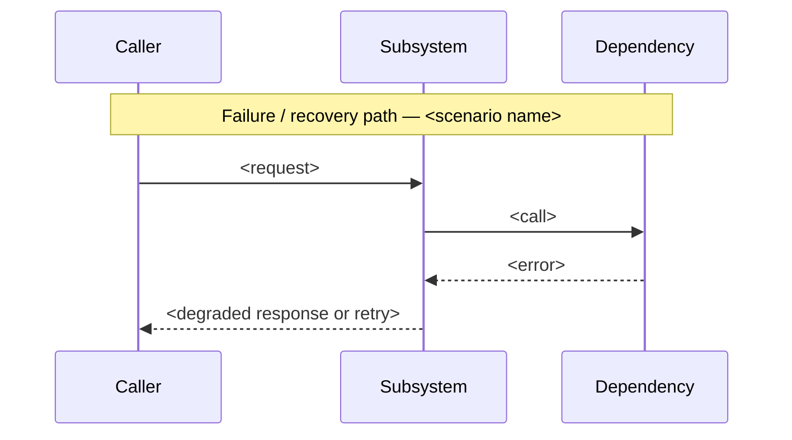

<!-- Subsystem design — one subsystem, zoomed to its internal elements and
     the contracts it exposes. Every section opens with the question it
     answers, and every modelled section puts the model (table or diagram)
     before the prose that explains it. Cite evidence inline or link out;
     never accumulate it in an appendix. -->

# Subsystem Design — <one-phrase name>

**Author(s):** <names>
**Status:** Draft | Under review | Accepted | Superseded
**Last updated:** <YYYY-MM-DD>
**Reviewers:** <names or teams expected to sign off>

## 1. Scope and Context

What does this subsystem own, what does it explicitly not own, and why does
the boundary sit there rather than somewhere else?

<!-- model -->
| In scope | Out of scope | Why |
| --- | --- | --- |
| <capability this subsystem owns> | <capability a neighbor owns instead> | <the reason the boundary falls here> |
| <…> | <…> | <…> |

**Goals**
- <Testable from the outside — "p95 < 200ms at 10x current load", not "fast".>

**Non-goals**
- <Something a reasonable reader might assume is in scope. Name why it's out.>

<!-- rationale -->
<Explain why the boundary and the goals/non-goals sit where the table and the
diagram place them — what would go wrong if a capability crossed the line the
other way, and why the excluded neighbor is a better owner for it.>

## 2. Structural Model

What are this subsystem's internal elements, how do they relate to each
other, and at what zoom level are we looking?

<!-- model -->
| Element | Type | Responsibility | Zoom |
| --- | --- | --- | --- |
| <element name> | <component / process / store> | <one sentence> | <this diagram's zoom level> |
| <…> | <…> | <…> | <…> |

| From | To | Nature | Protocol |
| --- | --- | --- | --- |
| <element> | <element> | <calls / owns / publishes-to> | <sync RPC / async event / shared store> |

<!-- rationale -->
<Explain the declared zoom, why these elements are the right grain for it —
not coarser, not finer — and why the relationships shown are the ones that
matter at this zoom.>

## 3. Runtime Model

How does this subsystem behave at runtime, on the normal path and when
something goes wrong?

<!-- model -->
| Scenario | Trigger | Path |
| --- | --- | --- |
| <scenario name> | <what starts it> | normal |
| <scenario name> | <what starts it> | failure / recovery |

<!-- rationale -->
<Explain why these two scenarios are the ones worth sequencing — the normal
path a reader needs to trust, and the failure/recovery path that decides
whether the subsystem degrades safely or takes its callers down with it.>

## 4. Contracts and Invariants

What must always hold true across every boundary this subsystem exposes, and
how would a violation be caught?

<!-- model -->
| Semantic name | Parties | Inputs/outputs | Identity | Compatibility | Failure semantics | Invariant | Enforcement | Verification |
| --- | --- | --- | --- | --- | --- | --- | --- | --- |
| <contract name> | <caller, provider> | <request / response shape> | <how a party is identified> | <backward / forward rule> | <what happens on violation> | <what must always hold> | <how it's enforced — type, schema, runtime check> | <how it's verified — test, contract test, monitor> |

<!-- rationale -->
<Explain why each invariant is load-bearing — what breaks silently downstream
if it stops holding, and why the named enforcement mechanism is sufficient
rather than aspirational.>

## 5. Data and State

Who owns each piece of data or state this subsystem touches, how does it
change over its lifecycle, and what must stay consistent?

<!-- model -->
| Element | State it owns | Lifecycle | Consistency requirement |
| --- | --- | --- | --- |
| <element name> | stateless | n/a | n/a |
| <element name> | <the state it owns> | <created / updated / retired — by what event> | <what must never be observed inconsistent, and across what window> |

<!-- rationale -->
<Explain the ownership boundary — why this element and not its caller or
callee owns the state — and why the consistency requirement is strict or
eventual. An element that holds no state is written `stateless` in the table
explicitly, never left as an absent row a reader has to interpret.>

## 6. Deployment and Operations

How is this subsystem deployed, operated, and observed once it is running?

<!-- model -->
| Deployment unit | Runs as | Scaling | Observability |
| --- | --- | --- | --- |
| <unit name> | <process / container / function> | <scaling trigger and bound> | <the signal an operator watches> |

<!-- rationale -->
<Explain why this is the deployment shape — what operational property it
buys. Add a topology diagram only when physical placement differs from the
structural model above; when placement matches structure, say so here instead
of drawing a second diagram that would only repeat section 2.>

## 7. Quality Scenarios and Verification

For each quality attribute that matters here, what scenario proves it holds,
and how do we verify that?

<!-- model -->
| Source | Stimulus | Environment | Artifact | Response | Measurable target | Business consequence | Mechanism | Verification |
| --- | --- | --- | --- | --- | --- | --- | --- | --- |
| <who or what triggers it> | <the event> | <normal / degraded / peak load> | <the element under test> | <what the subsystem does> | <the number that decides pass/fail> | <what happens to the business if it fails> | <how the response is achieved — the design mechanism> | <how the scenario is checked — load test, chaos drill, monitor> |

<!-- rationale -->
<Explain why this scenario, at this target, is the one worth writing down —
what business consequence follows if the target is missed, and why the named
mechanism is what achieves the response rather than hoping load stays low.>

## 8. Implementation Mapping

Where does each element in the model above actually live in source, build,
and deployment?

<!-- model -->
| Semantic element | Source owner | Build unit | Deployable | Verification |
| --- | --- | --- | --- | --- |
| <element from section 2> | <team or owning path> | <package / module that builds it> | <the deployment unit from section 6> | <the test or check that proves the mapping holds> |

<!-- rationale -->
<Explain any place this mapping is not one-to-one — an element split across
build units, or a build unit serving two elements — and why that split is
deliberate rather than drift.>

## 9. Decisions, Alternatives, and Risks

What did we decide, what did we reject, and what could still go wrong?

**Decisions**
- <Decision, one phrase.> <Why this and not the alternative below.>

**Alternatives considered**
- **<Alternative — one phrase.>** <What it would have looked like.>
  **Rejected because:** <specific property, not "didn't fit">.

**Risks**
- **<Risk, one phrase>.** <How it manifests. Mitigation, or explicitly
  *accepted unmitigated* with the reason.>

## 10. Rollout, Migration, and Reversal

How does this subsystem roll out, migrate any existing data or state, and
reverse cleanly if it needs to come back out?

<Migration and launch shape: big-bang, phased, shadow-traffic, dark launch,
feature-flag. The rollback story — concrete, not aspirational. Who is on the
hook for the rollout window.>

## 11. Open Questions

What remains genuinely unresolved, and who or what could resolve it?

- <Question, with the person, team, or measurement that could answer it.>

<Omit this section entirely in an authored document when there are no honest
open questions left — an empty section is not evidence that none exist.>
