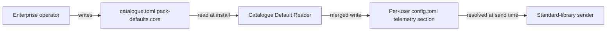
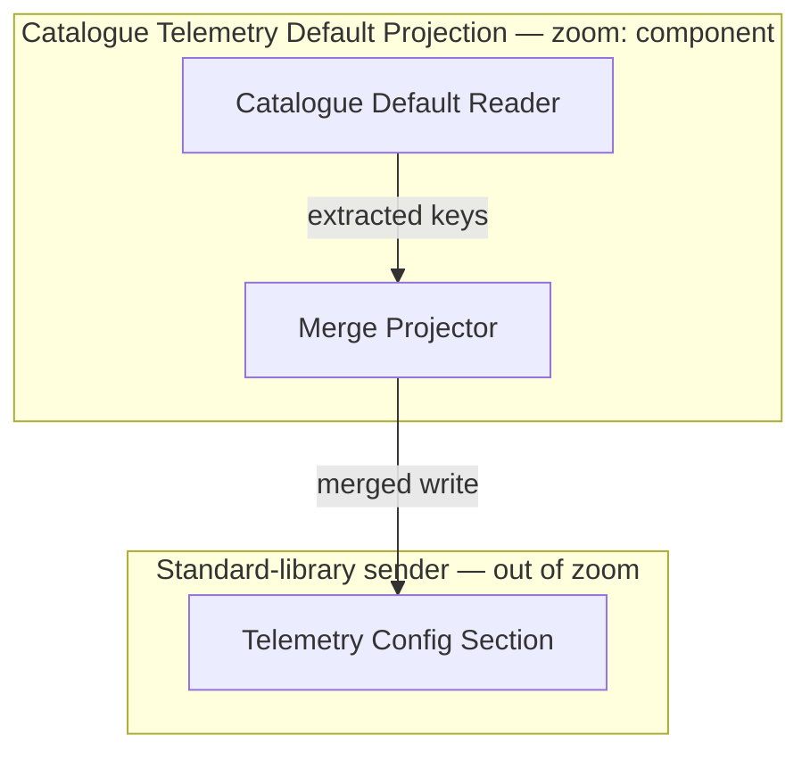
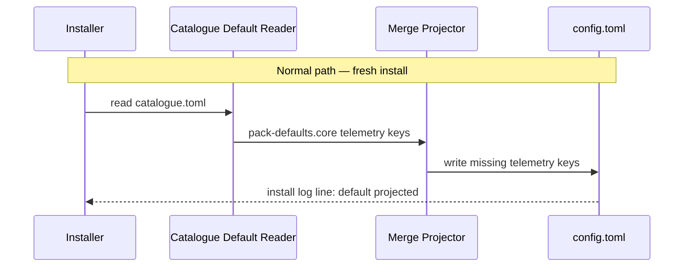

<!-- Deliberately non-conforming: this document is NOT an authored design and
is not the DA3/DA10 clean corpus. It is the reference document at
testdata/telemetry-endpoint-default-design.md plus exactly seven planted
edits, one per hybrid precheck — DA1, DA2, DA4, DA6, DA7, DA8 and DA9 — added
so the precheck walk recorded in
docs/specs/architect-design-document-gates/notes/verification-ledger.md has a
document each precheck is proven to fire on. Every other line is identical to
the reference document. Do not read this file as design guidance. -->

# Subsystem Design — Catalogue Telemetry Default Projection

**Decision sought:** Should the installer project a catalogue-baked
telemetry endpoint into the user-scope `[telemetry]` section so a
standard-library-only sender reads it with no configuration step from the
installing user?
**Author(s):** AgentBundle distribution maintainers
**Status:** Draft
**Last updated:** 2026-09-19
**Reviewers:** AgentBundle distribution maintainers, the
credential-pack-defaults-projection owner

## 1. Scope and Context

What does this subsystem own, what does it explicitly not own, and why does
the boundary sit there rather than somewhere else?

<!-- model -->
| In scope | Out of scope | Why |
| --- | --- | --- |
| Reading `[pack-defaults.core] telemetry_endpoint` and `service_name` from the resolved `catalogue.toml` at install time | Resolving `[telemetry]` at send time across the operator and repository scopes | The sender already owns that two-scope resolution; this subsystem adds one lower-precedence source ahead of it |
| Merging the baked default with an existing user-authored `[telemetry]` section before writing | Overwriting a user's own `[telemetry]` setting | `_append_layout_section` is never-overwrite by contract; a merge that replaced an existing key would break that contract |
| Running at `user` and `project` install scope | Running at `local` install scope | `local` installs are ephemeral, and `install.py` never dispatches the layout-section write for that scope |

**Goals**
- An enterprise operator sets `[pack-defaults.core] telemetry_endpoint`
  once in `catalogue.toml`, and every `user`- or `project`-scope install of
  the core pack from that catalogue exports telemetry to it with zero
  configuration steps taken by the installing user.
- A user who already carries their own `[telemetry]` section keeps that
  value untouched; the projection adds a missing key and never replaces one
  that is already present.

**Non-goals**
- Reaching `local`-scope installs. `install.py` structurally never calls the
  layout-section write for that scope, and closing that gap is a separate
  change to the installer's scope dispatch, not this subsystem.
- Refreshing an already-projected value when the enterprise later changes
  its endpoint. `_append_layout_section` is never-overwrite and `upgrade.py`
  does not call it, so a changed catalogue default reaches only a fresh
  install, never one that already ran.



<!-- rationale -->
The boundary stops at the write into `config.toml` because everything past
that point is the sender's previously-shipped resolution chain. Extending
this subsystem into send-time resolution would duplicate a chain that
already covers five layers and already ranks the user scope correctly. The
operator and the catalogue sit outside; the reader, the projector and the
written config sit inside.

## 2. Structural Model

What are this subsystem's internal elements, how do they relate to each
other, and at what zoom level are we looking?

The subsystem is composed of three cooperating elements.

<!-- model -->
| Element | Type | Responsibility | Zoom |
| --- | --- | --- | --- |
| Catalogue Default Reader | component | Reads the resolved `catalogue.toml` and extracts `[pack-defaults.core]` telemetry keys | subsystem-internal |
| Merge Projector | component | Decides whether a key is missing from the user's `[telemetry]` section and writes only the missing keys | subsystem-internal |
| Telemetry Config Section | store | The `[telemetry]` table inside the pack's per-user `config.toml`, read later by the sender | subsystem-internal |

| From | To | Nature | Protocol |
| --- | --- | --- | --- |
| Catalogue Default Reader | Merge Projector | calls | in-process function call |
| Merge Projector | Telemetry Config Section | owns | file write via `_append_layout_section` |
| Telemetry Config Section | Sender (neighbor) | publishes-to | file read at send time |



<!-- rationale -->
Component zoom is the right grain here: the reader and the projector are two
distinct responsibilities — extraction and merge-decision — and a coarser
single-box view would hide the never-overwrite decision that the risk
register in section 9 depends on. A finer, per-function zoom would show
nothing this design needs to reason about. The split is extraction in the
reader and the never-overwrite merge decision in the projector.

## 3. Runtime Model

How does this subsystem behave at runtime, on the normal path and when
something goes wrong?

<!-- model -->
| Scenario | Trigger | Path |
| --- | --- | --- |
| Fresh install, baked default present | `agentbundle install` with a catalogue carrying `[pack-defaults.core] telemetry_endpoint` | normal |
| Malformed catalogue value | `[pack-defaults.core] telemetry_endpoint` is not a string | failure / recovery |



```mermaid
sequenceDiagram
    participant Installer
    participant Reader as Catalogue Default Reader
    participant Projector as Merge Projector
    Note over Installer,Projector: Failure / recovery path — malformed value · Question: does a bad catalogue value corrupt an existing setting? · Zoom: component
    Installer->>Reader: read catalogue.toml
    Reader->>Reader: validate telemetry_endpoint is a string
    Reader-->>Installer: refuse; install log line: default skipped
    Installer->>Projector: no write attempted
```

<!-- rationale -->
The normal path is the one an operator needs to trust: it proves the
zero-configuration promise this intent exists to deliver. The failure path
proves the opposite property — that a bad enterprise value degrades to "no
default projected" rather than to a corrupted or half-written config file.

## 4. Contracts and Invariants

What must always hold true across every boundary this subsystem exposes, and
how would a violation be caught?

<!-- model -->
| Semantic name | Parties | Inputs/outputs | Identity | Compatibility | Failure semantics | Invariant | Enforcement | Verification |
| --- | --- | --- | --- | --- | --- | --- | --- | --- |
| Baked telemetry default | Enterprise operator (producer), Catalogue Default Reader (consumer) | `catalogue.toml [pack-defaults.core]` string keys to an extracted key/value pair | Pack name plus key name | Additive-only; an unrecognized key passes through as an open-map entry | A non-string value is refused and logged, never written | An existing user `[telemetry]` key is never overwritten by this subsystem | Type check on read, before any write is attempted | Unit test against a fixture `catalogue.toml` carrying both a valid and a malformed value |
| Merged telemetry section | Merge Projector (producer), Sender (consumer) | Extracted keys to a `[telemetry]` table in `config.toml` | The `[telemetry]` table itself | The sender's existing reader is untouched; this subsystem only ever adds keys it reads | A write that would replace an existing key is refused rather than attempted | The merged section is a strict superset of whatever the user had before the install ran | `_append_layout_section`'s never-overwrite check | Integration test asserting a pre-existing key survives byte-for-byte across an install |

<!-- rationale -->
Both contracts are enforced before the write rather than after, because a
config file the sender already trusts is the wrong place to discover a
violation. Verifying with a byte-for-byte comparison, not a value comparison,
catches a merge that reordered or reformatted a key the user had already set.

## 5. Data and State

Who owns each piece of data or state this subsystem touches, how does it
change over its lifecycle, and what must stay consistent?

<!-- model -->
| Element | State it owns | Lifecycle | Consistency requirement |
| --- | --- | --- | --- |
| Catalogue Default Reader | stateless | n/a | n/a |
| Merge Projector | stateless | n/a | n/a |
| Telemetry Config Section | The merged `[telemetry]` table on disk | Created at install time; never updated by this subsystem afterward | Must never be observed holding two different endpoint values across two reads within the same install run |

<!-- rationale -->
The reader and the projector hold no state between calls, so the only
consistency question is the file itself. The single-writer-per-install
assumption is what keeps that file from being observed half-written, which
is why the risk register in section 9 treats a concurrent second install as
an operational risk rather than a design defect.

## 6. Deployment and Operations

How is this subsystem deployed, operated, and observed once it is running?

<!-- model -->
| Deployment unit | Runs as | Scaling | Observability |
| --- | --- | --- | --- |
| Catalogue telemetry projection step | An in-process step inside the `agentbundle install` CLI invocation | No independent scaling; one invocation per install run | An install log line stating whether a baked default was projected, skipped, or absent |

<!-- rationale -->
Placement matches the structural model as described above, so no separate
topology diagram is drawn here; a second diagram would only repeat the
two-component picture already shown there.

## 7. Quality Scenarios and Verification

For each quality attribute that matters here, what scenario proves it holds,
and how do we verify that?

<!-- model -->
| Source | Stimulus | Environment | Artifact | Response | Measurable target | Business consequence | Mechanism | Verification |
| --- | --- | --- | --- | --- | --- | --- | --- | --- |
| Enterprise operator | Sets `telemetry_endpoint` in `catalogue.toml` | Fresh install, normal load | Merge Projector | Writes the merged `[telemetry]` section | 100% of fresh `user`/`project`-scope installs from that catalogue carry the endpoint with zero adopter action | Without it, enterprise-wide telemetry coverage needs manual per-seat configuration, which does not happen reliably | The never-overwrite merge write at install time | An installer integration test asserting the key's presence after install |
| Installing user | Already has a `[telemetry]` section set | Fresh install, normal load | Merge Projector | Leaves the existing key untouched | 0% of pre-existing `[telemetry]` keys change value across an install | An overwritten user setting silently redirects that user's telemetry without their consent | The never-overwrite check inside `_append_layout_section` | The same integration test's byte-for-byte comparison |

<!-- rationale -->
Both scenarios share one mechanism and one test, which is deliberate: a
design that needed two different mechanisms to keep "add the default" and
"never touch what's already there" both true would be a design with a race
between them.

## 8. Implementation Mapping

Where does each element in the model above actually live in source, build,
and deployment?

<!-- model -->
| Semantic element | Source owner | Build unit | Deployable | Verification |
| --- | --- | --- | --- | --- |
| Catalogue Default Reader | AgentBundle distribution maintainers | `packages/agentbundle/agentbundle/config` | The `agentbundle install` CLI | Unit test reading a fixture `catalogue.toml` with a valid and a malformed value |
| Config Merge Service | AgentBundle distribution maintainers | `packages/agentbundle/agentbundle/install.py` | The `agentbundle install` CLI | Integration test asserting an existing key survives and a missing key is added |
| Telemetry Config Section | AgentBundle distribution maintainers | n/a — data, not code | The per-user `config.toml` | Contract test proving the sender's existing reader consumes the merged file unchanged |

<!-- rationale -->
Together the model above and this mapping are sufficient to implement from:
every element names its build unit and its verification, and no element here
has no home. A reader who needed a fourth column to start work would be
finding a gap this mapping should have already closed.

## 9. Decisions, Alternatives, and Risks

What did we decide, what did we reject, and what could still go wrong?

**Decisions**
- Project into the sender's existing user-scope `[telemetry]` section
  rather than adding a new sender-side precedence layer. This is the only
  option that costs the sender nothing, since the sender already resolves
  that scope today.

**Alternatives considered**
- **A sixth precedence layer read directly by the sender.** The sender
  would gain a new catalogue-scope layer of its own, read independently of
  `[telemetry]`. **Rejected because:** it needs a sender contract change to
  rank correctly against the repository scope, and the sender's contract is
  already shipped and stable — this design costs it nothing precisely by
  not asking for that change.
- **Writing the baked default at `local` scope too.** This would close the
  ephemeral-install gap this design's non-goals name. **Rejected because:**
  `install.py` structurally never dispatches the layout-section write for
  `local` scope, so reaching it is a separate installer change with its own
  review, not a corollary of this one.

**Risks**
- **A changed catalogue endpoint never reaches an already-installed user.**
  An enterprise updates its endpoint and every prior install keeps sending
  to the retired one. **Accepted unmitigated:** `_append_layout_section`'s
  never-overwrite contract belongs to the installer's shared write path, and
  closing this is `upgrade.py`'s change to make, not this subsystem's.
- **A malformed catalogue value silently disables the default rather than
  failing loudly.** An operator believes telemetry is configured when the
  write was refused. Mitigation: the install log line named in section 6
  states whether a default was projected, skipped, or absent, so the
  failure is visible on the install transcript even though it is silent to
  the installing user.
- **Operational: the merge write races a concurrent second install of the
  same pack in the same user scope.** An interleaved read-modify-write could
  corrupt `config.toml`. Mitigation: the projector opens the file through
  the same locking discipline `_append_layout_section`'s existing callers
  already use, so a concurrent run is serialized rather than interleaved.

## 10. Rollout, Migration, and Reversal

How does this subsystem roll out, migrate any existing data or state, and
reverse cleanly if it needs to come back out?

Rollout is feature-flag shaped: an enterprise opts in per catalogue by
setting `[pack-defaults.core] telemetry_endpoint`, and no catalogue carries
that key today, so the rollout changes nothing until an operator acts. The
rollback story is equally direct: an operator clears the key, and every
install from that point reads no baked default, while already-projected
files stay exactly as accepted in the risk register above. AgentBundle
distribution maintainers are on the hook for the rollout window.

## 11. Open Questions

What remains genuinely unresolved, and who or what could resolve it?

- Whether a catalogue-supplied default belongs in the per-pack `config.toml`
  file at all, or in `[telemetry]` proper, given a user-authored
  `agentbundle-layout.toml` already carries a defined precedence the sender
  honours — answerable by the RFC-0101 addendum this design's owning intent
  names as its likely next step.

## Revision History

- 2026-09-19 — Planted-defect variant created for the precheck walk.

## Evidence

- Manual trace of `install.py`'s scope dispatch, pasted here rather than
  linked from the sections above.
